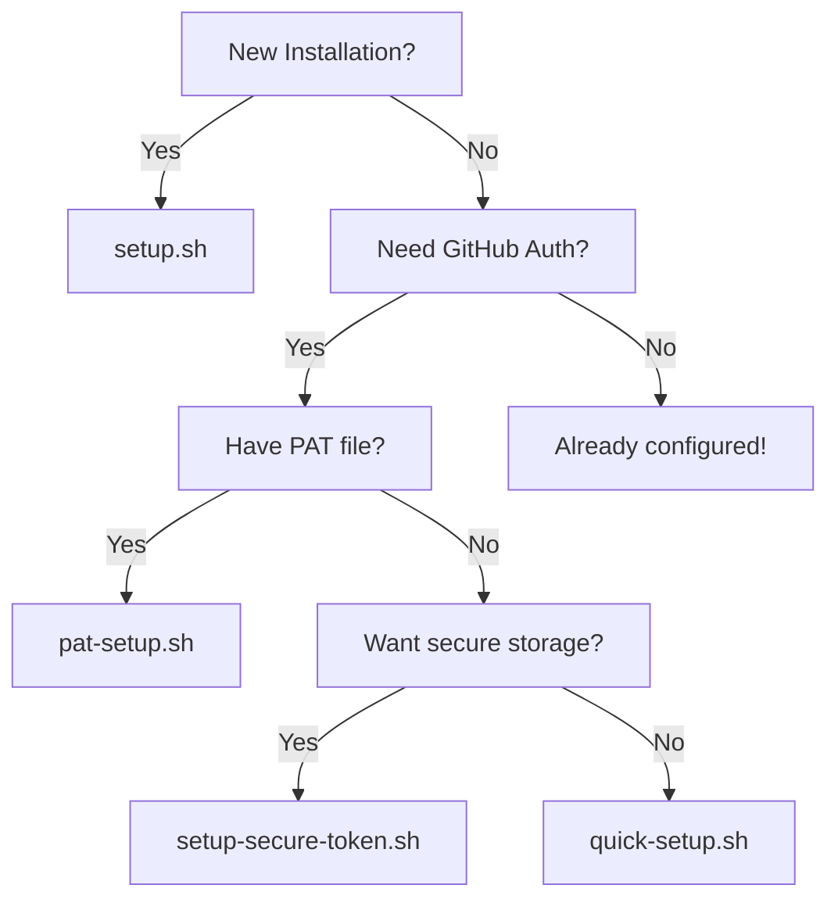

# Time-Shift Proxmox Setup Scripts Guide

This document explains the purpose of each setup script and helps you choose the right one for your needs.

## 🚀 Primary Setup Scripts (Recommended)

### 1. **setup.sh** - Main Installation Script
- **Purpose**: Complete project setup including dependencies, configuration, and environment
- **Use when**: First time installation or full reinstallation
- **Features**: 
  - Installs all dependencies
  - Sets up virtual environment
  - Configures Dell iDRAC defaults
  - Runs initial configuration wizard

### 2. **pat-setup.sh** - PAT File Authentication
- **Purpose**: Set up GitHub authentication using a `.pat` file
- **Use when**: You have a GitHub Personal Access Token and prefer file-based setup
- **Features**:
  - Looks for `.pat` files automatically
  - Simple and secure token storage
  - No manual token entry needed

### 3. **setup-secure-token.sh** - Secure Token Management (NEW)
- **Purpose**: Securely store GitHub tokens using system keyring
- **Use when**: You want the most secure token storage method
- **Features**:
  - Uses system keyring (keychain on macOS, credential manager on Windows)
  - Encrypted fallback storage
  - Automatic migration from legacy token files

## 📦 Alternative Setup Scripts

### 4. **browser-auth.sh** - Browser-Based Authentication
- **Purpose**: Authenticate via web browser
- **Use when**: You prefer OAuth-style authentication
- **Status**: Experimental - may not work with all configurations

### 5. **quick-setup.sh** - Fast Setup with Token Parameter
- **Purpose**: One-line setup with token passed as parameter
- **Use when**: Automating deployment with CI/CD
- **Example**: `GITHUB_TOKEN=ghp_xxx ./quick-setup.sh`

## 🗑️ Deprecated Scripts (To Be Removed)

The following scripts are redundant and will be consolidated:

- `one-click-setup.sh` - Redundant with `setup.sh`
- `instant-setup.sh` - Redundant with `quick-setup.sh`
- `interactive-git-setup.sh` - Functionality merged into `setup-secure-token.sh`
- `web-auth-setup.sh` - Redundant with `browser-auth.sh`
- `token-file-setup.sh` - Redundant with `pat-setup.sh`
- `setup-github-token.sh` - Replaced by `setup-secure-token.sh`
- `git-clone-easy.sh` - Specific use case, consider removal
- `easy-git-auth.sh` - Redundant functionality

## 🎯 Which Script Should You Use?

## 📋 Migration Plan

1. **Phase 1**: Document current scripts (this document)
2. **Phase 2**: Update README to reference only primary scripts
3. **Phase 3**: Add deprecation warnings to redundant scripts
4. **Phase 4**: Remove deprecated scripts in next major version

## 💡 Best Practices

1. **For new users**: Use `setup.sh` for complete installation
2. **For GitHub authentication**: Use `setup-secure-token.sh` for best security
3. **For automation**: Use `quick-setup.sh` with environment variables
4. **For simplicity**: Use `pat-setup.sh` with a `.pat` file

## 🔒 Security Notes

- Never commit `.pat` files or tokens to git
- Use `setup-secure-token.sh` for production environments
- The `.gitignore` file is configured to exclude token files
- Consider using GitHub's fine-grained personal access tokens