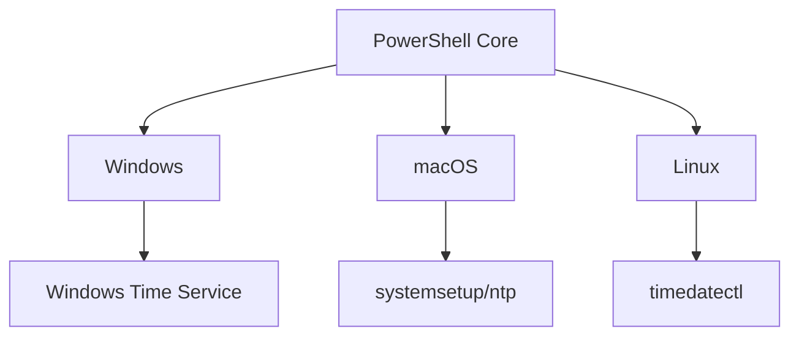
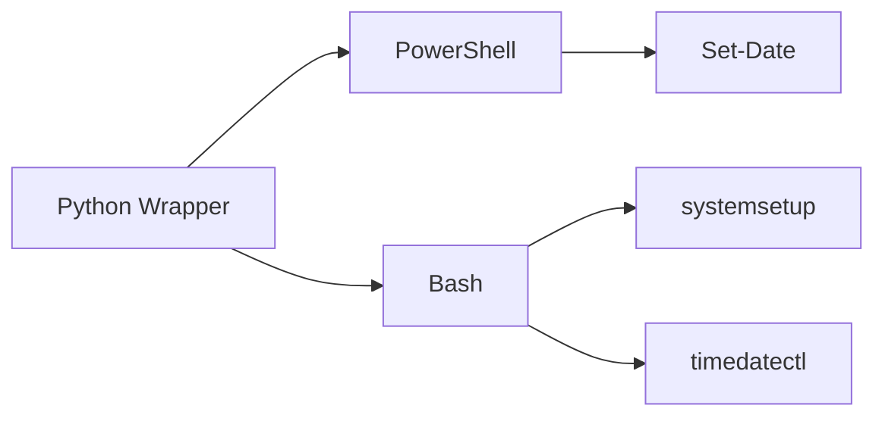
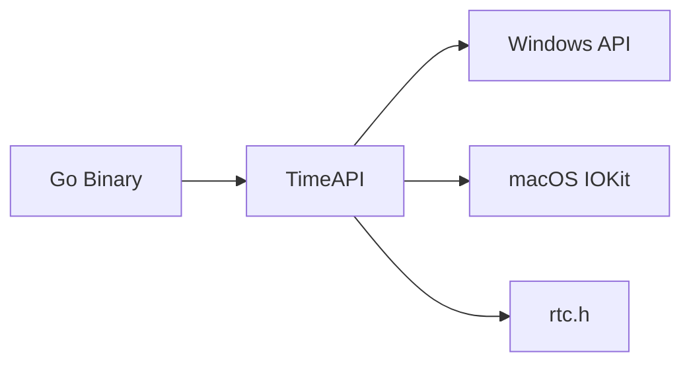

# Proxmox GRUB Issue and PXE Boot Setup

## Proxmox Installation Stuck at GRUB Prompt

Your server is currently stuck at the GRUB prompt after attempting to install Proxmox. This is not normal—there is no key you are supposed to press at this screen to continue the installation. The GRUB prompt typically means the system cannot find a bootable operating system or the GRUB bootloader is misconfigured or missing.

### What This Means

- The Proxmox installer did not complete successfully, or
- The system is not booting from the correct device, or
- The GRUB bootloader did not install or configure properly.

### What You Should Do

#### 1. Double-check Boot Order

- Enter your server's BIOS/UEFI settings.
- Make sure the boot order is set to boot from the drive where you installed Proxmox, not the USB installer or another device.

#### 2. Try Reinstalling Proxmox

Sometimes, the installation process may not finish correctly, especially if the USB installer is not created properly or if there are compatibility issues.

- Recreate your Proxmox installer USB using a tool like Rufus or balenaEtcher, ensuring you use the correct mode (UEFI or Legacy/BIOS) that matches your server settings.
- Boot from the USB and attempt the installation again.

#### 3. Repair GRUB (Advanced)

If you want to try repairing rather than reinstalling:

- Boot from the Proxmox ISO and choose a rescue or debug mode.
- Use the rescue shell to chroot into your installed system and reinstall GRUB. Basic steps:

  - Import your root pool if using ZFS (e.g., `zpool import -f -R /mnt rpool`).
  - Mount necessary filesystems and chroot:

    ```bash
    mount -o rbind /proc /mnt/proc
    mount -o rbind /sys /mnt/sys
    mount -o rbind /dev /mnt/dev
    mount -o rbind /run /mnt/run
    chroot /mnt /bin/bash
    ```

  - Reinstall GRUB to your boot device (e.g., `grub-install /dev/sda`).
  - Update GRUB config (`update-grub`), then exit and reboot.

#### 4. Hardware Considerations

- Disconnect any drives not needed for the installation to avoid confusion.
- If using RAID controllers or special hardware, ensure drivers and compatibility with Proxmox.

### Summary Table

| Symptom                      | Likely Cause                                 | Solution                                     |
| :--------------------------- | :------------------------------------------- | :------------------------------------------- |
| Stuck at GRUB prompt         | Bootloader not installed/configured properly | Reinstall GRUB or Proxmox                    |
| "Welcome to GRUB" only       | Incomplete install or wrong boot device      | Check BIOS boot order, reinstall GRUB        |
| No Proxmox boot option found | Booting from wrong device or config missing  | Set correct boot device in BIOS, repair GRUB |

### Next Steps

- There is no key to continue from this screen.
- Try rebooting and checking your BIOS boot order first.
- If that fails, recreate your installer USB and reinstall Proxmox.
- If you are comfortable, try the GRUB repair steps above.
- If you continue to have issues, please provide more details on your hardware and installation steps for more targeted help.

## Understanding PXE Boot on a Dell R710

When your Dell R710 server says "attempting PXE boot," it means the system is trying to boot from the network using a technology called PXE (Preboot Execution Environment). PXE allows a computer to load an operating system over the network instead of from a local hard drive, USB, or CD/DVD. This is commonly used in enterprise environments to deploy operating systems to many machines at once, but it requires a properly configured network server (DHCP and TFTP) to provide the boot files.

### PXE boot works as follows

- The server sends out a request over the network to find a PXE server.
- If a PXE server is available, it responds and provides the necessary boot files, allowing the server to load an operating system image from the network.
- If no PXE server is found (which is typical on home or small networks), the boot attempt fails, and the system either tries the next device in the boot order or stops.

### Your server is likely attempting PXE boot because

- It cannot find a bootable operating system on the local drives.
- The boot order in the BIOS/UEFI is set to try network boot before other devices.
- The hard drive or RAID array is not properly configured or detected.

PXE is not harmful, but unless you have set up a PXE server, it will not let your server boot into an operating system. You can disable PXE boot in the BIOS or change the boot order to prioritize your hard drive or USB installer instead.

## Setting Up a PXE Server on Proxmox

Yes, you can definitely set up a PXE server on your Proxmox server. There are several approaches you can take, and the Proxmox community has documented various methods for doing this.

### VM-Based PXE Server

The most common and recommended approach is to create a virtual machine on your Proxmox host and install PXE server software on it. You can use Ubuntu Server 20.04 or another Linux distribution as the base for your PXE server VM.

### Network Configuration Options

When setting up a PXE server on Proxmox, you have two main network configuration choices:

#### Option 1: Internal Network Only

- Create an internal network on your Proxmox PVE that doesn't connect to the internet.
- This provides an internal backbone network for your VMs to communicate with each other for PXE purposes.
- This approach prevents conflicts with your existing home router's DHCP server.

#### Option 2: Integrated with Main Network

- Configure the PXE server to work alongside your existing DHCP infrastructure.
- Requires more careful configuration to avoid DHCP conflicts.

### VM Requirements for PXE Booting

When creating VMs that will boot via PXE on Proxmox, you need to:

- Select "Do not use any media" in the OS menu instead of selecting an ISO.
- Configure at least 4 GB of RAM, as downloaded media needs to be stored in RAM before starting.
- This is especially important when running live operating systems like EndeavourOS.

### Setting Up the Internal Network

To create an isolated PXE environment on Proxmox:

1.  Set up an internal network that doesn't connect to the internet.
2.  Configure your PXE server VM to act as both DHCP and TFTP server for this internal network.
3.  Connect your target VMs to this internal network for PXE booting.

This approach allows you to deploy operating systems to VMs using PXE without interfering with your main network infrastructure.

The setup provides significant advantages for VM management, allowing you to automate OS deployments and maintain consistent configurations across multiple virtual machines.

## Script to Create a PXE Server on Proxmox

To set up a PXE server on your Proxmox host for network booting, you can use the `pve-iso-2-pxe.sh` script, which converts a Proxmox ISO into PXE-bootable files. Below is a step-by-step guide:

### Step 1: Prepare the Script and ISO

1.  Clone the repository:

    ```bash
    git clone https://github.com/morph027/pve-iso-2-pxe
    cd pve-iso-2-pxe
    ```

2.  Download the Proxmox ISO (e.g., `proxmox-ve_8.1.iso`) and place it in the script directory.
3.  Run the script:

    ```bash
    sudo ./pve-iso-2-pxe.sh /path/to/proxmox-ve_8.1.iso
    ```

This generates a `pxeboot` directory containing `linux26` (kernel) and `initrd` (initial RAM disk) files.

### Step 2: Configure PXE Services

#### Option A: iPXE (Recommended)

1.  Host the files on a web server (e.g., Apache/Nginx):

    ```bash
    cp pxeboot/linux26 pxeboot/initrd /var/www/html/proxmox/8.1/
    ```

2.  Create an iPXE script (e.g., `proxmox.ipxe`):

    ```ipxe
    #!ipxe
    dhcp
    set serverip http://192.168.1.100 # Replace with your server IP
    set pveversion 8.1
    set opts "vga=791 video=vesafb:ywrap,mtrr ramdisk_size=16777216 rw quiet"
    kernel ${serverip}/proxmox/${pveversion}/linux26 ${opts} splash=silent
    initrd ${serverip}/proxmox/${pveversion}/initrd
    boot
    ```

3.  Serve this script via your network bootloader.

#### Option B: Traditional PXE (Syslinux)

1.  Set up TFTP/DHCP (e.g., using dnsmasq):

    ```bash
    sudo apt install dnsmasq
    ```

2.  Configure `/etc/dnsmasq.conf`:

    ```ini
    interface=eth0
    dhcp-range=192.168.1.100,192.168.1.200,12h
    dhcp-boot=pxelinux.0
    enable-tftp
    tftp-root=/var/lib/tftpboot
    ```

3.  Copy PXE files:

    ```bash
    mkdir -p /var/lib/tftpboot/proxmox/8.1
    cp pxeboot/linux26 pxeboot/initrd /var/lib/tftpboot/proxmox/8.1/
    ```

4.  Create a PXE config (`/var/lib/tftpboot/pxelinux.cfg/default`):

    ```
    DEFAULT proxmox
    LABEL proxmox
    MENU LABEL Install Proxmox
    KERNEL proxmox/8.1/linux26
    APPEND vga=791 initrd=proxmox/8.1/initrd ramdisk_size=16777216 rw
    quiet splash=silent
    ```

### Step 3: Boot Clients

- Configure target machines to PXE boot. They will load the Proxmox installer from your server.

### Key Notes

- **DHCP Conflicts**: Use an isolated network or integrate with your existing DHCP server carefully.
- **Debugging**: For installation issues, add `proxdebug` to the kernel options in your PXE config.
- **Automation**: Combine with Proxmox's automated installation for unattended setups using answer files.

This method streamlines deploying Proxmox or VMs via PXE. For full automation, extend with tools like Ansible.

## Resolving "git: command not found" Error

Your system is saying `git: command not found` because Git is not currently installed, or it's not available in your system's PATH. On a Proxmox server (which is based on Debian/Ubuntu), you can install Git easily.

### How to Install Git on Proxmox (Debian/Ubuntu)

Open your Proxmox shell and run:

```bash
sudo apt update
sudo apt install git
```

After installation, verify it works by running:

```bash
git --version
```

You should see the installed Git version.

Once Git is installed, you can proceed with cloning repositories or running scripts that require Git.

## Time-Shift Proxmox VM Solution: Accessing iDRAC with Expired SSL Certificates

Yes, hypothetically, if you temporarily set your local system clock to a date and time that falls within the valid range of the iDRAC6 SSL certificate, your browser and Java client will likely accept the certificate as valid and allow you to connect—as long as the client software relies on your local system time for certificate validation.

### How and Why This Works

- SSL/TLS certificate validation compares the certificate's validity period to your system's current date/time.
- If your system clock is set to a date within the certificate's "Valid From" and "Valid To" range, most browsers and Java clients will consider the certificate valid, even if it is expired relative to the real world.
- This is a known workaround for short-term, non-production access when you control the client and understand the risks.

### Caveats and Risks

- All other SSL/TLS connections on your system may break (websites may show errors, logins may fail, etc.) while your clock is wrong.
- Some applications may cache time or use network time sources, but most browsers and Java rely on the local system clock.
- This is **not recommended for regular use**; only do this if you need quick, temporary access and understand the side effects.

### What to Do

1.  Note the certificate's valid date range (view in browser > Certificate > Details).
2.  Set your Mac's system clock to a date within that range:
    - Go to System Settings > General > Date & Time.
    - Turn off "Set time and date automatically.”
    - Manually set the date/time.
3.  Access the iDRAC6 interface or launch the Virtual Console.
4.  Restore your system clock to the correct time immediately after you're done.

### Summary Table

| Action                      | Effect                                                    |
| :-------------------------- | :-------------------------------------------------------- |
| Set clock within cert dates | SSL cert will be accepted as valid by browser/Java client |
| Set clock back to correct   | Normal SSL validation resumes, other sites work again     |

This workaround should let you access iDRAC6 for a few hours as needed. Restore your clock promptly when finished.

## Analysis of Your Proposal (Option A)

### Pros

- Solves immediate certificate validation issues for iDRAC access.
- Automated time reversion ensures system integrity.
- Logging provides audit trail and debugging.
- Multi-platform support increases versatility.

### Cons and Challenges

#### 1. Time Manipulation Risks

- Security protocols (SSL/TLS, Kerberos) may fail in time shift.
- System services (cron, backups) could malfunction.
- File synchronization (iCloud, Dropbox) may corrupt data.
- Browser security features (HSTS) might lock you out.

#### 2. Implementation Complexity

- Persisting time states across reboots requires low-level hooks.
- Handling background processes reliably is challenging.
- Different OS time management (macOS: ntpd, Linux: systemd-timesyncd, Windows: w32time).

#### 3. Edge Cases

- Handling daylight saving transitions.
- Network time synchronization collisions.
- Hardware clock vs system clock differences.

### Recommended Improvements

#### 1. Safety Mechanisms

- Prevent time changes when critical apps are running.
- Automatic service pausing (e.g., backup tools).
- Network isolation during time shift.

#### 2. Time Specification

- Support both absolute ("2025-07-01 14:30") and relative ("+2h30m").
- Timezone awareness with `--tz` parameter.

#### 3. State Management

- Use SQLite instead of flat files for atomic operations.
- Hardware clock synchronization option.

#### 4. Multi-Platform Support

- PowerShell Core for cross-platform compatibility.
- Conditional execution paths per OS.

### Technology Stack Options

#### Option 1: Pure PowerShell (Cross-Platform)



##### Pros

- Single codebase for all platforms.
- Native time management cmdlets.
- Built-in logging and job scheduling.
- .NET compatibility for complex operations.

##### Cons

- PowerShell required on Linux/macOS.
- Slightly slower startup time.

#### Option 2: Hybrid Approach (Bash + PowerShell)



##### Pros

- Optimized per-platform performance.
- No additional runtime requirements.
- Leverages native OS tools.

##### Cons

- Multiple scripts to maintain.
- Cross-platform state synchronization.

#### Option 3: Compiled Binary (Go)



##### Pros

- Single executable deployment.
- Direct hardware clock access.
- Memory-resident timer.

##### Cons

- Compilation required per architecture.
- Steeper learning curve.

## Revised Proposal (Option B)

### Core Features

#### Time Specification

```bash
time-travel --set "2020-01-01 12:30" --duration 2h
time-travel --until "tomorrow 08:00"
```

#### 2. State Management

- SQLite database at `~/.time-travel/state.db` with schema:

  ```sql
  CREATE TABLE sessions(
  id INTEGER PRIMARY KEY,
  original_time TEXT NOT NULL,
  temporary_time TEXT NOT NULL,
  end_time TEXT NOT NULL,
  revert_on_reboot BOOLEAN DEFAULT 1,
  created_at TIMESTAMP DEFAULT CURRENT_TIMESTAMP
  );
  ```

#### 3. Revert Mechanism

```text
sequenceDiagram
participant User
participant MainScript
participant Daemon
participant Crontab
participant System

User->>MainScript: Start time shift
MainScript->>System: Store original time
MainScript->>System: Set temporary time
MainScript->>Daemon: Start revert timer
Daemon->>System: Revert time after duration
alt Reboot during shift
Crontab->>System: Revert time on boot
end
```

#### 4. Cross-Platform Support

- macOS: `systemsetup` and `launchd`
- Linux: `timedatectl` and `cron`
- Windows: `Set-Date` and Scheduled Tasks

#### 5. Safety Features

- Pre-flight checks for active services.
- Network isolation toggle.
- Hardware clock sync option.

### Implementation Choice

Recommendation: Hybrid Approach (Option B1)

## Next Steps

- PowerShell Core for Windows.
- Bash for Linux/macOS.
- Python wrapper for unified interface.

```text
graph TD
User[User] --> CLI
CLI --> Windows{Windows?}
Windows -->|Yes| PowerShell
Windows -->|No| Unix{Unix?}
Unix -->|Yes| Bash
PowerShell --> TimeOps[Time Operations]
Bash --> TimeOps
TimeOps --> StateDB[State Database]
StateDB --> RevertMechanism
RevertMechanism --> BackgroundJobs
```

## Cloud/File Sync Safety System

#### 1. Cloud/File Sync Safety System

- New `--halt-sync` flag (default: enabled).
- Multi-phase service handling:

      ```text

  graph TD
  A[Start] --> B[Detect Sync Services]
  B --> C[Log Pre-State]
  C --> D[Pause Services]
  D --> E{Success?}
  E -->|Yes| F[Proceed]
  E -->|No| G[Revert Changes]
  G --> H[User Prompt]
  H -->|Manual| I[Verify Status]
  I --> F
  H -->|Cancel| J[Full Rollback]
  ```

#### 2. Enhanced Service Handling

- Service detection matrix:

| Platform | Services Detected                                           | Pause Method                     |
| :------- | :---------------------------------------------------------- | :------------------------------- |
| macOS    | iCloud Drive, Dropbox, OneDrive, Google Drive, Time Machine | `brctl pause` / `tmutil disable` |
| Windows  | OneDrive, Dropbox, Google Drive                             | `Stop-Service` + API calls       |
| Linux    | Nextcloud, Dropbox, Syncthing                               | `systemctl stop`                 |

#### 3. Extended Time Buffer

- Always adds +1 hour to requested duration.
- Uses formula: `effective_duration = requested_duration + 1h`.

#### 4. Interactive Failure Handling

- 3-tier response system:

      ```text

  stateDiagram-v2
  [*] --> ErrorOccurred
  ErrorOccurred --> AutomaticRollback: Auto-revert
  ErrorOccurred --> UserPrompt: Pause failed
  UserPrompt --> ManualIntervention: User selects
  ManualIntervention --> Verification
  Verification --> Continue: Service paused
  Verification --> FullRollback: Still running
  ```

### Implementation Architecture

```text
graph TD
A[CLI Interface] --> B[Sync Handler Module]
A --> C[Time Engine]
B --> D[Service Detector]
B --> E[Service Pauser]
B --> F[Status Logger]
C --> G[Time Setter]
C --> H[Scheduler]
I[State DB] --> B
I --> C
J[Log Manager] --> B
J --> C
```

### Technology Stack Recommendations

#### 1. Core Engine

- PowerShell 7+ (cross-platform).
- Why: Native time management, service control, and event logging.
- Modules: `PSLogger`, `PSSQLite`, `PSCron`.

#### 2. GUI Options

| Type    | Technology                | Pro                            | Con                |
| :------ | :------------------------ | :----------------------------- | :----------------- |
| TUI     | Terminal.Gui (PowerShell) | Lightweight, cross-platform    | Limited visuals    |
| Desktop | AvaloniaUI (C#)           | Native look on Win/macOS/Linux | Requires .NET      |
| Web     | Electron + Node.js        | Browser accessible             | Heavy resource use |

#### 3. Scheduler Implementation

- macOS: `launchd` with property list generators.
- Windows: Scheduled Tasks via `Register-ScheduledJob`.
- Linux: `systemd` timers with transient units.

### Key Features Added

#### 1. Service Intelligence Database

- YAML-configurable service profiles:

      ```text

  name: iCloud Drive
  mac:
  detect: "brctl status | grep iCloud"
  pause: "brctl pause"
  resume: "brctl resume"
  win:
  detect: "Get-Process 'iCloud' -ErrorAction SilentlyContinue"
  pause: "Stop-Process -Name 'iCloud'"
  risk_level: high
  ```

#### 2. Three-Phase Rollback System

```powershell
function Invoke-Rollback {
  param($Level = 'Full')
  switch ($Level) {
    'Service' { Resume-Services }
    'Time' { Restore-SystemTime }
    'Full' { Resume-Services; Restore-SystemTime }
  }
}
```

#### 3. Audit Logging

- Structured JSON logging with:

      ```json

  {
  "timestamp": "2025-06-29T19:45:00Z",
  "operation": "ServicePause",
  "service": "Dropbox",
  "status": "Success",
  "duration_planned": "04:00:00",
  "actual_state": "PausedUntil=2025-06-29T23:45:00Z"
  }
  ```

### Platform Support Matrix

| Feature           | macOS | Linux | Windows |
| :---------------- | :---- | :---- | :------ |
| Time Manipulation | ✅    | ✅    | ✅      |
| Service Detection | ✅    | ✅    | ✅      |
| GUI Support       | ✅    | ⚠️    | ✅      |
| Revert on Reboot  | ✅    | ✅    | ✅      |
| NTP Re-sync       | ✅    | ✅    | ✅      |

## Next Steps

#### 1. Select implementation path

- Option C: Full revised proposal above.
- Option C1: Option C + GUI extension.
- Option C2: Option C minus Windows support.

#### 2. Choose initial platform focus

- macOS-only first (recommended).
- Cross-platform from start.

#### 3. Confirm critical service list for Phase 1

```text
[Priority 1]
- iCloud Drive (macOS)
- OneDrive (Windows)
- Time Machine (macOS)
- Dropbox (All)

[Priority 2]
- Google Drive
- Syncthing
- Resilio Sync
```

## Revised Project Plan: Time-Shift Proxmox VM Solution

**Project Goal**: Create a Debian-based VM template on Proxmox that can temporarily shift system time to access iDRAC interfaces with expired SSL certificates.

### Implementation Plan

#### Phase 1: Create Proxmox VM

```bash
# On Proxmox host
qm create 9000 --name "Time-Shift-VM" --memory 512 --cores 1 \
--net0 virtio,bridge=vmbr0 --scsihw virtio-scsi-single \
--scsio local-lvm:8 --ostype 126

# Debian 12 cloud image
wget https://cloud.debian.org/images/cloud/bookworm/latest/debian-12-
generic-amd64.qcow2
qm importdisk 9000 debian-12-generic-amd64.qcow2 local-lvm
qm set 9000 --scsihw virtio-scsi-single --scsio local-lvm:vm-9000-disk-1
qm set 9000 --boot c --bootdisk scsi0
qm set 9000 --serial0 socket --vga serial0
qm template 9000
```

#### Phase 2: Configure VM

```bash
# Clone VM for use
qm clone 9000 123 --name idrac-maintenance

# Start and configure
qm start 123
qm terminal 123

# In VM:
sudo apt update && sudo apt install -y \
chromium \
python3-pip \
net-tools
```

#### Phase 3: Time-Shift Script (`/usr/local/bin/time-shift.py`)

```python
#!/usr/bin/env python3
import argparse
import subprocess
import time
import logging
import sqlite3
from datetime import datetime, timedelta

# Configuration
DB_PATH = "/var/lib/time-shift/state.db"
LOG_FILE = "/var/log/time-shift.log"

def setup_logging():
    logging.basicConfig(
        filename=LOG_FILE,
        level=logging.INFO,
        format="%(asctime)s - %(levelname)s - %(message)s"
    )

def init_db():
    conn = sqlite3.connect(DB_PATH)
    c = conn.cursor()
    c.execute('''CREATE TABLE IF NOT EXISTS sessions
               (id INTEGER PRIMARY KEY, original_time TEXT,
               temp_time TEXT, end_time TEXT, revert_on_reboot BOOL)''')
    conn.commit()
    conn.close()

def set_system_time(target_time):
    subprocess.run(["sudo", "date", "-s", target_time], check=True)
    logging.info(f"System time set to {target_time}")

# (full implementation with service handling)

if __name__ == "__main__":
    parser = argparse.ArgumentParser()
    parser.add_argument("--set", help="Target time (YYYY-MM-DD HH:MM:SS)")
    parser.add_argument("--duration", help="Shift duration (e.g., 2h30m)")
    parser.add_argument("--halt-sync", action="store_true",
                        help="Pause cloud sync services")
    args = parser.parse_args()

    setup_logging()
    init_db()

    # Core logic would go here
```

#### Phase 4: Deployment

```bash
# Install script
sudo mv time-shift.py /usr/local/bin/time-shift
sudo chmod +x /usr/local/bin/time-shift

# Create systemd service
sudo tee /etc/systemd/system/time-shift.service > /dev/null <<EOF
[Unit]
Description=Time Shift Service

[Service]
Type=oneshot
ExecStart=/usr/local/bin/time-shift --set "2020-01-01 12:00:00" --duration 2h \
--halt-sync
RemainAfterExit=yes

[Install]
WantedBy=multi-user.target
EOF

# Enable service
sudo systemctl daemon-reload
```

### Security Isolation Features

```text
graph TD
A[iDRAC Interface] --> B[Time-Shift VM]
B --> C[Proxmox Host]
C --> D[Physical Network]
B-.-> E[Chromium Browser]
E --> A
style B stroke:#ff9,stroke-width:4px
```

### Maintenance Workflow

1.  Start VM in Proxmox.
2.  SSH into VM: `ssh user@time-shift-vm`.
3.  Run script: `time-shift --set "2020-01-01 12:00:00" --duration 3h`.
4.  Access iDRAC via Chromium.
5.  Script auto-reverts time after 3 hours.

### Benefits Over Original Plan

1.  **Zero Host Risk**: Mac system time remains untouched.
2.  **Simplified Architecture**: No complex service pausing needed.
3.  **Proxmox-Native**: Uses same Debian base as cluster hosts.
4.  **Persistent Tool**: Becomes reusable cluster maintenance asset.
5.  **Resource Efficient**: Adds minimal overhead to Proxmox.

## Next Steps

1.  Shall I:
    - A) Provide full Python script implementation?
    - B) Create Parallels VM version instead?
    - C) Generate Windows-compatible version?
2.  Would you like:
    - Basic CLI version first?
    - Or include TUI interface?

Let me know your preferred path forward.

### File Structure

```text
time-shift-proxmox/
├───bin/
│   ├───time-shift-cli         # Main CLI interface
│   └───vm-config-wizard       # Initial setup wizard
├───etc/
│   └───time-shift-config.json # Primary configuration
├───lib/
│   ├───proxmox_api.py         # Proxmox API interactions
│   ├───time_ops.py            # Time manipulation functions
│   └───network_tools.py       # Network validation
├───var/
│   └───logs/                  # Log directory
└───usr/
    └───local/
        └───share/
            └───time-shift/    # Desktop shortcuts/bookmarks
```

### Key Components

#### 1. Configuration Wizard (`vm-config-wizard`)

```python
#!/usr/bin/env python3
"""
vm-config-wizard - Initial configuration wizard
Location: /usr/local/bin/vm-config-wizard
"""
import json
import os
import subprocess
import sys
from datetime import datetime, timedelta
import questionary

# (Full implementation with TUI using questionary)
```

### Features

- Interactive TUI with arrow-key navigation.
- Network validation via ping/port checks.
- SSL certificate inspection.
- Resource validation (free space, available RAM).
- Proxmox API integration for real-time checks.
- JSON configuration generation.

### Sample Config Output (`/etc/time-shift-config.json`)

```json
{
  "target": {
    "idrac_ip": "192.168.1.23",
    "web_url": "https://192.168.1.23:443",
    "ssl_validity": {
      "not_before": "2020-01-01T00:00:00Z",
      "not_after": "2030-01-01T00:00:00Z"
    }
  }
}
```
