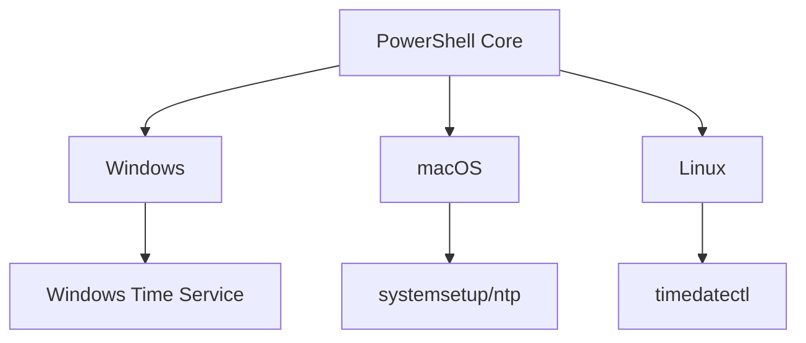
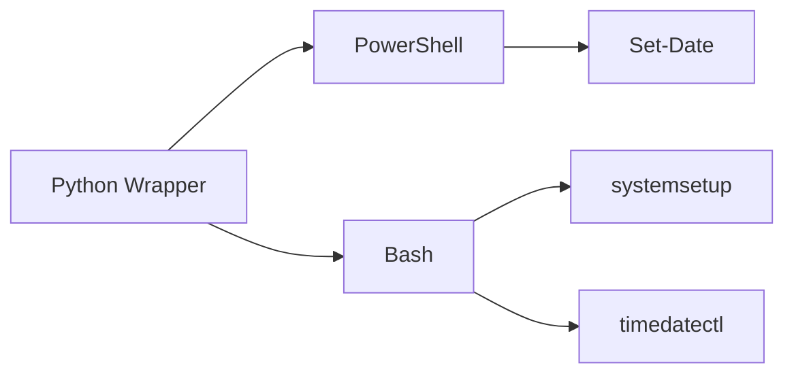
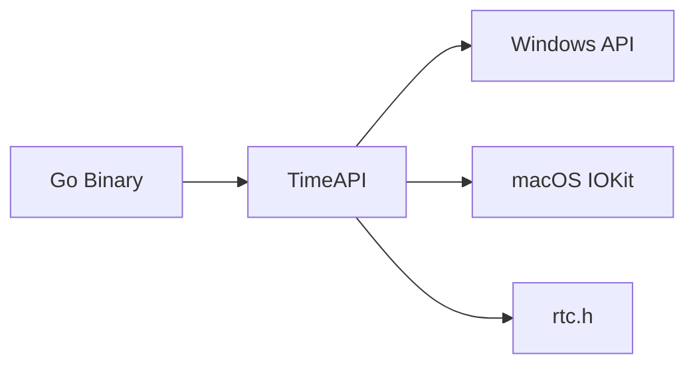
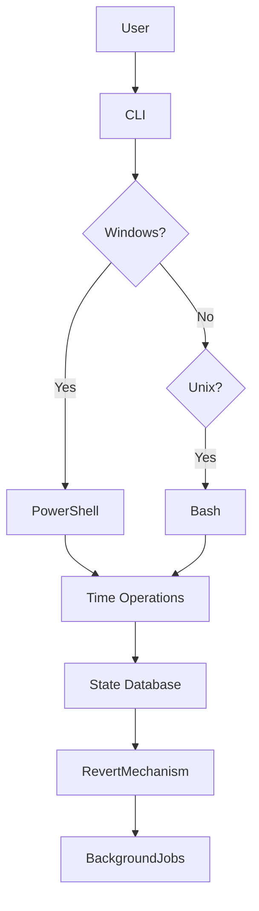
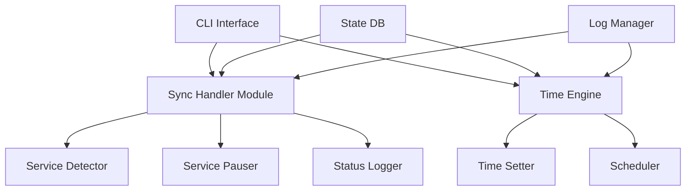
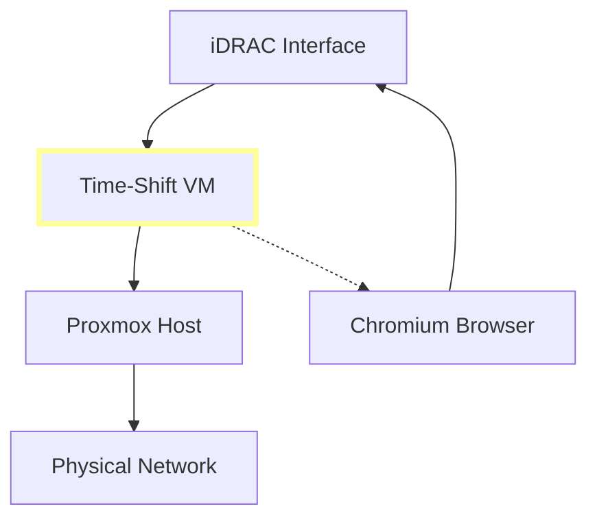
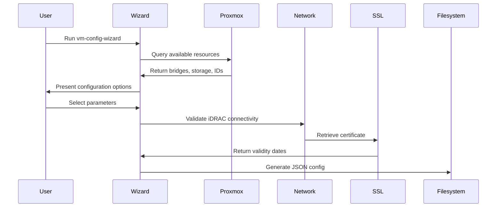
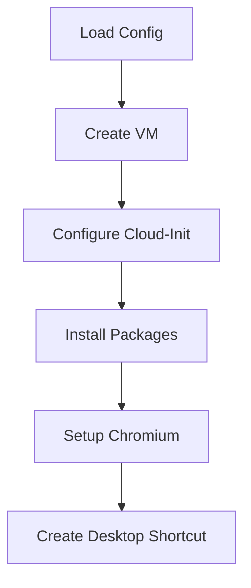
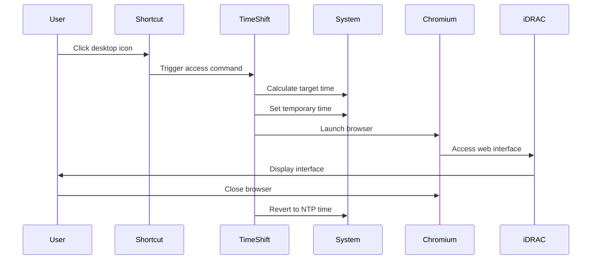

# Working on installing proxmox and my server sitting here waiting for a while now just says GRUB. I attached a screenshot. Is there a key I am supposed to press

Your server is currently stuck at the GRUB prompt after attempting to install Proxmox, as shown in your screenshot[^1_1]. This is not normal—there is no key you are supposed to press at this screen to continue the installation. The GRUB prompt typically means the system cannot find a bootable operating system or the GRUB bootloader is misconfigured or missing.

## What This Means

- The Proxmox installer did not complete successfully, or
- The system is not booting from the correct device, or
- The GRUB bootloader did not install or configure properly[^1_2][^1_3][^1_4][^1_5].

## What You Should Do

**1. Double-check Boot Order**

- Enter your server's BIOS/UEFI settings.
- Make sure the boot order is set to boot from the drive where you installed Proxmox, not the USB installer or another device[^1_3].

**2. Try Reinstalling Proxmox**

- Sometimes, the installation process may not finish correctly, especially if the USB installer is not created properly or if there are compatibility issues.
- Recreate your Proxmox installer USB using a tool like Rufus or balenaEtcher, ensuring you use the correct mode (UEFI or Legacy/BIOS) that matches your server settings[^1_3].
- Boot from the USB and attempt the installation again.

**3. Repair GRUB (Advanced)**
If you want to try repairing rather than reinstalling:

- Boot from the Proxmox ISO and choose a rescue or debug mode[^1_6][^1_7].
- Use the rescue shell to chroot into your installed system and reinstall GRUB. Basic steps:
  - Import your root pool if using ZFS (e.g., `zpool import -f -R /mnt rpool`).
  - Mount necessary filesystems and chroot:

```
mount -o rbind /proc /mnt/proc
mount -o rbind /sys /mnt/sys
mount -o rbind /dev /mnt/dev
mount -o rbind /run /mnt/run
chroot /mnt /bin/bash
```

    - Reinstall GRUB to your boot device (e.g., `grub-install /dev/sda`).
    - Update GRUB config (`update-grub`), then exit and reboot[^1_6][^1_8].

**4. Hardware Considerations**

- Disconnect any drives not needed for the installation to avoid confusion.
- If using RAID controllers or special hardware, ensure drivers and compatibility with Proxmox[^1_9].

## Summary Table

| Symptom                      | Likely Cause                                 | Solution                                     |
| :--------------------------- | :------------------------------------------- | :------------------------------------------- |
| Stuck at GRUB prompt         | Bootloader not installed/configured properly | Reinstall GRUB or Proxmox                    |
| "Welcome to GRUB" only       | Incomplete install or wrong boot device      | Check BIOS boot order, reinstall GRUB        |
| No Proxmox boot option found | Booting from wrong device or config missing  | Set correct boot device in BIOS, repair GRUB |

## Next Steps

- There is no key to continue from this screen.
- Try rebooting and checking your BIOS boot order first.
- If that fails, recreate your installer USB and reinstall Proxmox.
- If you are comfortable, try the GRUB repair steps above.

If you continue to have issues, please provide more details on your hardware and installation steps for more targeted help.

<div style="text-align: center">⁂</div>

[^1_1]: image.jpg
[^1_2]: https://forum.proxmox.com/threads/proxmox-installation-stuck-on-welcome-to-grub.155754/
[^1_3]: https://www.reddit.com/r/Proxmox/comments/1i0fprx/after_proxmox_successful_installation_grub/
[^1_4]: https://forum.proxmox.com/threads/rebooted-proxmox-and-getting-grub-screen-with-no-information.141603/
[^1_5]: https://forum.proxmox.com/threads/stuck-on-welcome-to-grub-after-update.164133/
[^1_6]: http://aroundmyroom.com/2020/10/19/fixing-proxmox-boot-ending-in-grub-prompt-with-zfs-disks/
[^1_7]: https://forum.proxmox.com/threads/stuck-at-grub-screen.147321/
[^1_8]: https://proxmox-openvz.blogspot.com/2015/11/proxmox-boot-failure-missing-proxmox.html
[^1_9]: https://www.reddit.com/r/Proxmox/comments/1k8u608/pve_84_boot_issue_stuck_at_grub_on_reboot/
[^1_10]: https://askubuntu.com/questions/16042/how-to-get-to-the-grub-menu-at-boot-time
[^1_11]: https://www.youtube.com/watch?v=3UMx7P5n91Y

---

# What does my r710 server mean when it says attempting pxe boot? What is pxe?

When your Dell R710 server says "attempting PXE boot," it means the system is trying to boot from the network using a technology called PXE (Preboot Execution Environment). PXE allows a computer to load an operating system over the network instead of from a local hard drive, USB, or CD/DVD. This is commonly used in enterprise environments to deploy operating systems to many machines at once, but it requires a properly configured network server (DHCP and TFTP) to provide the boot files[^2_1][^2_2].

PXE boot works as follows:

- The server sends out a request over the network to find a PXE server.
- If a PXE server is available, it responds and provides the necessary boot files, allowing the server to load an operating system image from the network.
- If no PXE server is found (which is typical on home or small networks), the boot attempt fails, and the system either tries the next device in the boot order or stops[^2_1][^2_3][^2_2].

Your server is likely attempting PXE boot because:

- It cannot find a bootable operating system on the local drives.
- The boot order in the BIOS/UEFI is set to try network boot before other devices.
- The hard drive or RAID array is not properly configured or detected[^2_4].

PXE is not harmful, but unless you have set up a PXE server, it will not let your server boot into an operating system. You can disable PXE boot in the BIOS or change the boot order to prioritize your hard drive or USB installer instead[^2_4][^2_3].

<div style="text-align: center">⁂</div>

[^2_1]: https://pcsite.co.uk/what-is-pxe-boot/
[^2_2]: https://www.techtarget.com/searchnetworking/definition/Preboot-Execution-Environment
[^2_3]: https://www.reddit.com/r/pcmasterrace/comments/ncqmva/can_anyone_explain_to_me_in_laymans_terms_what/
[^2_4]: https://serverfault.com/questions/135813/dell-poweredge-860-always-does-pxe-boot
[^2_5]: image.jpg
[^2_6]: https://www.dell.com/community/en/conversations/poweredge-hardware-general/attempting-pxe-boot-make-it-stop/647f3226f4ccf8a8de865eee
[^2_7]: https://learn.microsoft.com/en-us/troubleshoot/mem/configmgr/os-deployment/understand-pxe-boot
[^2_8]: https://techcommunity.microsoft.com/blog/itopstalkblog/how-does-the-pxe-boot-process-work/888557
[^2_9]: https://blog.sensecodons.com/2016/04/troubleshooting-pxe-boot-problems-on.html
[^2_10]: https://www.cablematters.com/Blog/Networking/pxe-boot-guide
[^2_11]: https://www.youtube.com/watch?v=6eVd1oJh4Q8

---

# Can I setup a pxe server on my proxmox server

Yes, you can definitely set up a PXE server on your Proxmox server. There are several approaches you can take, and the Proxmox community has documented various methods for doing this.

## **VM-Based PXE Server**

The most common and recommended approach is to create a virtual machine on your Proxmox host and install PXE server software on it[^3_1]. You can use Ubuntu Server 20.04 or another Linux distribution as the base for your PXE server VM[^3_1].

## **Network Configuration Options**

When setting up a PXE server on Proxmox, you have two main network configuration choices:

**Option 1: Internal Network Only**

- Create an internal network on your Proxmox PVE that doesn't connect to the internet[^3_1]
- This provides an internal backbone network for your VMs to communicate with each other for PXE purposes[^3_1]
- This approach prevents conflicts with your existing home router's DHCP server[^3_1]

**Option 2: Integrated with Main Network**

- Configure the PXE server to work alongside your existing DHCP infrastructure
- Requires more careful configuration to avoid DHCP conflicts

## **VM Requirements for PXE Booting**

When creating VMs that will boot via PXE on Proxmox, you need to:

- Select "Do not use any media" in the OS menu instead of selecting an ISO[^3_2]
- Configure at least 4 GB of RAM, as downloaded media needs to be stored in RAM before starting[^3_2]
- This is especially important when running live operating systems like EndeavourOS[^3_2]

## **Setting Up the Internal Network**

To create an isolated PXE environment on Proxmox:

1. Set up an internal network that doesn't connect to the internet
2. Configure your PXE server VM to act as both DHCP and TFTP server for this internal network
3. Connect your target VMs to this internal network for PXE booting

This approach allows you to deploy operating systems to VMs using PXE without interfering with your main network infrastructure[^3_1].

The setup provides significant advantages for VM management, allowing you to automate OS deployments and maintain consistent configurations across multiple virtual machines.

<div style="text-align: center">⁂</div>

[^3_1]: https://forum.proxmox.com/threads/setting-up-a-pxe-server-vm.73231/
[^3_2]: https://blog.kail.io/pxe-booting-on-proxmox.html
[^3_3]: https://forum.proxmox.com/threads/install-proxmox-host-via-pxe.108281/
[^3_4]: https://forum.proxmox.com/threads/pxe-install.46488/
[^3_5]: https://www.reddit.com/r/Proxmox/comments/y3t1vq/boot_proxmox_host_from_pxe/
[^3_6]: https://forum.level1techs.com/t/best-easiest-way-to-create-a-pxe-network-boot-server-for-booting-proxmox/193090
[^3_7]: image.jpg
[^3_8]: https://github.com/morph027/pve-iso-2-pxe
[^3_9]: https://forum.proxmox.com/threads/proxmox-installation-via-pxe-solution.8484/
[^3_10]: https://www.youtube.com/watch?v=QFPuxtvvQ1k
[^3_11]: https://github.com/diego021/PXE-boot-environment

---

# find me a script to create a pxe server on my proxmox server

To set up a PXE server on your Proxmox host for network booting, you can use the [`pve-iso-2-pxe.sh`](https://github.com/morph027/pve-iso-2-pxe) script, which converts a Proxmox ISO into PXE-bootable files. Below is a step-by-step guide:

### Step 1: Prepare the Script and ISO

1. **Clone the repository**:
   ```bash
   git clone https://github.com/morph027/pve-iso-2-pxe
   cd pve-iso-2-pxe
   ```
2. **Download the Proxmox ISO** (e.g., `proxmox-ve_8.1.iso`) and place it in the script directory.
3. **Run the script**:
   ```bash
   sudo ./pve-iso-2-pxe.sh /path/to/proxmox-ve_8.1.iso
   ```
   This generates a `pxeboot` directory containing `linux26` (kernel) and `initrd` (initial RAM disk) files[^4_3][^4_5].

### Step 2: Configure PXE Services

#### Option A: iPXE (Recommended)

1. **Host the files** on a web server (e.g., Apache/Nginx):
   ```bash
   cp pxeboot/linux26 pxeboot/initrd /var/www/html/proxmox/8.1/
   ```
2. **Create an iPXE script** (e.g., `proxmox.ipxe`):
   ```ipxe
   #!ipxe
   dhcp
   set serverip http://192.168.1.100  # Replace with your server IP
   set pveversion 8.1
   set opts "vga=791 video=vesafb:ywrap,mtrr ramdisk_size=16777216 rw quiet"
   kernel ${serverip}/proxmox/${pveversion}/linux26 ${opts} splash=silent
   initrd ${serverip}/proxmox/${pveversion}/initrd
   boot
   ```
3. **Serve this script** via your network bootloader[^4_3].

#### Option B: Traditional PXE (Syslinux)

1. **Set up TFTP/DHCP** (e.g., using `dnsmasq`):
   ```bash
   sudo apt install dnsmasq
   ```
2. **Configure `/etc/dnsmasq.conf`**:
   ```ini
   interface=eth0
   dhcp-range=192.168.1.100,192.168.1.200,12h
   dhcp-boot=pxelinux.0
   enable-tftp
   tftp-root=/var/lib/tftpboot
   ```
3. **Copy PXE files**:
   ```bash
   mkdir -p /var/lib/tftpboot/proxmox/8.1
   cp pxeboot/linux26 pxeboot/initrd /var/lib/tftpboot/proxmox/8.1/
   ```
4. **Create a PXE config** (`/var/lib/tftpboot/pxelinux.cfg/default`):
   ```text
   DEFAULT proxmox
   LABEL proxmox
     MENU LABEL Install Proxmox
     KERNEL proxmox/8.1/linux26
     APPEND vga=791 initrd=proxmox/8.1/initrd ramdisk_size=16777216 rw quiet splash=silent
   ```

### Step 3: Boot Clients

- Configure target machines to PXE boot. They will load the Proxmox installer from your server[^4_3][^4_4].

### Key Notes

- **DHCP Conflicts**: Use an isolated network or integrate with your existing DHCP server carefully[^4_3].
- **Debugging**: For installation issues, add `proxdebug` to the kernel options in your PXE config[^4_3][^4_5].
- **Automation**: Combine with Proxmox’s [automated installation](https://pve.proxmox.com/wiki/Automated_Installation) for unattended setups using answer files[^4_2].

This method streamlines deploying Proxmox or VMs via PXE. For full automation, extend with tools like Ansible[^4_2][^4_3].

<div style="text-align: center">⁂</div>

[^4_1]: https://forum.proxmox.com/threads/install-proxmox-host-via-pxe.108281/
[^4_2]: https://pve.proxmox.com/wiki/Automated_Installation
[^4_3]: https://github.com/morph027/pve-iso-2-pxe
[^4_4]: https://forum.proxmox.com/threads/proxmox-installation-via-pxe-solution.8484/
[^4_5]: https://forum.proxmox.com/threads/pxe-install.46488/
[^4_6]: https://forum.proxmox.com/threads/auto-install-through-pxe.146270/
[^4_7]: https://forum.proxmox.com/tags/pxe/
[^4_8]: https://forum.proxmox.com/threads/setting-up-a-pxe-server-vm.73231/
[^4_9]: https://tteck.github.io/Proxmox/
[^4_10]: https://www.youtube.com/watch?v=G5BhQqRLN4A

---

# says git command not found

Your system is saying `git: command not found` because Git is not currently installed, or it's not available in your system's PATH[^5_1][^5_2][^5_3]. On a Proxmox server (which is based on Debian/Ubuntu), you can install Git easily.

## How to Install Git on Proxmox (Debian/Ubuntu)

Open your Proxmox shell and run:

```bash
sudo apt update
sudo apt install git
```

After installation, verify it works by running:

```bash
git --version
```

You should see the installed Git version[^5_2][^5_1].

Once Git is installed, you can proceed with cloning repositories or running scripts that require Git.

<div style="text-align: center">⁂</div>

[^5_1]: https://www.reddit.com/r/Proxmox/comments/1eysjzg/proxmox_shell_commands/
[^5_2]: https://graphite.dev/guides/how-to-install-git-on-linux
[^5_3]: https://graphite.dev/guides/git-not-recognized-windows
[^5_4]: https://stackoverflow.com/questions/4492979/error-git-is-not-recognized-as-an-internal-or-external-command
[^5_5]: https://unix.stackexchange.com/questions/68070/git-command-not-found
[^5_6]: https://askubuntu.com/questions/1455916/git-installed-but-still-gets-command-not-found
[^5_7]: https://superuser.com/questions/568964/git-command-not-found-windows
[^5_8]: https://iqss.github.io/git_guide/install_git.html
[^5_9]: https://www.youtube.com/watch?v=PLQQ3tJwBJg
[^5_10]: https://www.youtube.com/watch?v=yeE74Q3ZGMg

---

# which option is most compatible with my older server being an r710

For your Dell PowerEdge R710, **Legacy BIOS mode is the most compatible and reliable option for PXE booting and general server operation**[^6_1][^6_2][^6_3]. Here’s why:

- **Legacy BIOS is the default and best-supported mode for 11th-generation Dell servers like the R710**. Most PXE boot tools, installers, and OS images are designed to work seamlessly with BIOS/MBR, and Dell’s documentation and user experiences confirm this[^6_1][^6_2].
- **UEFI boot on the R710 is limited and often problematic**. While the R710 technically has some support for UEFI, it is not fully featured, and users report issues with UEFI PXE booting and OS installs, especially with newer operating systems[^6_4][^6_5]. Dell’s own documentation notes that reliable UEFI PXE and advanced features like HTTP boot are only fully supported on 14th-generation servers and newer[^6_5].
- **Community experience confirms Legacy PXE works well on the R710**. Multiple users report successful PXE booting and OS installs using Legacy BIOS mode, while UEFI attempts often fail or require complex workarounds[^6_1][^6_6][^6_2][^6_3].

**Recommendation:**

- Set your R710 to use **Legacy BIOS mode** (not UEFI) in the BIOS setup.
- Use PXE boot with a standard TFTP server and legacy boot files (like `undionly.kpxe` or `pxelinux.0`).
- If you’re creating bootable USBs or installation media, use the MBR partition scheme for maximum compatibility[^6_1].

**Summary Table**

| Option          | Compatibility with R710 | Notes                                                    |
| --------------- | ----------------------- | -------------------------------------------------------- |
| Legacy BIOS PXE | Excellent               | Most reliable, best community and vendor support         |
| UEFI PXE        | Limited/Problematic     | Not fully supported, often fails or requires workarounds |

**Bottom line:**  
**Always use Legacy BIOS mode for PXE and OS installs on your R710.** This ensures the highest compatibility and smoothest experience[^6_1][^6_2][^6_3].

<div style="text-align: center">⁂</div>

[^6_1]: https://www.reddit.com/r/homelab/comments/115bk2b/dell_r710_newbe/
[^6_2]: https://virtuallymikebrown.com/2011/11/09/vsphere-5-best-practices-dell-poweredge-r710-bios/
[^6_3]: https://forums.fogproject.org/topic/13663/getting-dells-to-pxe-boot-with-uefi
[^6_4]: https://www.dell.com/community/en/conversations/poweredge-os-forum/pe-r710-and-uefi-boot/647f42f9f4ccf8a8deac9cc9
[^6_5]: https://downloads.dell.com/manuals/common/dellemc-boot-mode-bios-uefi.pdf
[^6_6]: https://serverfault.com/questions/728767/how-to-debug-failed-ubuntu-15-04-pxe-install-on-dell-r710
[^6_7]: https://i.dell.com/sites/doccontent/business/solutions/engineering-docs/en/Documents/server-poweredge-r710-tech-guidebook.pdf
[^6_8]: https://downloads.dell.com/manuals/all-products/esuprt_ser_stor_net/esuprt_poweredge/poweredge-r710_owner's%20manual_en-us.pdf
[^6_9]: https://www.dell.com/support/kbdoc/en-us/000176910/how-to-boot-into-the-bios-or-the-lifecycle-controller-on-your-poweredge-server
[^6_10]: https://www.dell.com/support/kbdoc/en-us/000131551/bios-settings-to-allow-pxe-boot-on-newer-model-dell-latitude-laptops
[^6_11]: https://www.cleverence.com/articles/tech-blog/legacy-bios-pxe-boot-vs-uefi-what-you-need-to-know/
[^6_12]: https://www.dell.com/support/kbdoc/en-us/000130160/how-to-install-the-operating-system-on-a-dell-poweredge-server-os-deployment
[^6_13]: https://www.dell.com/community/en/conversations/desktops-general-locked-topics/pxe-boot-over-uefi-not-supported-on-any-dell-optiplex/647f253df4ccf8a8de96ca55
[^6_14]: https://github.com/PartialVolume/shredos.x86_64/discussions/148
[^6_15]: https://infohub.delltechnologies.com/l/server-configuration-profiles-reference-guide/preboot-execution-environment-pxe-1/
[^6_16]: https://www.dell.com/community/en/conversations/poweredge-hardware-general/how-to-enable-pxe-for-extarnal-nic-intel-82576/647f2616f4ccf8a8dea6307b
[^6_17]: https://serverfault.com/questions/1004597/installing-dell-r710-from-scratch

---

# i don't have a /var/lib/tftpboot folder, I don't think you gave me the steps for installing the tftp server

You are correct—I did not provide the full steps for installing the TFTP server or creating the `/var/lib/tftpboot` directory. Here’s how to set up a TFTP server on your Proxmox (Debian-based) system:

## **Step-by-Step: Install and Configure TFTP Server**

**1. Install the TFTP Server**

Open a terminal and run:

```bash
sudo apt update
sudo apt install tftpd-hpa
```

This installs the enhanced TFTP daemon (`tftpd-hpa`), which is recommended for most setups[^7_1][^7_2].

**2. Create the TFTP Root Directory**

By default, TFTP uses `/var/lib/tftpboot` as its root directory. Create it if it doesn’t exist:

```bash
sudo mkdir -p /var/lib/tftpboot
sudo chown -R tftp:tftp /var/lib/tftpboot
sudo chmod -R 755 /var/lib/tftpboot
```

**3. Configure the TFTP Server**

Edit the configuration file:

```bash
sudo nano /etc/default/tftpd-hpa
```

Set it up like this (modify if needed):

```
TFTP_USERNAME="tftp"
TFTP_DIRECTORY="/var/lib/tftpboot"
TFTP_ADDRESS="0.0.0.0:69"
TFTP_OPTIONS="--secure"
```

Save and exit.

**4. Restart the TFTP Service**

Apply your changes:

```bash
sudo systemctl restart tftpd-hpa
sudo systemctl enable tftpd-hpa
```

**5. (Optional) Test the TFTP Server**

You can test uploads/downloads from another machine using a TFTP client:

```bash
sudo apt install tftp-hpa
tftp <your_server_ip>
tftp> get testfile.txt
tftp> put testfile.txt
```

If the transfers work, your TFTP server is ready[^7_1][^7_2].

Now you can place your PXE boot files into `/var/lib/tftpboot` and continue with your PXE setup.

<div style="text-align: center">⁂</div>

[^7_1]: https://www.tecmint.com/install-tftp-server-on-ubuntu-debian/
[^7_2]: https://reintech.io/blog/installing-configuring-tftp-server-debian-12
[^7_3]: https://docs.oracle.com/en/operating-systems/oracle-linux/6/install/ol-pxe-boot.html
[^7_4]: https://www.reddit.com/r/homelab/comments/st3bji/proxmox_zfs_pxe_booting_with_grub_for_bios_systems/
[^7_5]: https://forum.proxmox.com/threads/proxmox-installation-via-pxe-solution.8484/
[^7_6]: https://forum.proxmox.com/tags/tftp/
[^7_7]: https://forum.proxmox.com/threads/tftp-hpa-in-container.105919/
[^7_8]: https://askubuntu.com/questions/201505/how-do-i-install-and-run-a-tftp-server
[^7_9]: https://std.rocks/gnulinux_tftp.html
[^7_10]: https://documentation.commvault.com/11.38/expert/pxe_boot_configuration_1_touch_for_linux.html

---

# i am logged in as root so you don't need to include the sudo command in the scripts

Thank you for letting me know! Here are the updated, root-user-friendly steps to install and configure a TFTP server on your Proxmox system:

## **Install and Configure TFTP Server (as root)**

### 1. Install the TFTP Server

```bash
apt update
apt install tftpd-hpa
```

### 2. Create the TFTP Root Directory

```bash
mkdir -p /var/lib/tftpboot
chown -R tftp:tftp /var/lib/tftpboot
chmod -R 755 /var/lib/tftpboot
```

### 3. Configure the TFTP Server

Edit the configuration file:

```bash
nano /etc/default/tftpd-hpa
```

Set it as follows:

```
TFTP_USERNAME="tftp"
TFTP_DIRECTORY="/var/lib/tftpboot"
TFTP_ADDRESS="0.0.0.0:69"
TFTP_OPTIONS="--secure"
```

Save and exit (`Ctrl+O`, `Enter`, `Ctrl+X`).

### 4. Restart and Enable the TFTP Service

```bash
systemctl restart tftpd-hpa
systemctl enable tftpd-hpa
```

You can now place your PXE boot files into `/var/lib/tftpboot`.  
If you need further help with PXE configuration or DHCP setup, just ask!

---

# I got this error

The error message:

```
cp: cannot create regular file '/var/lib/tftpboot/proxmox/8.1/': No such file or directory
```

means that the directory `/var/lib/tftpboot/proxmox/8.1/` does not exist yet. The `cp` command cannot copy files into a directory that hasn't been created.

## How to Fix

1. **Create the missing directories first:**

```bash
mkdir -p /var/lib/tftpboot/proxmox/8.1/
```

2. **Then copy the file again:**

```bash
cp pxeboot/linux26 /var/lib/tftpboot/proxmox/8.1/
```

Repeat the same process for any other files (such as `initrd`) you need to copy into that directory.

## Summary

- Always ensure the full destination path exists before copying files into it.
- Use `mkdir -p` to create any missing parent directories in one step.

Once the files are in place, you can proceed with your PXE configuration.

<div style="text-align: center">⁂</div>

[^9_1]: image.jpg

---

# Walk me through this step from your earlier response "4. Create a PXE config (`/var/lib/tftpboot/pxelinux.cfg/default`):"

Here’s a step-by-step walkthrough to create a PXE configuration file at `/var/lib/tftpboot/pxelinux.cfg/default` for your PXE setup:

## **1. Create the Configuration Directory**

First, make sure the directory exists:

```bash
mkdir -p /var/lib/tftpboot/pxelinux.cfg
```

This ensures the PXE configuration folder is in place[^10_1][^10_2].

## **2. Create the Default PXE Config File**

Now, create the `default` configuration file inside that directory:

```bash
nano /var/lib/tftpboot/pxelinux.cfg/default
```

## **3. Add a Basic PXE Boot Menu**

Paste the following sample configuration into the file. This example assumes you have your Proxmox kernel (`linux26`) and initrd (`initrd`) in `/var/lib/tftpboot/proxmox/8.1/`:

```text
DEFAULT proxmox
PROMPT 1
TIMEOUT 100
MENU TITLE Proxmox PXE Boot

LABEL proxmox
  MENU LABEL Install Proxmox VE 8.1
  KERNEL proxmox/8.1/linux26
  APPEND initrd=proxmox/8.1/initrd ramdisk_size=16777216 rw quiet splash=silent
```

- `DEFAULT proxmox` sets the default boot option.
- `LABEL proxmox` defines a menu entry.
- `KERNEL` and `APPEND` specify the kernel and initrd paths (relative to your TFTP root), and any boot parameters[^10_1][^10_3][^10_2].

Save and exit (`Ctrl+O`, `Enter`, then `Ctrl+X`).

## **4. (Optional) Add More Boot Options**

You can add more `LABEL` sections for other installers, rescue systems, or tools as needed[^10_1][^10_3][^10_2].

## **5. Confirm File Placement**

Your file structure should now look like:

```
/var/lib/tftpboot/
  ├── proxmox/8.1/linux26
  ├── proxmox/8.1/initrd
  └── pxelinux.cfg/default
```

## **6. Next Steps**

- Make sure you have `pxelinux.0` (from the syslinux package) in your TFTP root.
- Configure your DHCP server to point PXE clients to `pxelinux.0`.
- Boot a client via PXE to test the menu.

This setup will present a simple boot menu to PXE clients, allowing them to start the Proxmox installer over the network[^10_1][^10_2]. If you need more advanced menus or troubleshooting, you can expand the config file as needed.

<div style="text-align: center">⁂</div>

[^10_1]: https://docs.redhat.com/en/documentation/red_hat_enterprise_linux/6/html/installation_guide/s1-netboot-pxe-config
[^10_2]: https://www.hpc.temple.edu/mhpc/hpc-technology/exercise2/pxelinux.html
[^10_3]: https://www.fefe.de/netboot/how-to-netboot-installer.html
[^10_4]: https://askubuntu.com/questions/445653/how-to-configure-pxelinux-cfg-default-properly-in-order-to-install-ubuntu-from-n
[^10_5]: https://docs.oracle.com/html/E50247_08/vmiug-install-pxe-pxelinux.html
[^10_6]: https://docs.oracle.com/cd/E20815_01/html/E20821/gjqeh.html
[^10_7]: https://serverfault.com/questions/810083/defining-a-new-location-for-syslinux-configuration-files-when-setting-up-pxelinu
[^10_8]: https://www.synoforum.com/resources/how-to-pxe-boot-linux-windows-using-syslinux.115/
[^10_9]: https://documentation.commvault.com/11.38/expert/pxe_boot_configuration_1_touch_for_linux.html
[^10_10]: https://wiki.syslinux.org/wiki/index.php?title=PXELINUX

---

# i don't have the initrd file you never gave me instructions for creating that

Great catch! The `initrd` (initial RAM disk) file is essential for PXE booting an installer like Proxmox. Here’s how you can extract both the kernel (`linux26`) and `initrd` from your Proxmox ISO so you can use them in your PXE environment.

## **How to Extract `linux26` and `initrd` from the Proxmox ISO**

### **1. Mount the Proxmox ISO**

Assume your ISO is named `proxmox-ve_8.1.iso` and is in your home directory. First, create a mount point and mount the ISO:

```bash
mkdir /mnt/pveiso
mount -o loop /root/proxmox-ve_8.1.iso /mnt/pveiso
```

### **2. Locate the Kernel and Initrd Files**

Navigate to the `boot` directory inside the mounted ISO:

```bash
ls /mnt/pveiso/boot/
```

You should see files like `linux26` (the kernel) and `initrd.img` or `initrd` (the initial RAM disk).

### **3. Copy the Files to Your TFTP Directory**

Create the destination directory if you haven't already:

```bash
mkdir -p /var/lib/tftpboot/proxmox/8.1/
```

Now copy the files:

```bash
cp /mnt/pveiso/boot/linux26 /var/lib/tftpboot/proxmox/8.1/
cp /mnt/pveiso/boot/initrd.img /var/lib/tftpboot/proxmox/8.1/initrd
```

> **Note:** Some Proxmox ISOs may name the initrd file `initrd.img` or just `initrd`. For consistency, copy it as `initrd` in your TFTP directory.

### **4. Unmount the ISO (Optional)**

Once you’ve copied the files, unmount the ISO:

```bash
umount /mnt/pveiso
rmdir /mnt/pveiso
```

## **Summary Table**

| Source File on ISO            | Destination in TFTP Boot Directory      |
| ----------------------------- | --------------------------------------- |
| `/mnt/pveiso/boot/linux26`    | `/var/lib/tftpboot/proxmox/8.1/linux26` |
| `/mnt/pveiso/boot/initrd.img` | `/var/lib/tftpboot/proxmox/8.1/initrd`  |

Now you have both the `linux26` and `initrd` files in the correct location for your PXE setup.  
If you need to extract these files from a different ISO or have trouble finding them, just let me know!

---

# okay that's all done, so how do I use this pve server to install proxmox on my r710 server?

To use your Proxmox PXE server to install Proxmox on your Dell PowerEdge R710, follow these steps:

### **1. Configure DHCP for PXE Booting**

Add these options to your DHCP server (e.g., `dnsmasq` or router DHCP settings):

```ini
# For Legacy BIOS PXE (required for R710)
dhcp-boot=pxelinux.0
next-server=<PXE_SERVER_IP>  # Replace with your Proxmox server's IP
```

### **2. Prepare the R710 for PXE Boot**

1. Power on the R710 and press **F2** to enter System Setup.
2. Navigate to **Boot Settings**:
   - Set **Boot Mode** to **Legacy BIOS** (required for R710 compatibility).
   - Move **Network** to the top of the boot order.
3. Save changes and exit.

### **3. Start the Installation**

1. Reboot the R710. It will automatically load the PXE menu from your Proxmox server.
2. Select **Install Proxmox VE 8.1** from the PXE menu.
3. Follow the on-screen Proxmox installer prompts:
   - **Disk selection**: Choose your RAID array (e.g., `/dev/sda`).
   - **Network configuration**: Assign a static IP to the R710.
   - **Timezone/Password**: Set your preferences.

### **4. Post-Installation (Optional)**

- **Remove subscription notice** (if desired):
  ```bash
  sed -i "s/data.status !== 'Active'/false/g" /usr/share/javascript/proxmox-widget-toolkit/proxmoxlib.js
  systemctl restart pveproxy
  ```
- **Update packages**:
  ```bash
  apt update && apt dist-upgrade
  ```

### **Troubleshooting R710-Specific Issues**

- If PXE boot fails:
  1. Check cable connections (use dedicated iDRAC port if available).
  2. Disable **UEFI Network Stack** in BIOS (R710 works best with Legacy BIOS).
  3. Verify TFTP paths in `/var/lib/tftpboot/pxelinux.cfg/default` match your setup.
- If installation hangs:
  - Add `proxdebug` to the kernel options in your PXE config for verbose logs.

### **Alternative: iDRAC Virtual Media**

If PXE is unreliable, use the R710's iDRAC:

1. Mount the Proxmox ISO via iDRAC's **Virtual Media**.
2. Boot from the virtual CD/DVD.
3. Install normally (no network boot required).

For visual guidance, see this [R710 Proxmox installation video](https://www.youtube.com/watch?v=9z3wfVoGkc0)[^12_1].

<div style="text-align: center">⁂</div>

[^12_1]: https://www.youtube.com/watch?v=tASVYJg6qQk
[^12_2]: https://www.reddit.com/r/homelab/comments/4lwikx/installing_proxmox_on_dell_r710/
[^12_3]: https://github.com/morph027/pve-iso-2-pxe
[^12_4]: https://phoenixnap.com/kb/install-proxmox
[^12_5]: https://www.youtube.com/watch?v=9z3wfVoGkc0
[^12_6]: https://www.youtube.com/watch?v=cGMgeSlHn6o
[^12_7]: https://www.youtube.com/playlist?list=PLO6KswO64zVtgbN2h5RdGOAYrKi_rRYLb
[^12_8]: https://forum.proxmox.com/threads/install-proxmox-host-via-pxe.108281/
[^12_9]: https://www.youtube.com/watch?v=6eVd1oJh4Q8
[^12_10]: https://forums.unraid.net/topic/108831-no-internet-on-boot-installation-poweredge-r620/
[^12_11]: https://forum.proxmox.com/threads/dell-r710-graphical-and-terminal-ui-both-installation-aborted-cannot-load-web-interface-on-terminal-ui-installation-w-e-nomodeset.147123/
[^12_12]: https://www.reddit.com/r/homelab/comments/umw6b8/dell_r710_booting_proxmox_input_not_supported_and/
[^12_13]: https://forum.proxmox.com/threads/installation-problem-for-pve-8-2-on-dell-r710.146969/
[^12_14]: https://forum.proxmox.com/threads/6-3-1-on-dell-r710-not-booting-grub-lvmid-not-found.80168/
[^12_15]: https://forum.proxmox.com/threads/how-to-install-proxmox-on-pcie-nvme-disk-when-bios-cant-boot-from-it-sd-card.29909/

---

# you had me do apt install dnsmasq earlier but what is the file path I am supposed to put those ini settings into?

You should put your `dnsmasq` DHCP and PXE configuration settings in the main configuration file:

```
/etc/dnsmasq.conf
```

This is the standard location on Debian-based systems (including Proxmox), and it is read first at startup[^13_1][^13_2][^13_3][^13_4].

Alternatively, you can create a new file with a `.conf` extension in the directory:

```
/etc/dnsmasq.d/
```

Files in this directory are also loaded as configuration fragments by `dnsmasq`[^13_2].

**Most common and straightforward:**  
Edit `/etc/dnsmasq.conf` directly.

**Example:**

```ini
# /etc/dnsmasq.conf
dhcp-range=192.168.1.100,192.168.1.200,12h
dhcp-boot=pxelinux.0
enable-tftp
tftp-root=/var/lib/tftpboot
# Set this to the IP of your PXE server
# (dnsmasq will use its own IP by default)
# next-server=192.168.1.10
```

After editing, restart dnsmasq to apply changes:

```bash
systemctl restart dnsmasq
```

**Summary:**

- Use `/etc/dnsmasq.conf` for your main settings[^13_1][^13_2][^13_3][^13_4].
- Or, use a custom `.conf` file in `/etc/dnsmasq.d/`[^13_2].
- Always restart the service after changes.

You can check your configuration for syntax errors with:

```bash
dnsmasq --test
```

If it says `dnsmasq: syntax check OK`, you’re good to go[^13_1][^13_4].

<div style="text-align: center">⁂</div>

[^13_1]: https://www.linux.com/topic/networking/advanced-dnsmasq-tips-and-tricks/
[^13_2]: https://github.com/liquidm/dnsmasq/blob/master/debian/readme
[^13_3]: https://fedoramagazine.org/dnsmasq-provide-dns-dhcp-services/
[^13_4]: https://wiki.archlinux.org/title/Dnsmasq
[^13_5]: https://www.linuxquestions.org/questions/linux-newbie-8/dnsmasq-config-file-4175627914/
[^13_6]: https://discourse.pi-hole.net/t/where-are-the-actual-dnsmasq-config-files/36165
[^13_7]: https://thekelleys.org.uk/dnsmasq/docs/dnsmasq-man.html
[^13_8]: https://docs.fedoraproject.org/en-US/fedora-server/administration/dnsmasq/
[^13_9]: https://xdaforums.com/t/dnsmasq-conf-location.3750897/
[^13_10]: https://iomarmochtar.wordpress.com/2015/01/24/mx-record-configuration-in-dnsmasq/

---

# i got this error after editting the dnsmasq.conf file with the changes you recommended

The error message in your screenshot indicates that the `dnsmasq` service failed to start after editing its configuration. This is a common issue, often caused by:

- Syntax errors in the config file
- Invalid or conflicting DHCP ranges
- The network interface not having an IP in the DHCP range
- Another service (like another DHCP or DNS server) already using the same port[^14_1][^14_2][^14_3][^14_4][^14_5]

## Troubleshooting Steps

### 1. **Check the Status and Logs**

Run the following to get more details about the error:

```bash
systemctl status dnsmasq.service
journalctl -xeu dnsmasq.service
```

Look for lines indicating what went wrong (e.g., "bad dhcp-range", "cannot assign requested address", or "address already in use").

### 2. **Verify Your Configuration**

Open your `/etc/dnsmasq.conf` and check for common mistakes:

- Make sure your `dhcp-range` matches the IP subnet of your server’s network interface[^14_5].
- If you specified an `interface=` line, ensure it matches your actual network interface name.
- If you specified `listen-address=`, ensure your server actually has that IP assigned.

**Sample minimal config for a typical home/lab network:**

```ini
interface=eth0               # Replace eth0 with your actual network interface
dhcp-range=192.168.1.100,192.168.1.200,12h
dhcp-boot=pxelinux.0
enable-tftp
tftp-root=/var/lib/tftpboot
```

- Make sure your server’s interface (e.g., eth0) has an IP in the `192.168.1.x` range.

### 3. **Check for Port Conflicts**

If another DHCP or DNS server is running (like `systemd-resolved` or another DHCP server), it can block `dnsmasq` from starting[^14_4][^14_6].

- Check running services:
  ```bash
  netstat -tulnp | grep :67
  netstat -tulnp | grep :53
  ```
- Stop/disable conflicting services if needed.

### 4. **Restart the Interface**

If your network interface does not have an IP in the DHCP range, assign one and restart the interface:

```bash
ip a              # Check your IP addresses
ip addr add 192.168.1.10/24 dev eth0   # Example: assign an IP if needed
```

Or, bring it up if it’s down:

```bash
ip link set eth0 up
```

### 5. **Test Configuration**

Test your config for syntax errors:

```bash
dnsmasq --test
```

If it says `dnsmasq: syntax check OK`, try restarting the service again:

```bash
systemctl restart dnsmasq
```

**Summary Table of Common Causes**

| Cause                 | Solution                                          |
| --------------------- | ------------------------------------------------- |
| Bad dhcp-range syntax | Use correct format, ensure it matches your subnet |
| Interface missing IP  | Assign correct IP to interface                    |
| Port already in use   | Stop conflicting DHCP/DNS services                |
| Config syntax error   | Run `dnsmasq --test` and fix issues               |

If you share the contents of your `/etc/dnsmasq.conf` and the output of `systemctl status dnsmasq.service`, I can provide more targeted help.

<div style="text-align: center">⁂</div>

[^14_1]: https://superuser.com/questions/684485/dnsmasq-fails-to-start-on-boot-ubuntu-13-10
[^14_2]: https://serverfault.com/questions/763541/dnsmasq-failed-to-restart
[^14_3]: https://discourse.pi-hole.net/t/dnsmasq-failed-bad-dhcp-range/7001
[^14_4]: https://forums.fogproject.org/topic/17668/dnsmasq-issue
[^14_5]: https://bbs.archlinux.org/viewtopic.php?id=219092
[^14_6]: https://serverfault.com/questions/1129993/dnsmasq-dhcp-server-not-responding
[^14_7]: image.jpg
[^14_8]: https://bbs.archlinux.org/viewtopic.php?id=255534
[^14_9]: https://serverfault.com/questions/934066/failed-to-start-dnsmasq-a-lightweight-dhcp-and-caching-dns-server
[^14_10]: https://askubuntu.com/questions/1525523/dnsmasq-failed-to-start-following-update-to-ubuntu-server-24-04-1-from-22-04
[^14_11]: https://forums.raspberrypi.com/viewtopic.php?t=250168
[^14_12]: https://askubuntu.com/questions/500162/how-do-i-restart-dnsmasq
[^14_13]: https://superuser.com/questions/894513/resolv-conf-keeps-getting-overwritten-when-dnsmasq-is-restarted-breaking-dnsmas
[^14_14]: https://discourse.pi-hole.net/t/when-i-try-to-restart-the-dnsmasq-im-getting-error/22291
[^14_15]: https://stackoverflow.com/questions/51976913/dnsmasq-fails-to-start-every-time-i-reboot-my-vps
[^14_16]: https://www.reddit.com/r/pihole/comments/yo5h8b/dnsmasq_warnings_when_enabling_pihole_dhcp_server/
[^14_17]: https://github.com/NethServer/dev/issues/5208
[^14_18]: https://forum.openwrt.org/t/dhcp-doesnt-work-anymore-when-router-ip-is-inside-dhcp-range/166539
[^14_19]: https://docs.fedoraproject.org/en-US/fedora-server/administration/dnsmasq/
[^14_20]: https://www.linux.com/topic/networking/dns-and-dhcp-dnsmasq/
[^14_21]: https://groups.google.com/g/beagleboard/c/8AglOo7pl5M

---

# how do i find the ip subnet of my servers network interface

To find the IP subnet of your server’s network interface, you can use the `ip` command, which is the modern and recommended tool on Linux systems[^15_1][^15_2][^15_3][^15_4][^15_5].

### **Step-by-Step Instructions**

1. **Open a terminal** on your server.

2. **List all network interfaces and their IP addresses:**

   ```bash
   ip a
   ```

   or

   ```bash
   ip addr
   ```

3. **Find your active interface** (commonly `eth0`, `enp2s0`, or similar for wired, `wlo1` for wireless). Look for the line starting with `inet` under the interface you’re using.  
   Example output:

   ```
   2: eth0: <BROADCAST,MULTICAST,UP,LOWER_UP> mtu 1500 ...
       inet 192.168.1.10/24 brd 192.168.1.255 scope global eth0
   ```

4. **Interpret the result:**

   - The IP address is `192.168.1.10`
   - The subnet is `/24`, which means `255.255.255.0`
   - So, the subnet for this interface is `192.168.1.0/24`

5. **Alternative: Show just one interface (replace `eth0` with your interface name):**

   ```bash
   ip addr show eth0
   ```

   or for IPv4 only:

   ```bash
   ip -4 addr show eth0
   ```

6. **Quickest way to see all assigned IPv4 addresses:**
   ```bash
   hostname -I
   ```
   This will list all IPv4 addresses assigned to your server[^15_3][^15_5].

**Summary:**

- Use `ip a` to see all interfaces and subnets.
- Look for the `inet` line under your active interface.
- The subnet is shown after the `/`, e.g., `/24` for `255.255.255.0`[^15_1][^15_2][^15_3][^15_4][^15_5].

If you’re unsure which interface to use, look for one with an IP address in the same range as your network.

Let me know if you need help interpreting your specific output!

<div style="text-align: center">⁂</div>

[^15_1]: https://www.ionos.com/digitalguide/hosting/technical-matters/get-linux-ip-address/
[^15_2]: https://serverfault.com/questions/195273/how-can-i-display-the-ip-address-of-an-interface
[^15_3]: https://tech.rochester.edu/tutorials/finding-your-linux-ip-address/
[^15_4]: https://www.techtarget.com/searchdatacenter/tutorial/How-to-check-an-IP-address-in-Linux
[^15_5]: https://www.linuxtrainingacademy.com/determine-public-ip-address-command-line-curl/
[^15_6]: https://askubuntu.com/questions/1443572/how-to-get-the-ip-address-without-ifconfig-or-ip-command-in-ubuntu
[^15_7]: https://phoenixnap.com/kb/linux-ip-command-examples
[^15_8]: https://stackoverflow.com/questions/37199871/find-network-interface-by-ip-address-linux-bash
[^15_9]: https://www.linode.com/docs/guides/how-to-use-the-linux-ip-command/

---

# this is what i found using 'ip a' in the attached image. Tell me what my dnsmasq.conf settings should be based on this

Based on your screenshot, your server’s network interface is `vmbr0` with the IP address **192.168.1.202/24**. This means your subnet is **192.168.1.0/24** (or netmask 255.255.255.0).

Here’s what your `dnsmasq.conf` settings should look like for PXE booting on this network:

```ini
interface=vmbr0
dhcp-range=192.168.1.100,192.168.1.200,12h
dhcp-boot=pxelinux.0
enable-tftp
tftp-root=/var/lib/tftpboot
```

**Explanation:**

- `interface=vmbr0` tells dnsmasq to listen on your active bridge interface.
- `dhcp-range=192.168.1.100,192.168.1.200,12h` assigns DHCP addresses in the range 192.168.1.100–192.168.1.200 for 12 hours.
- `dhcp-boot=pxelinux.0` points PXE clients to your bootloader.
- `enable-tftp` and `tftp-root=/var/lib/tftpboot` enable and set the TFTP server root directory.

**After editing, restart dnsmasq:**

```bash
systemctl restart dnsmasq
```

This configuration will allow devices on your 192.168.1.0/24 network to PXE boot from your Proxmox server at 192.168.1.202[^16_1].

<div style="text-align: center">⁂</div>

[^16_1]: image.jpg

---

# give me a command that wil grep out only the non commented out lines in the dnsmasq.conf file

To display only the non-commented, non-empty lines in your `dnsmasq.conf` file, use:

```bash
grep -v '^\s*#' /etc/dnsmasq.conf | grep -v '^\s*$'
```

- The first `grep -v '^\s*#'` removes lines starting with a `#` (comments), even if preceded by spaces.
- The second `grep -v '^\s*$'` removes empty or whitespace-only lines[^17_2][^17_5].

This will show you just the active configuration lines.

<div style="text-align: center">⁂</div>

[^17_1]: https://stackoverflow.com/questions/67110854/how-do-i-grep-for-a-word-and-then-uncomment-that-line-only-if-its-commented
[^17_2]: https://unix.stackexchange.com/questions/337911/is-there-a-way-to-show-only-uncommented-lines-in-a-text-file-script
[^17_3]: https://help.salesforce.com/s/articleView?id=002330982&language=en_US&type=1
[^17_4]: https://superuser.com/questions/681601/verify-dnsmasq-configuration
[^17_5]: https://lists.thekelleys.org.uk/pipermail/dnsmasq-discuss/2011q2/005015.html
[^17_6]: https://wiki.archlinux.org/title/Dnsmasq
[^17_7]: https://www.reddit.com/r/pihole/comments/aeqq3d/blanked_out_dnsmasqconf_file_after_pihole_upgrade/
[^17_8]: https://discourse.pi-hole.net/t/dnsmasq-dhcp-script-option-not-working/37671
[^17_9]: https://forum.archive.openwrt.org/viewtopic.php?id=6395

---

# here i have the output showing my dnsmasq.conf settings and the error i am still getting

Your `dnsmasq.conf` (as shown in your output) is missing the `interface=vmbr0` line, which is necessary for dnsmasq to bind to your active network interface. Without this, or if the interface is not up or doesn't have an IP in the correct subnet when dnsmasq starts, it will fail to create a listening socket—exactly as seen in your error and as described in [^18_1][^18_2][^18_3].

**Your current config:**

```
dhcp-range=192.168.1.100,192.168.1.200,12h
dhcp-boot=pxelinux.0
enable-tftp
tftp-root=/var/lib/tftpboot
```

## What to do:

1. **Add the interface line** to your `/etc/dnsmasq.conf`:

   ```
   interface=vmbr0
   ```

   (Replace `vmbr0` with your actual interface if different, but your earlier output showed `vmbr0` as your main interface.)

2. **Check that `vmbr0` is up and has the IP 192.168.1.202 assigned** before starting dnsmasq:

   ```bash
   ip a show vmbr0
   ```

   You should see `inet 192.168.1.202/24` in the output.

3. **Restart dnsmasq:**

   ```bash
   systemctl restart dnsmasq
   ```

4. **If it still fails, check for conflicting DHCP servers** (such as another DHCP server running on your network or another instance on your Proxmox host). Only one DHCP server should be active on the subnet.

5. **Check logs for details:**
   ```bash
   journalctl -xeu dnsmasq.service
   ```

## Example working config for your setup:

```ini
interface=vmbr0
dhcp-range=192.168.1.100,192.168.1.200,12h
dhcp-boot=pxelinux.0
enable-tftp
tftp-root=/var/lib/tftpboot
```

## Key Points

- The `interface=vmbr0` line is critical for binding dnsmasq to the correct bridge.
- The bridge must be up and have its IP before dnsmasq starts[^18_1][^18_2][^18_3].
- Only one DHCP server should be active on your network.

Add the interface line, ensure the bridge is up, and try again. This should resolve the startup failure.

<div style="text-align: center">⁂</div>

[^18_1]: https://forums.raspberrypi.com/viewtopic.php?t=250168
[^18_2]: https://superuser.com/questions/684485/dnsmasq-fails-to-start-on-boot-ubuntu-13-10
[^18_3]: https://bugzilla.redhat.com/show_bug.cgi?id=1502081
[^18_4]: image.jpg
[^18_5]: https://serverfault.com/questions/1150701/dnsmasq-reads-addn-hosts-config-but-ignores-it-falls-back-to-systems-etc-host
[^18_6]: https://superuser.com/questions/1497222/failed-at-step-exec-spawning-usr-sbin-dnsmasq-no-such-file-or-directory
[^18_7]: https://bbs.archlinux.org/viewtopic.php?id=255534
[^18_8]: https://github.com/pi-hole/pi-hole/issues/487
[^18_9]: https://serverfault.com/questions/934066/failed-to-start-dnsmasq-a-lightweight-dhcp-and-caching-dns-server
[^18_10]: https://www.reddit.com/r/archlinux/comments/17cv2n4/cant_start_enable_dnsmasqservice/
[^18_11]: https://forums.freebsd.org/threads/dnsmasq-refusing-to-use-specified-public-dns-servers.84308/

---

# output of the error logs

The error in your logs—**"dnsmasq: failed to create listening socket for port 69: Address already in use"**—means another service is already using UDP port 69, which is the default port for TFTP[^19_1][^19_2][^19_3]. This is why `dnsmasq` cannot start: it cannot bind the TFTP port because it is already occupied.

### Why is this happening?

You previously installed and configured **tftpd-hpa** as a standalone TFTP server. Both `dnsmasq` and `tftpd-hpa` cannot share port 69 at the same time. Only one service can provide TFTP on the same port and interface.

## **How to Fix**

### **Option 1: Use Only dnsmasq for TFTP**

1. **Stop and disable tftpd-hpa:**

   ```bash
   systemctl stop tftpd-hpa
   systemctl disable tftpd-hpa
   ```

2. **Restart dnsmasq:**
   ```bash
   systemctl restart dnsmasq
   ```

This will free up port 69 for `dnsmasq` to use, and your PXE/TFTP setup will work as configured.

### **Option 2: Use Only tftpd-hpa for TFTP**

If you want to keep using `tftpd-hpa` for TFTP, remove or comment out the TFTP-related lines in your `dnsmasq.conf`:

```ini
# enable-tftp
# tftp-root=/var/lib/tftpboot
```

Then restart dnsmasq:

```bash
systemctl restart dnsmasq
```

But you must ensure your DHCP (PXE) settings still point clients to the right TFTP server.

## **Summary Table**

| Service   | Provides DHCP | Provides TFTP | Notes                      |
| --------- | ------------- | ------------- | -------------------------- |
| dnsmasq   | Yes           | Yes           | Use if you want all-in-one |
| tftpd-hpa | No            | Yes           | Use if you want separate   |

**Recommendation:**  
For simplicity, use only `dnsmasq` for both DHCP and TFTP by stopping and disabling `tftpd-hpa`, then restarting `dnsmasq`[^19_1][^19_2][^19_3].

Once you do this, `dnsmasq` should start successfully and your PXE boot environment will be ready.

<div style="text-align: center">⁂</div>

[^19_1]: https://stackoverflow.com/questions/42616954/dnsmasq-failed-to-create-listening-socket-for-xxx-xxx-xxx-xxx-address-already
[^19_2]: https://www.reddit.com/r/debian/comments/i12ma4/dnsmasq_failed_to_create_listening_socket_for/
[^19_3]: https://www.suse.com/support/kb/doc/?id=000021783
[^19_4]: image.jpg
[^19_5]: https://askubuntu.com/questions/1312325/dnsmasq-unable-to-access-log-file
[^19_6]: https://bbs.archlinux.org/viewtopic.php?id=255534
[^19_7]: https://github.com/pi-hole/pi-hole/issues/487
[^19_8]: https://forum.yunohost.org/t/dnsmasq-keep-failing/12675
[^19_9]: https://serverfault.com/questions/919691/dnsmasq-job-for-dnsmasq-service-failed
[^19_10]: https://github.com/ltsp/ltsp/issues/11
[^19_11]: https://askubuntu.com/questions/904504/troubleshooting-dnsmasq
[^19_12]: https://ubuntuforums.org/showthread.php?t=1473485
[^19_13]: https://bugs.launchpad.net/bugs/2045570
[^19_14]: https://www.reddit.com/r/archlinux/comments/17cv2n4/cant_start_enable_dnsmasqservice/
[^19_15]: https://superuser.com/questions/1497222/failed-at-step-exec-spawning-usr-sbin-dnsmasq-no-such-file-or-directory
[^19_16]: https://serverfault.com/questions/617205/dnsmasq-failed-to-create-listening-socket-address-already-in-use
[^19_17]: https://askubuntu.com/questions/1501790/dnsmasq-is-not-logging-dns-queries
[^19_18]: https://superuser.com/questions/681601/verify-dnsmasq-configuration
[^19_19]: https://bbs.archlinux.org/viewtopic.php?id=157889
[^19_20]: https://unix.stackexchange.com/questions/417645/dnsmasq-systemd-causing-intermittent-cpu-spikes
[^19_21]: https://forum.manjaro.org/t/dnsmasq-interface-enp13s0-does-not-currently-exist/154246
[^19_22]: https://github.com/code-ready/crc/issues/2833
[^19_23]: https://unix.stackexchange.com/questions/162973/how-to-measure-dns-cache-efficiency-cached-items
[^19_24]: https://www.reddit.com/r/debian/comments/typsco/systemctl_starting_dnsmasq_too_soon_before_all/

---

# I have been setting up this pve server on my promox host itself, was I supposed to do it inside of it's own vm instead? could. that be the issue?

Setting up your PXE (network boot) server **directly on your Proxmox host** is possible, but it is not the recommended or most common approach—especially if your Proxmox host is also running production workloads or managing other VMs. Here’s why and what you should consider:

## **Should the PXE Server Run Inside a VM or on the Proxmox Host?**

### **Best Practice: Use a Dedicated VM**

- **Isolation:** Running the PXE/DHCP/TFTP services inside a dedicated VM keeps them isolated from your Proxmox host, reducing the risk of conflicts with host services and making troubleshooting easier[^20_1][^20_2].
- **Network Management:** If you have a home router or another DHCP server on your network, running a PXE server on the Proxmox host itself can cause DHCP conflicts or unexpected behavior, as both may try to serve IP addresses[^20_1].
- **Flexibility:** A VM can be easily started, stopped, or reconfigured without impacting the Proxmox host or other VMs.

### **On the Host: Risks and Limitations**

- **Service Conflicts:** As you’ve experienced, running `dnsmasq` or `tftpd-hpa` on the Proxmox host can conflict with other services or with each other, especially if the host is also acting as a DHCP client or server.
- **Stability:** If you need to reboot or troubleshoot the Proxmox host, your PXE services will also go down, affecting your ability to provision or recover other systems.
- **Complexity:** Networking gets more complex if you’re bridging physical and virtual networks, and mistakes can impact your host’s connectivity.

## **Could This Be the Source of Your Issues?**

Yes, running PXE services directly on the Proxmox host is a common source of port conflicts, DHCP confusion, and TFTP issues[^20_1][^20_2]. Many guides and users recommend running PXE servers in a VM for exactly these reasons.

## **What Should You Do?**

- **Recommended:**

  - **Create a dedicated VM** (e.g., Ubuntu Server) on your Proxmox host.
  - Install and configure `dnsmasq` or another PXE solution inside that VM.
  - Bridge the VM’s network interface to your main network (so it can serve PXE to your physical R710).
  - Disable or remove PXE/DHCP/TFTP services from the Proxmox host itself to avoid conflicts.

- **If you must run PXE on the host:**
  - Ensure only one DHCP/TFTP service is running.
  - Be very careful with service configurations and port usage.
  - Understand that this is less flexible and more prone to conflicts.

## **Summary Table**

| Approach       | Pros                         | Cons/Issues                                  |
| -------------- | ---------------------------- | -------------------------------------------- |
| PXE in a VM    | Isolated, flexible, standard | Needs a VM, but avoids host conflicts        |
| PXE on Proxmox | No VM needed                 | Service conflicts, less stable, not standard |

**Conclusion:**  
Running your PXE server inside its own VM is the best practice and will likely resolve many of the issues you’re experiencing. It keeps your network boot environment clean, isolated, and easy to manage[^20_1][^20_2]. If you continue on the host, you’ll need to be extra cautious about service conflicts and network configuration.

<div style="text-align: center">⁂</div>

[^20_1]: https://forum.proxmox.com/threads/setting-up-a-pxe-server-vm.73231/
[^20_2]: https://forums.fogproject.org/topic/13222/not-able-to-pxe-boot-from-fogserver-on-proxmox-lxc-with-proxydhcp
[^20_3]: https://serverfault.com/questions/450137/proxmox-and-pxe-boot
[^20_4]: https://www.reddit.com/r/Proxmox/comments/y3t1vq/boot_proxmox_host_from_pxe/
[^20_5]: https://forum.level1techs.com/t/best-easiest-way-to-create-a-pxe-network-boot-server-for-booting-proxmox/193090
[^20_6]: https://www.xda-developers.com/pxe-server-boot-devices-over-network/
[^20_7]: https://forum.proxmox.com/threads/install-proxmox-host-via-pxe.108281/
[^20_8]: https://www.youtube.com/watch?v=G5BhQqRLN4A
[^20_9]: https://github.com/morph027/pve-iso-2-pxe
[^20_10]: https://forums.fogproject.org/topic/16781/vm-won-t-boot-from-pxe-on-proxmox

---

# yes i have a home router that has a dhcp server on it

You are correct to be concerned: **having a home router with its own DHCP server running on the same network as your PXE server is a common source of problems with PXE booting**.

## Why This Is a Problem

- Most consumer/home routers do **not** allow you to set the special DHCP options (66 and 67) required for PXE booting, which tell the client where to find the TFTP server and what boot file to use[^21_1][^21_2][^21_3][^21_4].
- If you run **two DHCP servers** (your router and dnsmasq) on the same network, clients may get IPs from either one, leading to conflicts and unpredictable PXE behavior[^21_2][^21_3][^21_4].
- Some advanced routers (with OpenWRT, DD-WRT, or similar) allow you to set these options, but most stock home routers do not[^21_2][^21_3].

## Your Options

### 1. **Configure PXE Options on Your Router (If Supported)**

- If your router allows you to set DHCP options 66 (TFTP server address) and 67 (boot file name), you can point them to your PXE server and boot file (e.g., `pxelinux.0`)[^21_5][^21_1][^21_3].
- This is rare on consumer routers, but check your router’s DHCP settings for these options.

### 2. **Disable Router DHCP and Use dnsmasq as Your Only DHCP Server**

- **Best practice for labs and home servers:** Turn off DHCP on your router and let your dnsmasq server (in a VM or on a dedicated machine) handle all DHCP and PXE needs[^21_5][^21_1][^21_4].
- This gives you full control and avoids conflicts, but you must ensure your dnsmasq config provides DNS and default gateway pointing to your router.

### 3. **Use dnsmasq as a ProxyDHCP (Advanced)**

- In some setups, you can run dnsmasq in _proxyDHCP_ mode, where it only provides PXE/TFTP info, and your router still provides IP addresses[^21_1][^21_3].
- This is more complex and may not work with all network setups or all clients.

## **Summary Table**

| Approach                  | Pros                       | Cons                                 |
| ------------------------- | -------------------------- | ------------------------------------ |
| Set PXE options on router | Easiest if supported       | Rare on consumer routers             |
| Use only dnsmasq for DHCP | Full control, reliable PXE | Must disable router DHCP, more setup |
| Use dnsmasq as proxyDHCP  | Keeps router DHCP for IPs  | Complex, not always reliable         |

**Bottom line:**

- If your router supports DHCP options 66/67, use those.
- Otherwise, for reliable PXE booting, disable DHCP on your router and let dnsmasq handle all DHCP and PXE services[^21_5][^21_1][^21_2][^21_3][^21_4].
- Do **not** run two DHCP servers on the same subnet unless you know how to configure proxyDHCP mode and understand the risks.

If you need help with a dnsmasq config that provides both DHCP and PXE, let me know your router’s IP and I can provide a sample config.

<div style="text-align: center">⁂</div>

[^21_1]: https://superuser.com/questions/716866/router-dhcp-config-for-pxe-boot
[^21_2]: https://bbs.archlinux.org/viewtopic.php?id=231642
[^21_3]: https://serverfault.com/questions/293514/pxe-with-dhcp-on-another-server
[^21_4]: https://unix.stackexchange.com/questions/320010/can-i-use-my-isps-dhcp-server-as-part-of-my-local-pxe-boot-configuration
[^21_5]: https://www.reddit.com/r/HomeServer/comments/26gr4i/is_it_possible_to_have_pxe_boot_server_when_dhcp/
[^21_6]: https://forums.fogproject.org/topic/17558/pxe-booting-using-dhcp-from-home-router
[^21_7]: https://learn.microsoft.com/en-us/troubleshoot/mem/configmgr/os-deployment/boot-from-pxe-server
[^21_8]: https://bbs.archlinux.org/viewtopic.php?id=292674
[^21_9]: https://www.phenix.bnl.gov/~purschke/RescueCD/PXEBoot.html
[^21_10]: https://community.infosecinstitute.com/discussion/1645/booting-from-pxe-on-a-network-with-a-linksys-router

---

# show me step by step how to do option 3 "3. Use dnsmasq as a ProxyDHCP (Advanced)

    •	In some setups, you can run dnsmasq in proxyDHCP mode, where it only provides PXE/TFTP info, and your router still provides IP addresses.
    •	This is more complex and may not work with all network setups or all clients."

Here's a step-by-step guide to configure dnsmasq as a ProxyDHCP server, allowing your existing router to handle standard DHCP while your Proxmox server provides PXE boot information:

### **Step 1: Install Required Packages**

```bash
apt update
apt install dnsmasq pxelinux syslinux-common
```

### **Step 2: Configure dnsmasq as ProxyDHCP**

Create/edit the configuration file:

```bash
nano /etc/dnsmasq.d/pxe-proxy.conf
```

Paste this configuration (adjust values as needed):

```ini
# Disable DNS functionality
port=0

# Enable DHCP logging
log-dhcp

# Respond to PXE requests on your subnet (replace 192.168.1.0 with your subnet)
dhcp-range=192.168.1.0,proxy

# Specify PXE boot file
dhcp-boot=pxelinux.0

# Provide network boot option
pxe-service=x86PC,"Network Boot",pxelinux

# Enable TFTP and set root directory
enable-tftp
tftp-root=/var/lib/tftpboot
```

### **Step 3: Prevent Local Interface Conflicts**

Edit the default configuration:

```bash
nano /etc/default/dnsmasq
```

Add this line to exclude the loopback interface:

```ini
DNSMASQ_EXCEPT=lo
```

### **Step 4: Verify TFTP Setup**

Ensure your boot files are in place:

```bash
mkdir -p /var/lib/tftpboot/pxelinux.cfg
cp /usr/lib/syslinux/modules/bios/ldlinux.c32 /var/lib/tftpboot/
cp /usr/lib/PXELINUX/pxelinux.0 /var/lib/tftpboot/
```

### **Step 5: Create PXE Menu Configuration**

```bash
nano /var/lib/tftpboot/pxelinux.cfg/default
```

Basic menu example:

```text
DEFAULT vesamenu.c32
PROMPT 0
TIMEOUT 100
MENU TITLE PXE Boot Menu

LABEL proxmox
  MENU LABEL Install Proxmox VE 8.1
  KERNEL proxmox/8.1/linux26
  APPEND initrd=proxmox/8.1/initrd ramdisk_size=16777216 rw quiet splash=silent
```

### **Step 6: Restart Services**

```bash
systemctl restart dnsmasq
```

### **Step 7: Configure R710 BIOS**

1. Enter BIOS setup (F2 during boot)
2. Set **Boot Mode** to **Legacy BIOS**
3. Move **Network** to top of boot order
4. Enable **PXE Boot**

### **Testing and Troubleshooting**

1. Check logs for DHCP/PXE activity:
   ```bash
   journalctl -u dnsmasq -f
   ```
2. Test TFTP access:
   ```bash
   tftp localhost
   tftp> get pxelinux.0
   ```
3. Verify client sees PXE menu during boot

### **Key Configuration Notes**

| Parameter           | Value                  | Purpose                                     |
| ------------------- | ---------------------- | ------------------------------------------- |
| `dhcp-range`        | `subnet,proxy`         | Enables proxyDHCP mode for specified subnet |
| `dhcp-boot`         | `pxelinux.0`           | Specifies boot file for PXE clients         |
| `pxe-service`       | `x86PC,"Network Boot"` | Advertises PXE boot service to clients      |
| `tftp-root`         | `/var/lib/tftpboot`    | Root directory for TFTP files               |
| `DNSMASQ_EXCEPT=lo` | N/A                    | Prevents conflicts with loopback interface  |

This configuration allows:

1. Your router to assign IP addresses
2. Your Proxmox server to provide:
   - PXE boot menu
   - Kernel/initrd via TFTP
   - Boot configuration

If you encounter "PXE-E16" or "PXE-E55" errors, verify your TFTP file permissions and network connectivity between client and server.

<div style="text-align: center">⁂</div>

[^22_1]: https://www.youtube.com/watch?v=mFQOXndJvDk
[^22_2]: https://docs.fedoraproject.org/en-US/fedora-server/administration/dnsmasq/
[^22_3]: https://ipxe.org/appnote/proxydhcp
[^22_4]: https://github.com/WillChamness/Dnsmasq-PXE
[^22_5]: https://manski.net/articles/ubuntu/ubuntu-pxe-server
[^22_6]: https://askubuntu.com/questions/1506431/dnsmasq-configuration-for-tftp-proxydhcp-in-ubuntu-server-22-04-3-lts
[^22_7]: https://docs.fogproject.org/en/latest/installation/network-setup/proxy-dhcp/
[^22_8]: https://serverfault.com/questions/1156567/set-up-dnsmasq-as-a-dhcp-proxy-for-uefi-https-boot
[^22_9]: https://forums.fogproject.org/topic/16935/how-to-setup-proxydhcp-with-fog
[^22_10]: https://docs.oracle.com/en/operating-systems/oracle-linux/6/install/ol-dnsmasq-conf.html

---

# this just doesn't seem to be working, how else can I install proxmox on this r710 server? The grub installer kept crashing on the bootable usb drive earlier... give me options

Based on your experiences with the Dell PowerEdge R710 and the recurring issues with USB installation and GRUB errors, here are the most reliable alternative installation methods, compiled from community solutions and official recommendations:

### 1. **Use iDRAC Virtual Media (Best Option if Available)**

If your R710 has an **iDRAC Enterprise** card (Express won’t work):

1. Download the Proxmox ISO.
2. In the iDRAC web interface:
   - Go to **Virtual Console > Virtual Media**.
   - Attach the Proxmox ISO as a virtual CD/DVD.
3. Reboot the server and press **F11** to enter the boot menu.
   - Select **Virtual CD/DVD** as the boot device.
4. Install Proxmox normally.  
   **Note**: This bypasses USB entirely and is the most stable method for R710s[^23_1][^23_2].

### 2. **Install via CD/DVD**

Since USB is unreliable on the R710:

1. Burn the Proxmox ISO to a DVD using a tool like [Rufus](https://rufus.ie/) (select "DD mode").
2. Insert the DVD into the R710’s optical drive.
3. Boot from the DVD drive (set in BIOS boot order).  
   **Why this works**: Older servers like the R710 handle optical media more reliably than USB[^23_3][^23_4].

### 3. **Network (PXE) Boot**

If iDRAC isn’t available:

1. Set up a PXE server on another machine (e.g., a laptop or VM):
   - Use `dnsmasq` or `pxelinux` to serve the Proxmox installer over the network.
2. On the R710:
   - Enable **Legacy BIOS PXE Boot** in BIOS.
   - Move **Network Boot** to the top of the boot order.
3. Follow the on-screen installer.  
   **Tip**: Test with a lightweight OS (e.g., Debian netinst) first to confirm PXE works[^23_5][^23_6].

### 4. **Install Debian First, Then Proxmox**

If direct Proxmox installation fails:

1. Install Debian 12:
   - Use a Debian ISO (netinst) via USB/DVD.
   - Partition disks manually (leave space for Proxmox).
2. Add Proxmox repositories:
   ```bash
   echo "deb [arch=amd64] http://download.proxmox.com/debian/pve bookworm pve-no-subscription" > /etc/apt/sources.list.d/pve.list
   apt update && apt install proxmox-ve
   ```
3. Reboot into Proxmox[^23_5][^23_6].

### 5. **Troubleshoot USB Issues**

If you must use USB:

- **Use Ventoy**:
  1. Create a Ventoy USB: [ventoy.net](https://www.ventoy.net/).
  2. Copy the Proxmox ISO to the Ventoy drive.
  3. Boot the R710 and select the ISO from the Ventoy menu.
- **Add Boot Parameters**:  
  At the Proxmox boot menu:
  1. Select **Install Proxmox VE (Terminal UI)**.
  2. Press **e** to edit, then add `nomodeset` to the kernel line.
  3. Press **Ctrl+X** to boot[^23_6].

### Key Fixes for Common Errors:

| Error                  | Solution                                                                                                          |
| ---------------------- | ----------------------------------------------------------------------------------------------------------------- |
| `GRUB rescue`          | Use [Proxmox ISO in debug mode](https://pve.proxmox.com/wiki/Recover_From_Grub_Failure) to reinstall GRUB[^23_7]. |
| `Installation aborted` | Add `nomodeset` to kernel boot parameters[^23_6].                                                                 |
| USB not detected       | Burn ISO using `dd` (Linux/Mac) or Rufus in "DD mode" (Windows)[^23_3][^23_4].                                    |

**Final Recommendation**:  
**Use iDRAC Virtual Media** if available (most reliable). If not, **burn a DVD** or **install Debian first**. Avoid USB unless Ventoy is used. Ensure BIOS settings:

- **SATA Mode**: AHCI (not RAID).
- **Boot Mode**: Legacy BIOS (not UEFI).
- **Disable Secure Boot**.

For hardware prep: Convert disks to non-RAID via Lifecycle Controller[^23_5].  
If issues persist, update the R710’s BIOS and firmware to the latest version.

<div style="text-align: center">⁂</div>

[^23_1]: https://www.reddit.com/r/homelab/comments/4lwikx/installing_proxmox_on_dell_r710/
[^23_2]: https://www.youtube.com/watch?v=tASVYJg6qQk
[^23_3]: https://forum.proxmox.com/threads/install-proxmox-from-usb-r710.49407/
[^23_4]: https://www.reddit.com/r/Proxmox/comments/msmspk/trouble_installing_from_usb/
[^23_5]: https://blog.aadarshadhakal.com.np/a-guide-to-installing-proxmox-on-dell-poweredge-server
[^23_6]: https://forum.proxmox.com/threads/dell-r710-graphical-and-terminal-ui-both-installation-aborted-cannot-load-web-interface-on-terminal-ui-installation-w-e-nomodeset.147123/
[^23_7]: https://pve.proxmox.com/wiki/Recover_From_Grub_Failure
[^23_8]: https://forum.proxmox.com/threads/grub-error-booting-installation-usb-stick-5-4-1-error-unknown-filesystems.55077/
[^23_9]: https://forum.proxmox.com/threads/usb-install-halts-at-a-black-screen-with-grub.42393/
[^23_10]: https://forum.proxmox.com/threads/clean-install-os-start-only-with-usb-and-grub-rescue.107043/
[^23_11]: https://www.youtube.com/watch?v=cGMgeSlHn6o
[^23_12]: https://www.youtube.com/playlist?list=PLO6KswO64zVtgbN2h5RdGOAYrKi_rRYLb
[^23_13]: https://www.reddit.com/r/Proxmox/comments/1ioeerh/83_crashing_on_install/
[^23_14]: https://www.youtube.com/watch?v=HunmDjEEtvA
[^23_15]: https://forum.proxmox.com/threads/installing-on-dell-r710-with-8-500g-drives.60068/
[^23_16]: https://www.youtube.com/watch?v=Fld3BCE6h7c
[^23_17]: https://forum.proxmox.com/threads/fresh-installation-goes-straight-into-grub-mode-not-rescue-with-error-invalid-filesystem.152420/
[^23_18]: https://forum.proxmox.com/threads/grub-error-during-boot-after-installing-proxmox.145487/
[^23_19]: https://www.reddit.com/r/Proxmox/comments/18o87i3/proxmox_ve_server_grub_failure_after_ssd/
[^23_20]: https://forum.proxmox.com/threads/installation-error-grub-error-disk-info-proxmox-ve-8-3.159131/

---

# the r710 has ubuntu on it already, will that work or does it have to be debian?

You **can** attempt to install Proxmox VE on top of Ubuntu, but it is **not officially supported** and is known to cause dependency problems and potential instability. Proxmox VE is designed to be installed directly on **Debian** (the version it is based on), not Ubuntu, even though Ubuntu is derived from Debian[^24_1][^24_2].

### What the Community and Official Sources Say

- **Officially:** Proxmox VE is only supported on Debian, and the install scripts and packages expect a Debian environment[^24_1][^24_3].
- **Community Experience:** Some users have tried installing Proxmox on Ubuntu by adding Proxmox repositories and installing the packages, but they often encounter missing dependencies and broken packages, especially with system components like `pve-manager`, `qemu-server`, and others[^24_2][^24_1].
- **Guides Exist, But...**: There are guides that walk through installing Proxmox on Ubuntu, but they are workarounds and may not result in a stable or fully functional Proxmox system[^24_4][^24_5].

### What Will Happen If You Try?

- You may run into **unmet dependencies** and package conflicts, as many Proxmox packages are built for specific Debian versions and may not be available or compatible with Ubuntu[^24_1].
- Even if you get it installed, you might experience **unexpected bugs or instability** due to differences in the underlying system.

### **Recommended Approach**

**For a reliable, supported, and stable Proxmox installation on your R710:**

- **Install Proxmox directly from the official ISO** (bare metal install) if possible[^24_3].
- If you must use a Linux base, **install Debian 12 (Bookworm)** first, then add the Proxmox repositories and install Proxmox VE. This is the only supported "install on top" method[^24_3].

### **Summary Table**

| Method                               | Supported | Stability | Notes                                           |
| ------------------------------------ | --------- | --------- | ----------------------------------------------- |
| Proxmox ISO (bare metal)             | Yes       | Excellent | Official, recommended                           |
| Proxmox on Debian (matching version) | Yes       | Excellent | Supported, stable                               |
| Proxmox on Ubuntu                    | No        | Unstable  | Not supported, likely to break, not recommended |

### **What Should You Do?**

- **Best:** Use the Proxmox ISO to install directly on your R710 (using iDRAC, DVD, or a working USB).
- **Second best:** Install Debian 12, then Proxmox VE.
- **Not recommended:** Installing Proxmox on Ubuntu.

If you need help preparing a Debian USB or burning a DVD, let me know!

<div style="text-align: center">⁂</div>

[^24_1]: https://stackoverflow.com/questions/66626642/is-it-possible-to-install-proxmox-ve-on-top-of-ubuntu-20-machine
[^24_2]: https://www.reddit.com/r/Proxmox/comments/law3j5/can_i_install_proxmox_ve_on_existing_ubuntu/
[^24_3]: https://phoenixnap.com/kb/install-proxmox
[^24_4]: https://draculaservers.com/tutorials/how-to-install-proxmox-in-ubuntu/
[^24_5]: https://www.diskinternals.com/vmfs-recovery/how-to-install-proxmox-on-ubuntu/
[^24_6]: https://pve.proxmox.com/wiki/Installation
[^24_7]: https://www.proxmox.com/en/products/proxmox-virtual-environment/requirements
[^24_8]: https://neuronvm.com/docs/install-proxmox-on-ubuntu-20-04/
[^24_9]: https://www.nakivo.com/blog/proxmox-install/
[^24_10]: https://greenwebpage.com/community/how-to-install-proxmox-on-debian-12/

---

### **Overwriting Ubuntu with Debian or Proxmox Directly from the Terminal**

Since you don’t care about the existing Ubuntu data and want a clean installation of Proxmox or Debian, **the fastest and most reliable method is to use the Proxmox VE ISO installer**. However, if you prefer to avoid external media (e.g., USB/DVD), you can perform a network-based installation or use `debootstrap` to install Debian first, then convert it to Proxmox. Below are your options:

### **Option 1: Clean Install via Proxmox ISO (Recommended)**

**Steps:**

1. **Download the Proxmox VE ISO** from your Ubuntu terminal:
   ```bash
   wget https://enterprise.proxmox.com/iso/proxmox-ve_8.1-1.iso
   ```
2. **Create a Bootable USB** (if you have physical access):
   ```bash
   sudo dd if=proxmox-ve_8.1-1.iso of=/dev/sdX bs=4M status=progress
   ```
   Replace `sdX` with your USB device (e.g., `sdb`).
3. **Boot the R710 from the USB** and follow the Proxmox installer.

**Note:** If your server has iDRAC Enterprise, use **Virtual Media** to mount the ISO remotely instead of a USB.

### **Option 2: Install Debian via `debootstrap` (Advanced)**

If you cannot use external media, use `debootstrap` to install Debian 12 ("Bookworm") directly from Ubuntu:

#### **Step 1: Install `debootstrap` and Dependencies**

```bash
sudo apt update
sudo apt install debootstrap arch-test qemu-user-static
```

#### **Step 2: Prepare the Disk**

```bash
sudo mkdir /mnt/debian
sudo debootstrap --arch=amd64 bookworm /mnt/debian http://deb.debian.org/debian
```

#### **Step 3: Chroot into Debian**

```bash
sudo mount --bind /dev /mnt/debian/dev
sudo mount --bind /proc /mnt/debian/proc
sudo mount --bind /sys /mnt/debian/sys
sudo chroot /mnt/debian
```

#### **Step 4: Complete Debian Setup**

Inside the chroot:

```bash
apt update
apt install locales systemd-sysv linux-image-amd64 grub2
dpkg-reconfigure locales  # Set to en_US.UTF-8
passwd root  # Set root password
echo "debian-hostname" > /etc/hostname  # Set hostname
exit
```

#### **Step 5: Install GRUB and Reboot**

```bash
sudo grub-install --root-directory=/mnt/debian /dev/sda  # Replace sda with your boot disk
sudo update-grub
sudo reboot
```

After reboot, you’ll have a minimal Debian system.

### **Option 3: Convert Debian to Proxmox**

Once Debian 12 is installed:

1. **Add Proxmox Repositories**:
   ```bash
   echo "deb [arch=amd64] http://download.proxmox.com/debian/pve bookworm pve-no-subscription" > /etc/apt/sources.list.d/pve.list
   wget -qO- https://enterprise.proxmox.com/debian/proxmox-release-bookworm.gpg | tee /etc/apt/trusted.gpg.d/proxmox-release-bookworm.gpg
   ```
2. **Install Proxmox**:
   ```bash
   apt update
   apt install proxmox-ve postfix open-iscsi chrony
   ```
3. **Remove Debian’s Kernel**:
   ```bash
   apt remove linux-image-amd64 'linux-image-6.1*'
   update-grub
   ```
4. **Reboot into Proxmox**:
   ```bash
   reboot
   ```

### **Key Considerations**

| Method              | Time Required | Complexity | Reliability |
| ------------------- | ------------- | ---------- | ----------- |
| Proxmox ISO         | 10–20 min     | ★☆☆☆☆      | ★★★★★       |
| `debootstrap` + PVE | 30–45 min     | ★★★★☆      | ★★★☆☆       |
| iDRAC Virtual Media | 15 min        | ★★☆☆☆      | ★★★★★       |

**Recommendation:**

- Use **Proxmox ISO via iDRAC** (if available) for a hassle-free installation.
- Avoid `debootstrap` unless you’re comfortable with Linux internals.

**Next Steps:**

1. Back up any critical data (though you mentioned none exists).
2. Ensure the R710’s BIOS is set to **Legacy BIOS** (not UEFI).
3. Disable Secure Boot in BIOS.

If you encounter issues, share the error logs for targeted troubleshooting.

<div style="text-align: center">⁂</div>

[^25_1]: https://www.debian.org/releases/testing/amd64/apds03.en.html
[^25_2]: https://askubuntu.com/questions/434635/reinstalling-ubuntu-via-terminal
[^25_3]: https://phoenixnap.com/kb/install-proxmox
[^25_4]: https://vsys.host/how-to/how-to-install-proxmox-on-debian-12-bookworm-2
[^25_5]: https://monovm.com/blog/install-deb-file-in-ubuntu/
[^25_6]: https://askubuntu.com/questions/40779/how-do-i-install-a-deb-file-via-the-command-line
[^25_7]: https://www.reddit.com/r/linux/comments/14qqjcu/how_easy_is_it_to_switch_to_debian_from_ubuntu/
[^25_8]: https://wireframesketcher.com/support/install/installing-deb-package-on-ubuntu-debian.html
[^25_9]: https://help.ubuntu.com/kubuntu/desktopguide/C/manual-install.html
[^25_10]: https://www.reddit.com/r/linux4noobs/comments/mim1rk/how_to_reinstall_linux_without_losing_data_and/

---

# find me a script to install a idrac enterprise license on my old r710

Here's a step-by-step script to install an iDRAC Enterprise license on your Dell PowerEdge R710 server using `racadm` commands. This method is more reliable than the web interface for older servers like the R710:

```bash
#!/bin/bash
# Dell R710 iDRAC Enterprise License Installer

# Prompt for iDRAC credentials
read -p "Enter iDRAC IP address: " IDRAC_IP
read -p "Enter iDRAC username (default: root): " IDRAC_USER
IDRAC_USER=${IDRAC_USER:-root}
read -s -p "Enter iDRAC password: " IDRAC_PASS
echo
read -p "Enter full path to license XML file: " LICENSE_FILE

# Verify racadm is accessible
if ! command -v racadm &> /dev/null; then
    echo "Error: racadm command not found. Install Dell OpenManage Server Administrator first."
    exit 1
fi

# Import license (critical for R710)
echo "Importing license..."
racadm -r $IDRAC_IP -u $IDRAC_USER -p $IDRAC_PASS license import -f "$LICENSE_FILE" -c idrac.embedded.1

# Reset iDRAC to apply changes
echo "Resetting iDRAC..."
racadm -r $IDRAC_IP -u $IDRAC_USER -p $IDRAC_PASS racreset

echo "License installation complete. Allow 5 minutes for iDRAC reset."
echo "Verify license status in iDRAC web interface: https://$IDRAC_IP"
```

### Key Requirements:

1. **Prerequisites**:

   - Install `racadm` via Dell OpenManage Server Administrator (OMSA)
   - License XML file specific to your R710's Service Tag
   - Network access to iDRAC IP

2. **Usage**:

   - Save as `install_idrac_license.sh`
   - Make executable: `chmod +x install_idrac_license.sh`
   - Run: `./install_idrac_license.sh`
   - Follow prompts to enter iDRAC credentials and license file path

3. **Post-Install Verification**:
   ```bash
   racadm -r $IDRAC_IP -u $IDRAC_USER -p $IDRAC_PASS license view
   ```
   Look for "iDRAC6 Enterprise License" under License Description

### Troubleshooting Tips:

- **License Mismatch Error**: Ensure XML file matches your server's Service Tag
- **Connection Issues**: Verify iDRAC network settings and firewall access
- **racadm Not Found**: Install OMSA from Dell support site
- **Permission Errors**: Run script as root/admin

### Alternative Web Method:

If CLI fails, use the iDRAC web interface:

1. Log in to iDRAC (https://[iDRAC_IP])
2. Navigate to **Overview > System > Licenses**
3. Select **Import** under License Options
4. Upload your XML license file
5. Perform iDRAC reset under **Maintenance > System Reset**

> ⚠️ **Important**: Always back up existing licenses before replacement using `racadm license export -f backup.xml -c idrac.embedded.1`

For R710-specific issues, Dell recommends:

1. Update iDRAC firmware to latest version
2. Use Java-based iDRAC6 Virtual Console
3. Confirm license is for iDRAC6 Enterprise (not newer versions)

<div style="text-align: center">⁂</div>

[^26_1]: https://www.dell.com/support/kbdoc/en-us/000145345/poweredge-how-to-manage-an-idrac-license-via-the-web-interface
[^26_2]: https://thornelabs.net/posts/dell-idrac-racadm-commands-and-scripts/
[^26_3]: https://github.com/dell/iDRAC-Redfish-Scripting/issues/154
[^26_4]: https://velocitytechsolutions.com/blog/easy-steps-for-importing-exporting-idrac-licenses/
[^26_5]: https://serverfault.com/questions/508360/what-steps-are-necessary-to-apply-an-enterprise-license-to-an-idrac7-that-shippe
[^26_6]: https://www.findbugzero.com/operational-defect-database/vendors/dell/defects/129975
[^26_7]: https://www.reddit.com/r/homelab/comments/45xnml/dell_r710_idrac6_enterprise_license/
[^26_8]: https://www.dell.com/support/kbdoc/en-us/000176472/idrac-cmc-openmanage-enterprise-openmanage-integration-with-microsoft-windows-admin-center-openmanage-integration-with-servicenow-and-dpat-trial-licenses
[^26_9]: https://www.youtube.com/watch?v=ScFv6qDunrs
[^26_10]: https://www.reddit.com/r/HomeServer/comments/1ex1e84/dell_r720_rdac_7_enterprise_license_workaround/
[^26_11]: https://dl.dell.com/manuals/all-products/esuprt_electronics/esuprt_software/esuprt_remote_ent_sys_mgmt/dell-chassis-mgmt-cntrllr-v4.0_reference%20guide_en-us.pdf
[^26_12]: https://www.dell.com/support/manuals/en-us/idrac9-lifecycle-controller-v6.x-series/idrac9_6.xx_racadm_pub/license?guid=guid-9c864254-db5b-40ee-8dda-b91ef33d2c2b&lang=en-us
[^26_13]: https://qsupport.quantum.com/kb/flare/Content/appliances/PDFs/M660/RNs/M6605.xReleaseNotes.pdf
[^26_14]: https://objects.icecat.biz/objects/mmo_89558217_1614762909_546_1279.pdf
[^26_15]: https://github.com/dell/iDRAC-Redfish-Scripting/issues/48
[^26_16]: https://www.reddit.com/r/sysadmin/comments/194clhe/racadm_config_files/
[^26_17]: https://infohub.delltechnologies.com/static/media/client/7phukh/DAM_ae99a869-4cde-41c6-9c79-82d582d2e5a3.pdf
[^26_18]: https://www.youtube.com/watch?v=pJT3Dx894fU
[^26_19]: https://www.reddit.com/r/homelab/comments/hy9iko/dell_idrac_8_9_enterprise_extended_trial_license/
[^26_20]: https://serverfault.com/questions/599713/idrac-on-dell-r710-and-r720
[^26_21]: https://www.youtube.com/watch?v=qpRQSxUDWhE
[^26_22]: https://www.dell.com/support/contents/en-us/videos/videoplayer/how-to-import-a-digital-license-using-idrac/6079807891001
[^26_23]: https://www.youtube.com/watch?v=QRekQKO5_oc
[^26_24]: https://infohub.delltechnologies.com/l/server-configuration-profiles-reference-guide/enabling-sekm-settings-on-the-idrac-2/
[^26_25]: https://infohub.delltechnologies.com/p/new-license-management-functionality-in-openmanage-enterprise-4-1/

---

# on my ubuntu i was able to open my usb drive that I installed the proxmox iso to, can I run the proxmox installer from ubuntu

No, you **cannot run the Proxmox installer directly from Ubuntu while booted into Ubuntu**, even if you can see and open the USB drive containing the Proxmox ISO. The Proxmox installer is a standalone, bootable environment—it is not meant to be run as a program inside another Linux distribution[^27_1][^27_2][^27_3].

### Why?

- The Proxmox ISO is designed to be booted from (like a live CD/DVD or USB), not executed as an application.
- It contains its own operating system and installer, which needs to take control of the system to partition disks and install Proxmox VE.

### What You Should Do Instead

1. **Shut down your R710 server.**
2. **Insert the USB drive** that you created with the Proxmox ISO (using `dd` or Rufus in DD mode).
3. **Power on the R710 and enter the boot menu** (usually F11 or F12 during POST).
4. **Select the USB drive as the boot device.**
5. The server will boot into the Proxmox installer environment. **Follow the on-screen instructions to install Proxmox VE** to your hard drive[^27_4][^27_3].

### If You Cannot Boot from USB

- Try burning the Proxmox ISO to a DVD and boot from the optical drive (older servers like the R710 often support this very reliably)[^27_3].
- Use iDRAC Virtual Media if available (mount the ISO as a virtual CD/DVD).

### Alternative: Install Proxmox on Top of Debian

If you cannot boot from USB or DVD at all, you can install **Debian 12** from within Ubuntu (using debootstrap, as described in a previous answer), then add the Proxmox packages. This is more advanced and not as straightforward as using the official installer.

**Summary:**  
You must boot your server from the Proxmox installer USB (or DVD). You cannot run the Proxmox installer from within Ubuntu itself[^27_1][^27_2][^27_3].

<div style="text-align: center">⁂</div>

[^27_1]: https://pve.proxmox.com/wiki/Prepare_Installation_Media
[^27_2]: https://pve.proxmox.com/pve-docs/chapter-pve-installation.html
[^27_3]: https://www.thomas-krenn.com/en/wiki/Proxmox_VE_USB_installation_media
[^27_4]: https://phoenixnap.com/kb/install-proxmox
[^27_5]: https://www.reddit.com/r/Proxmox/comments/1cahlru/proxmox_ubuntu_vm_to_live_usb/
[^27_6]: https://forum.proxmox.com/threads/running-proxmox-from-a-usb-drive-solved.66762/
[^27_7]: https://www.reddit.com/r/Proxmox/comments/juldvb/proxmox_on_usb_thumb_drive/
[^27_8]: https://www.youtube.com/watch?v=atoXCDGkKr8
[^27_9]: https://draculaservers.com/tutorials/how-to-install-proxmox-in-ubuntu/
[^27_10]: https://www.nakivo.com/blog/proxmox-install/

---

# i got access into the idrac 6 enterprise web interface on my r710 server finally, how do I use this to help me install proxmox as my new host os

To install Proxmox VE on your Dell PowerEdge R710 using iDRAC 6 Enterprise, follow these steps:

### 1. **Prepare the Proxmox ISO**

- Download the latest Proxmox VE ISO from the [official website](https://www.proxmox.com/en/downloads).
- Save it to your local machine.

### 2. **Mount ISO via iDRAC Virtual Media**

1.  Log in to the iDRAC web interface.
2.  Navigate to **Virtual Console & Media > Virtual Media**.
3.  Click **Map CD/DVD**:
    - Select the Proxmox ISO from your local machine.
    - Click **Map Device**.
4.  Ensure **Auto Attach** is enabled under **Configuration** so the server detects the virtual drive.

### 3. **Boot from Virtual Media**

1.  Go to **Virtual Console** and launch the remote viewer (Java/HTML5).
2.  Power-cycle the server via iDRAC (**Power > Reset**).
3.  During boot, press **F11** to enter the boot menu.
4.  Select **Virtual CD/DVD** from the boot options.

### 4. **Install Proxmox VE**

1.  In the Proxmox installer:
    - Select **Install Proxmox VE**.
    - Accept the EULA.
2.  **Target Disk Selection**:
    - Choose your system disk (e.g., `/dev/sda`).  
      ⚠️ _Caution: All data will be erased!_
3.  **Network Configuration**:
    - Set a **static IP** for the Proxmox host (e.g., `192.168.1.100/24`).
    - Specify gateway/DNS (match your router’s IP).
    - Select the management interface (e.g., `eth0`).
4.  Complete installation:
    - Set root password and email (optional).
    - Confirm settings and start installation.

### 5. **Post-Installation**

1.  After reboot, access Proxmox at `https://<your-server-ip>:8006`.
2.  **Remove Subscription Pop-up** (optional):
    ```bash
    sed -i "s/data.status !== 'Active'/false/g" /usr/share/javascript/proxmox-widget-toolkit/proxmoxlib.js
    systemctl restart pveproxy
    ```
3.  Update packages:
    ```bash
    apt update && apt dist-upgrade
    ```

### Key iDRAC Settings for R710

- **Boot Mode**: Set to **Legacy BIOS** (not UEFI) in BIOS (`F2` during boot).
- **Virtual Console**: Use **HTML5** or **Java** (ensure Java is enabled if required).
- **Virtual Media**: Confirm ISO is `Mapped` and `Attached` in the **Virtual Media** tab.

### Troubleshooting

- **Boot Failure**:
  - Verify **Boot Order** in BIOS places virtual media first.
  - Update iDRAC firmware if virtual media fails (use Dell Support).
- **Installation Hangs**:
  - Add `nomodeset` to kernel boot parameters in the Proxmox installer.
- **iDRAC Disconnects**:
  - Use a wired connection to your management network.

### Summary

Using iDRAC’s **Virtual Media** eliminates USB/DVD issues and allows full remote installation. For visual guidance, refer to [this video](https://www.youtube.com/watch?v=9z3wfVoGkc0) demonstrating the process on an R610 (similar to R710). Once installed, you can manage VMs/containers via the Proxmox web interface.

<div style="text-align: center">⁂</div>

[^28_1]: https://www.youtube.com/watch?v=9z3wfVoGkc0
[^28_2]: https://www.youtube.com/watch?v=tASVYJg6qQk
[^28_3]: https://forum.proxmox.com/threads/dell-r710-adding-idrac6-enterprise-card.160820/
[^28_4]: https://blog.aadarshadhakal.com.np/a-guide-to-installing-proxmox-on-dell-poweredge-server
[^28_5]: https://www.youtube.com/watch?v=FTVbWFURQrU
[^28_6]: https://www.youtube.com/playlist?list=PLO6KswO64zVtgbN2h5RdGOAYrKi_rRYLb
[^28_7]: https://www.youtube.com/watch?v=cGMgeSlHn6o
[^28_8]: https://forum.proxmox.com/threads/6-3-1-on-dell-r710-not-booting-grub-lvmid-not-found.80168/
[^28_9]: https://www.dell.com/community/en/conversations/poweredge-hddscsiraid/poweredge-r710-with-perc-h700-convert-from-one-disk-raid-0-to-two-disk-raid-1/647fa20ff4ccf8a8de771f15
[^28_10]: https://www.reddit.com/r/homelab/comments/4lwikx/installing_proxmox_on_dell_r710/

---

# what is the download link for the latest proxmox ve iso?

The official download link for the latest Proxmox VE ISO is:

**https://www.proxmox.com/downloads**

As of June 2025, the latest version is **Proxmox VE 8.4**. On the downloads page, you’ll find the ISO image at the top—simply click the “Download” button next to the latest release to get the installer ISO[^29_1][^29_2][^29_3][^29_4].

**Direct ISO download page:**

- https://www.proxmox.com/downloads

**Alternate (enterprise) ISO mirror:**

- https://enterprise.proxmox.com/iso

Always verify you are downloading from the official Proxmox site for security and authenticity.

<div style="text-align: center">⁂</div>

[^29_1]: https://pve.proxmox.com/wiki/Downloads
[^29_2]: https://forum.proxmox.com/threads/proxmox-ve-8-4-released.164821/
[^29_3]: https://pve.proxmox.com
[^29_4]: https://www.proxmox.com/en/products/proxmox-virtual-environment/get-started
[^29_5]: https://phoenixnap.com/kb/install-proxmox
[^29_6]: https://endoflife.date/proxmox-ve
[^29_7]: https://www.proxmox.com/en/downloads/proxmox-virtual-environment/iso
[^29_8]: https://www.proxmox.com/en/downloads/proxmox-virtual-environment/iso/proxmox-ve-8-4-iso-installer
[^29_9]: https://www.proxmox.com/en/downloads
[^29_10]: https://forum.proxmox.com/threads/proxmox-ve-8-0-3-or-8-0-7-iso.159029/

---

# give me a command line script to run on my macbook pro to download that iso locally

Here’s a command-line script you can run on your MacBook Pro to download the latest Proxmox VE ISO (8.4) directly to your local machine:

```bash
curl -LO https://enterprise.proxmox.com/iso/proxmox-ve_8.4-1.iso
```

- This uses `curl`, which is built into macOS.
- The `-L` flag follows redirects, and `-O` saves the file with its original name.
- The ISO will be saved in your current working directory.

**If you prefer the community (non-enterprise) mirror, use:**

```bash
curl -LO https://cdn.proxmox.com/iso/proxmox-ve_8.4-1.iso
```

You can always find the latest ISO links on the official [Proxmox downloads page][^30_1][^30_2].

[^30_1][^30_2]

<div style="text-align: center">⁂</div>

[^30_1]: https://pve.proxmox.com/wiki/Downloads
[^30_2]: https://www.techwrix.com/proxmox-ve-8-4-released-new-features-and-download/
[^30_3]: https://www.youtube.com/watch?v=R8qzd4jJ3Aw
[^30_4]: https://phoenixnap.com/kb/install-proxmox
[^30_5]: https://www.bacloud.com/en/blog/164/proxmox-ve-8.4-new-features-improvements-and-how-to-upgrade.html
[^30_6]: https://endoflife.date/proxmox-ve
[^30_7]: https://www.proxmox.com/en/downloads/proxmox-virtual-environment/iso
[^30_8]: https://www.proxmox.com/en/downloads
[^30_9]: https://www.proxmox.com/en/downloads/proxmox-virtual-environment/iso/proxmox-ve-8-4-iso-installer
[^30_10]: https://www.servethehome.com/directly-download-an-iso-to-proxmox-ve-for-vm-creation/

---

# i cant find the map cd/dvd button, here's the screenshot of the idrac6 web interface

On iDRAC6, the **"Map CD/DVD"** or ISO mapping feature is not found directly in the main web interface menus—instead, it is accessible through the **Virtual Console** Java application. This is why you don’t see the button in your screenshot[^31_1][^31_2][^31_3][^31_4].

Here’s how to use your iDRAC6 Enterprise to mount an ISO and install Proxmox:

## **Step-by-Step: Mount ISO via iDRAC6 Virtual Media**

1. **In the iDRAC web interface** (where your screenshot is from), go to the top menu and click **Console/Media**.

2. **Launch the Virtual Console**:

   - Look for a button labeled **"Launch Virtual Console"** or similar (often at the top or in a submenu).
   - This will download a `.jnlp` file (Java Network Launch Protocol). You need Java installed on your computer to run this file.

3. **Open the Virtual Console**:

   - Run the downloaded `.jnlp` file. If prompted, allow it to run as a trusted application.
   - The Virtual Console window will open.

4. **Access Virtual Media in the Console Window**:

   - In the Virtual Console window, find the **"Virtual Media"** menu at the top.
   - Select **"Connect Virtual Media"**.

5. **Map the Proxmox ISO**:

   - In the Virtual Media window, click **"Map CD/DVD"** or **"Add Image"** (the wording may vary).
   - Browse to and select your Proxmox ISO file on your local machine.
   - Check the box to **"Mapped"** or **"Connect"** the image.

6. **Boot from the Virtual CD/DVD**:

   - Reboot your R710.
   - During POST, press **F11** to enter the Boot Menu.
   - Select **Virtual CD/DVD/ISO** as the boot device.

7. **Install Proxmox**:
   - The server will boot from the Proxmox ISO and you can proceed with the installation as if the ISO were a physical disk.

### **Troubleshooting Tips**

- If you don’t have Java, you’ll need to [download and install it](https://www.java.com/download/).
- If the Virtual Console doesn’t launch, check your browser’s pop-up blocker or Java security settings.
- If the ISO doesn’t appear as a boot option, double-check that it is “Mapped” in the Virtual Media window and try rebooting the server again.

**Summary:**  
You must use the Java-based Virtual Console to access the Virtual Media features on iDRAC6. The ISO mapping is not available in the main web interface but only within the Virtual Console application[^31_2][^31_3][^31_4].

If you need more detailed steps or run into issues with Java, let me know!

<div style="text-align: center">⁂</div>

[^31_1]: image.jpg
[^31_2]: https://www.dell.com/support/kbdoc/en-us/000124001/using-the-virtual-media-function-on-idrac-6-7-8-and-9
[^31_3]: https://www.servers.com/support/knowledge/dedicated-servers/a-guide-to-idrac-s-virtual-media-function
[^31_4]: https://www.servers.com/support/knowledge/dedicated-servers/how-to-boot-a-bare-metal-server-into-a-custom-iso-image-remotely-using-i-drac
[^31_5]: https://www.dell.com/support/contents/en-gd/videos/videoplayer/how-to-create-mount-and-troubleshoot-virtual-media-in-idrac/6329413976112
[^31_6]: https://www.dell.com/support/contents/en-us/videos/videoplayer/how-to-use-virtual-media-in-idrac9/6336298566112
[^31_7]: https://dl.dell.com/manuals/all-products/esuprt_electronics/esuprt_software/esuprt_remote_ent_sys_mgmt/integrated-dell-remote-access-cntrllr-6-for-monolithic-srvr-v1.95_user's%20guide_en-us.pdf
[^31_8]: https://www.scribd.com/document/605473391/all-products-esuprt-electronics-esuprt-software-esuprt-remote-ent-sys-mgmt-integrated-dell-remote-access-cntrllr-6-ent-for-blade-srvr-v3-5-user-s-guid
[^31_9]: https://www.reddit.com/r/homelab/comments/zezdan/idrac6_virtual_media_error/
[^31_10]: https://objects.icecat.biz/objects/mmo_89558217_1614762909_546_1279.pdf
[^31_11]: https://forums.lawrencesystems.com/t/idrac6-on-windows-10-with-modern-browsers/12064
[^31_12]: https://snr.systems/site/data-files/Dell/Servers/Rack/R410/R410_Hardware_Owners_Manual.pdf
[^31_13]: https://www.dell.com/community/en/conversations/systems-management-general/mount-iso-from-file-server-as-virtual-media-via-idrac/647f7b94f4ccf8a8de9d4db3
[^31_14]: http://www.wasytechnology.com/article-14613-16307.html
[^31_15]: https://www.youtube.com/watch?v=o4PtenmMdbE
[^31_16]: https://kb.leaseweb.com/kb/remote-management-of-your-dedicated-server/dedicated-server-remote-management-of-your-dedicated-server-attaching-iso-to-virtual-console-idrac-9/
[^31_17]: https://www.reddit.com/r/homelab/comments/12gv2a1/journey_to_installing_esxi_on_dell_r710_from_2014/

---

# on my macbook i get this error trying to open the .jnlp file

Your Mac is blocking the `.jnlp` file from running because it’s not from a verified developer, which is common with legacy Java Web Start applications like iDRAC6’s Virtual Console[^32_1][^32_2][^32_3][^32_4]. Here’s how you can get around this and launch the iDRAC Virtual Console:

## **Step-by-Step: Launch iDRAC6 Virtual Console on macOS**

### **1. Make Sure Java is Installed**

- Download and install the latest Java from [java.com](https://www.java.com/download/) if you haven’t already.

### **2. Open the .jnlp File Anyway**

- In Finder, go to your Downloads folder (or wherever the `.jnlp` file is).
- **Right-click** (or Control-click) the `.jnlp` file and select **Open**.
- A warning will pop up; this time, you should see an **Open** button—click it to proceed[^32_2][^32_4].

### **3. If You Still Can’t Open It**

- Go to **System Preferences > Security & Privacy > General**.
- At the bottom, you’ll see a message about the blocked app. Click **Open Anyway**[^32_4].
- Try opening the `.jnlp` file again.

### **4. (Optional) Use the Terminal**

If double-clicking doesn’t work, you can try launching it from the Terminal:

```bash
cd ~/Downloads
javaws viewer.jnlp
```

If `javaws` is not found, you may need to install [IcedTea-Web](https://github.com/AdoptOpenJDK/icedtea-web) or use OpenWebStart, as Oracle Java no longer includes Java Web Start by default on macOS[^32_5].

### **5. Grant Java Full Disk Access (if needed)**

If the console launches but doesn’t work correctly, grant Java Full Disk Access:

- Go to **System Preferences > Security & Privacy > Privacy**.
- Add `/System/Library/CoreServices/Java Web Start.app` to Full Disk Access[^32_6].

## **Summary Table**

| Step              | Action                                                    |
| ----------------- | --------------------------------------------------------- |
| Install Java      | Download from java.com if not present                     |
| Right-click Open  | Right-click `.jnlp`, select **Open**, then **Open** again |
| Security Settings | System Preferences → Security & Privacy → Open Anyway     |
| Terminal Launch   | `javaws viewer.jnlp` from the Downloads folder            |
| Full Disk Access  | Add Java Web Start to Full Disk Access if needed          |

**Note:**

- iDRAC6 uses an old Java Web Start method, so modern Macs require these workarounds.
- Always be sure your `.jnlp` file is from a trusted source (your iDRAC).

If you need help installing IcedTea-Web or OpenWebStart, let me know!

<div style="text-align: center">⁂</div>

[^32_1]: image.jpg
[^32_2]: https://discussions.apple.com/thread/255077103
[^32_3]: https://www.softwaretestinghelp.com/how-to-open-jnlp-file/
[^32_4]: https://rt21.pmacs.upenn.edu/crcu_html/help/topics/jre/configure/configure_jnlp_macos.php
[^32_5]: https://apple.stackexchange.com/questions/342943/in-macos-how-to-run-a-jnlp-file-with-openjdk-8
[^32_6]: https://stackoverflow.com/questions/58436873/how-to-allow-java-web-start-application-to-access-file-system-on-macos-catalina
[^32_7]: https://forum.universal-devices.com/topic/44448-how-do-i-get-around-the-issue-of-startjnlp-not-being-able-to-run-on-macos-sequoia-1511/
[^32_8]: https://www.reddit.com/r/helpdesk/comments/yd0rub/cant_open_jnlpfile_with_jre8/
[^32_9]: https://ptolemy.berkeley.edu/ptolemyII/ptII10.0/ptII10.0.1/doc/webStartHelp.htm
[^32_10]: https://superuser.com/questions/163594/java-web-start-app-gives-faileddownloadexception-at-office-but-fine-at-home
[^32_11]: https://bugs.openjdk.org/browse/JDK-8008326

---

# it gave me a java runtime error.... can you give me a script to download and install the correct java version for this virtual console for idrac 6 for my r710 server?

Based on your Java runtime error and the search results, iDRAC6 Virtual Console has compatibility issues with modern Java versions. Here's a script to set up the correct Java environment for iDRAC6 on your Mac:

## **Java 7 Setup Script for iDRAC6 on Mac**

```bash
#!/bin/bash
# iDRAC6 Java Setup Script for macOS

echo "Setting up Java for iDRAC6 Virtual Console..."

# Create directory for iDRAC Java setup
mkdir -p ~/idrac6-java
cd ~/idrac6-java

echo "Step 1: Download Java 7 for macOS"
echo "You need to manually download Java 7 from Oracle (requires free account):"
echo "https://www.oracle.com/java/technologies/javase/javase7-archive-downloads.html"
echo "Download: jdk-7u80-macosx-x64.dmg"
echo ""
read -p "Press Enter after downloading and installing Java 7..."

echo "Step 2: Configuring Java security for iDRAC6..."

# Find Java 7 installation path
JAVA7_HOME=$(/usr/libexec/java_home -v 1.7)

if [ -z "$JAVA7_HOME" ]; then
    echo "Java 7 not found. Please install Java 7 first."
    exit 1
fi

echo "Found Java 7 at: $JAVA7_HOME"

# Backup original java.security file
sudo cp "$JAVA7_HOME/lib/security/java.security" "$JAVA7_HOME/lib/security/java.security.backup"

# Remove RC4 from disabled algorithms (required for iDRAC6)
sudo sed -i '' 's/jdk.tls.disabledAlgorithms=SSLv3, RC4, DES,/jdk.tls.disabledAlgorithms=SSLv3, DES,/g' "$JAVA7_HOME/lib/security/java.security"

echo "Step 3: Creating iDRAC6 launcher script..."

cat > ~/idrac6-java/launch_idrac.sh << 'EOF'
#!/bin/bash
# iDRAC6 Virtual Console Launcher

JAVA7_HOME=$(/usr/libexec/java_home -v 1.7)
export JAVA_HOME=$JAVA7_HOME
export PATH=$JAVA7_HOME/bin:$PATH

echo "Using Java 7 for iDRAC6: $JAVA7_HOME"
echo "Launch your .jnlp file now..."

# Add your iDRAC IP to Java exceptions
echo "Add your iDRAC IP (e.g., https://192.168.1.100) to Java Security Exception List:"
echo "Java Control Panel > Security > Exception Site List"

# Launch Java Control Panel
"$JAVA7_HOME/bin/ControlPanel" &

echo "After adding exception, use this command to launch .jnlp files:"
echo "$JAVA7_HOME/bin/javaws /path/to/viewer.jnlp"
EOF

chmod +x ~/idrac6-java/launch_idrac.sh

echo "Setup complete!"
echo ""
echo "To use iDRAC6 Virtual Console:"
echo "1. Run: ~/idrac6-java/launch_idrac.sh"
echo "2. Add your iDRAC IP to Java Security Exception List"
echo "3. Download the .jnlp file from iDRAC6"
echo "4. Run: $JAVA7_HOME/bin/javaws /path/to/viewer.jnlp"
```

## **Alternative: Modern Java Fix (Easier)**

If you prefer to use modern Java, try this security configuration fix:

```bash
#!/bin/bash
# Modern Java fix for iDRAC6

echo "Configuring modern Java for iDRAC6..."

JAVA_HOME=$(/usr/libexec/java_home)
SECURITY_FILE="$JAVA_HOME/lib/security/java.security"

# Backup original file
sudo cp "$SECURITY_FILE" "$SECURITY_FILE.backup"

# Remove RC4 from disabled algorithms
sudo sed -i '' 's/RC4, //g' "$SECURITY_FILE"

echo "Java security updated. Try launching your .jnlp file again."
echo "If it still fails, use the Java 7 method above."
```

## **Quick Steps Summary**

1. **Download Java 7**: Get `jdk-7u80-macosx-x64.dmg` from Oracle
2. **Install Java 7**: Run the DMG installer
3. **Run the setup script**: Execute the first script above
4. **Add iDRAC to exceptions**: In Java Control Panel, add your iDRAC IP
5. **Launch console**: Use `javaws viewer.jnlp` with Java 7

## **Testing**

After setup, test with:

```bash
$(/usr/libexec/java_home -v 1.7)/bin/javaws /path/to/viewer.jnlp
```

This should successfully launch your iDRAC6 Virtual Console without the Java runtime error.

<div style="text-align: center">⁂</div>

[^33_1]: image.jpg
[^33_2]: https://www.dell.com/community/en/conversations/systems-management-general/idrac-6-virtual-console-does-not-work-with-java-8/647f887ff4ccf8a8de7eb9ef
[^33_3]: https://techblog.jeppson.org/2021/04/access-idrac6-java-console-in-mac-os/
[^33_4]: https://forums.lawrencesystems.com/t/idrac6-on-windows-10-with-modern-browsers/12064
[^33_5]: https://gist.github.com/xbb/4fd651c2493ad9284dbcb827dc8886d6?permalink_comment_id=3991272
[^33_6]: https://kb.leaseweb.com/kb/remote-management-of-your-dedicated-server/dedicated-server-remote-management-of-your-dedicated-server-opening-a-console-with-idrac-6/
[^33_7]: https://www.reddit.com/r/homelab/comments/942cw1/dell_idrac6_on_win10_java_8x_google_chrome/
[^33_8]: https://dl.dell.com/manuals/all-products/esuprt_electronics/esuprt_software/esuprt_remote_ent_sys_mgmt/integrated-dell-remote-access-cntrllr-6-ent-for-blade-srvr-v3.5_release%20notes_en-us.pdf
[^33_9]: https://www.reddit.com/r/homelab/comments/9k227a/idrac_6_w_mac_os_mojave/
[^33_10]: https://gist.github.com/ElanHasson/0b009e995c8bd0a49cdf5b0cdc91d901
[^33_11]: https://www.youtube.com/watch?v=drhSo9Xl9M0
[^33_12]: https://www.dell.com/community/en/conversations/systems-management-general/idrac6-console-connection-error-tried-everything/647f6658f4ccf8a8de33c3bd
[^33_13]: https://www.youtube.com/watch?v=Rzvr0uLPhlk
[^33_14]: https://www.dell.com/community/en/conversations/systems-management-general/idrac-67-console-browserjava-compatibility-chart/647f43b9f4ccf8a8deb8d590
[^33_15]: https://gist.github.com/xbb/4fd651c2493ad9284dbcb827dc8886d6
[^33_16]: https://www.java.com/en/download/help/mac_install.html
[^33_17]: https://www.cs.dartmouth.edu/~thc/cs10/mac_install/mac_install.html
[^33_18]: https://docs.oracle.com/javase/9/install/installation-jdk-and-jre-macos.htm
[^33_19]: https://raibledesigns.com/rd/entry/installing_openjdk_7_on_os

---

# give me the direct link to jdk-7u80-macosx-x64.dmg

The direct link to download **jdk-7u80-macosx-x64.dmg** is:

```
https://files.liferay.com/mirrors/download.oracle.com/otn-pub/java/jdk/7u80-b15/jdk-7u80-macosx-x64.dmg
```

**Note:**

- This is a third-party mirror, not Oracle’s official site. Oracle’s own archive now requires a login and acceptance of their license, so direct downloads from Oracle are blocked without authentication[^34_1].
- Always use caution and verify checksums when using third-party mirrors for software, especially for critical infrastructure.

If you want to download from Oracle directly, you must log in to your Oracle account and accept the license agreement before downloading.

<div style="text-align: center">⁂</div>

[^34_1]: https://stackoverflow.com/questions/44131983/wget-curl-download-of-oracle-java-7-sdk-from-the-oracle-archive-page
[^34_2]: https://files.liferay.com/mirrors/download.oracle.com/otn-pub/java/jdk/7u80-b15/
[^34_3]: https://github.com/shyiko/jabba/issues/81
[^34_4]: https://www.oracle.com/java/technologies/javase-jdk-7-netbeans-install.html
[^34_5]: https://gist.github.com/wavezhang/ba8425f24a968ec9b2a8619d7c2d86a6
[^34_6]: https://www.oracle.com/java/technologies/javase/javase7-archive-downloads.html
[^34_7]: https://planetone.online/downloads/java/
[^34_8]: https://github.com/blahah/java-download/blob/master/java_urls.txt
[^34_9]: http://facweb.cs.depaul.edu/sjost/it212/documents/java-download-mac.htm
[^34_10]: https://www.youtube.com/watch?v=51Xc7aELuJQ

---

# give me that as a script to do the download for me i.e. curl

```bash
#!/bin/bash

# Script to download jdk-7u80-macosx-x64.dmg using curl

URL=https://files.liferay.com/mirrors/download.oracle.com/otn-pub/java/jdk/7u80-b15/jdk-7u80-macosx-x64.dmg
OUTPUT=jdk-7u80-macosx-x64.dmg

# Download the file
curl -L -o $OUTPUT $URL

echo "Download complete: $OUTPUT"
```

<div style="text-align: center">⁂</div>

---

# I got these errors stil while trying to connect but the web interface works fine but the idrac6 virtual console client refuses to connect claiming it doens't have a route to the host?

Your screenshots and error messages indicate a **network connectivity problem** between your MacBook and the iDRAC6’s Virtual Console port, not a Java version or security setting issue. Specifically, the error:

> **No route to host (Host unreachable)**

means your Java client cannot reach the iDRAC6 on your R710 at `192.168.1.23` over the necessary port (usually TCP 5900 for Virtual Console), even though the web interface works fine.

## **What’s Happening?**

- The iDRAC web interface uses port 443 (HTTPS), which is working.
- The Virtual Console uses **additional ports** (typically TCP 5900, sometimes 5901 or 623).
- If these ports are blocked by a firewall, not forwarded, or your MacBook is on a different network/VLAN, you’ll get this error.

## **How to Diagnose and Fix**

### **1. Test Port 5900 from Your MacBook**

Open Terminal and run:

```bash
nc -vz 192.168.1.23 5900
```

- If you see `succeeded`, the port is open.
- If you see `No route to host` or `Operation timed out`, the port is blocked or unreachable.

### **2. Check Your Network**

- **Are your MacBook and the iDRAC on the same subnet?**  
  For example, both should be on `192.168.1.x`.
- **Are you on Wi-Fi and the iDRAC is on a wired VLAN?**  
  Some home/business routers block traffic between Wi-Fi and wired devices, or between VLANs.

### **3. Check Firewalls**

- **On your MacBook:**  
  Go to **System Preferences > Security & Privacy > Firewall** and make sure it’s not blocking outgoing connections.
- **On your network:**  
  Ensure your router/switch is not blocking port 5900 between your MacBook and the iDRAC.

### **4. Check iDRAC Settings**

- In the iDRAC web interface, go to **iDRAC Settings > Network**:
  - Confirm the **NIC is set to Dedicated** (not Shared).
  - Confirm the iDRAC IP is correct and reachable.
- Go to **Console/Media > Virtual Console Configuration**:
  - Try toggling **Plug-in Type** between Java and Native.
  - Disable **Encrypted Video** if enabled.

### **5. Power Cycle iDRAC**

- Sometimes the iDRAC gets “stuck.” In the iDRAC web interface:
  - Go to **Maintenance > Diagnostics > Reset iDRAC** (or similar).
  - Wait a few minutes for it to reboot, then try again.

### **6. Try from Another Device**

- If possible, try launching the Virtual Console from a Windows PC or another device on the same network to rule out Mac-specific issues.

## **Dell’s Official Troubleshooting Steps**

> “Go to the iDRAC URL and add colon 5900. We should see a white page stating that we have an SSL certificate. If we do not see this page then the port is probably blocked.”  
> — [Dell support video][^36_1][^36_2]

So, in your browser, try:

```
https://192.168.1.23:5900
```

- If you see a certificate warning, the port is open.
- If not, the port is blocked or unreachable.

## **Summary Table**

| Step                     | What to Check/Do                               |
| ------------------------ | ---------------------------------------------- |
| Test port 5900 with `nc` | `nc -vz 192.168.1.23 5900`                     |
| Check network/VLAN       | Same subnet, no VLAN/firewall blocks           |
| Check iDRAC NIC setting  | Set to Dedicated, correct IP                   |
| Reset iDRAC              | Use iDRAC web interface Maintenance/Reset      |
| Try browser to port 5900 | `https://192.168.1.23:5900`                    |
| Try another device       | Rule out Mac-specific or local firewall issues |

**Bottom line:**  
This is a network connectivity issue to port 5900 on the iDRAC. Fixing your network/firewall or using a device on the same wired subnet as the iDRAC should resolve it[^36_3][^36_1][^36_4][^36_2].

If you need more help interpreting the results of any step, let me know!

<div style="text-align: center">⁂</div>

[^36_1]: https://www.dell.com/support/contents/en-do/videos/videoplayer/how-to-troubleshoot-the-idrac-virtual-console/6336286895112
[^36_2]: https://www.dell.com/support/contents/en-us/videos/videoplayer/how-to-troubleshoot-the-idrac-virtual-console/6336286895112
[^36_3]: https://www.dell.com/community/en/conversations/systems-management-general/idrac6-virtual-console-connection-failed/647f6b00f4ccf8a8de819a9a
[^36_4]: https://www.dell.com/community/en/conversations/systems-management-general/idrac6-console-connection-error-tried-everything/647f6658f4ccf8a8de33c3bd
[^36_5]: image.jpg
[^36_6]: image.jpg
[^36_7]: https://gist.github.com/xbb/4fd651c2493ad9284dbcb827dc8886d6?permalink_comment_id=2647342
[^36_8]: https://stackoverflow.com/questions/32188664/idrac7-connection-failed-when-launching-virtual-console
[^36_9]: https://www.dell.com/support/kbdoc/en-us/000185549/idrac-virtual-console-troubleshooting
[^36_10]: https://www.reddit.com/r/sysadmin/comments/1e2s084/cannot_start_idrac_java_console/
[^36_11]: https://www.reddit.com/r/homelab/comments/eofono/idrac6_virtual_console_issues/
[^36_12]: https://forums.lawrencesystems.com/t/idrac6-on-windows-10-with-modern-browsers/12064
[^36_13]: https://superuser.com/questions/720851/connection-refused-vs-no-route-to-host
[^36_14]: https://kb.leaseweb.com/kb/remote-management-of-your-dedicated-server/dedicated-server-remote-management-of-your-dedicated-server-opening-a-console-with-idrac-6/
[^36_15]: https://www.youtube.com/watch?v=drhSo9Xl9M0
[^36_16]: https://blog.workinghardinit.work/2017/07/25/dell-idrac-6-remote-console-connection-failed/
[^36_17]: https://serverfault.com/questions/334814/using-a-dell-drac-virtual-console-through-a-nat-firewall
[^36_18]: https://unix.stackexchange.com/questions/786991/confused-about-the-message-no-route-to-host-when-blocked-by-firewalld

---

# how do i launch the java control panel

To launch the **Java Control Panel** on your Mac:

1. **Click the Apple icon** in the upper left of your screen.
2. **Go to System Preferences.**
3. **Look for the Java icon** (usually near the bottom of the window).
4. **Click the Java icon** to open the Java Control Panel.[^37_1][^37_8]

If you do not see the Java icon in System Preferences, it may mean:

- Java is not installed, or
- You have a newer Java version (Java 11 or later), which no longer includes the Control Panel[^37_2][^37_3][^37_4].

**For Java 8 or earlier:**  
The Control Panel should appear in System Preferences after installation.

**For Java 9 and later:**  
You can try launching it from the command line:

```bash
/Library/Internet\ Plug-Ins/JavaAppletPlugin.plugin/Contents/Home/bin/ControlPanel
```

or

```bash
/Library/Internet\ Plug-Ins/JavaAppletPlugin.plugin/Contents/Home/bin/jcontrol
```

If you’re using a recent macOS and only have Java 11 or later, the Control Panel is no longer available[^37_3][^37_4]. In that case, you would need to install Java 8 or earlier to access it.

<div style="text-align: center">⁂</div>

[^37_1]: https://www.java.com/en/download/help/mac_controlpanel.html
[^37_2]: https://discussions.apple.com/thread/252798318
[^37_3]: https://www.reddit.com/r/MacOS/comments/17678ad/where_to_find_java_control_in_system_settings/
[^37_4]: https://stackoverflow.com/questions/53176089/macos-java-control-panel-missing-on-mojave
[^37_5]: https://www.java.com/en/download/help/javaconsole.html
[^37_6]: https://apple.stackexchange.com/questions/136035/where-is-my-java-console-on-os-x
[^37_7]: https://www.bu.edu/tech/services/teaching/lms/blackboard/how-to/java-settings/mac/
[^37_8]: https://www.java.com/en/download/help/java_mac.html
[^37_9]: https://docs.oracle.com/javase/10/deploy/java-control-panel.htm
[^37_10]: https://docs.oracle.com/javase/7/docs/technotes/guides/jweb/jcp/jcp.html

---

# I believe the problem is the ssl certificate on the idrac 6 website is expired, how do I update the ssl certificate to be valid? i have attached detailed error message screenshot

You're absolutely correct! The problem is that your iDRAC6's SSL certificate has expired, which is preventing both the Virtual Console from connecting and causing browser security warnings. This is a very common issue with older iDRAC6 systems.

Here's how to fix the expired SSL certificate on your R710's iDRAC6:

## **Method 1: Reset SSL Certificate via RACADM (Recommended)**

### **Step 1: Check iDRAC6 Firmware Version**

First, determine your iDRAC6 firmware version by logging into the web interface and checking **Overview > General**.

### **Step 2: Reset the SSL Certificate**

#### **If Firmware is 1.70 or Later:**

```bash
racadm -r 192.168.1.23 -u root -p [password] sslresetcfg
```

#### **If Firmware is Before 1.70:**

You have two options:

**Option A: Reset All iDRAC Configuration (including SSL):**

```bash
racadm -r 192.168.1.23 -u root -p [password] racresetcfg
```

⚠️ **Warning:** This resets ALL iDRAC settings to factory defaults.

**Option B: Update firmware first, then use `sslresetcfg`:**

1. Download the latest iDRAC6 firmware from Dell Support
2. Update via: `racadm -r 192.168.1.23 -u root -p [password] fwupdate -d firmware.d6`
3. Then run: `racadm -r 192.168.1.23 -u root -p [password] sslresetcfg`

### **Step 3: Wait for Certificate Regeneration**

After running the command, wait about 30 seconds for the new certificate to take effect and the web server to restart.

## **Method 2: Reset via iDRAC Web Interface (If Accessible)**

If you can still access the iDRAC web interface despite the certificate warning:

1. Click **"Continue"** on the security warning to proceed to the iDRAC interface
2. Navigate to **iDRAC Settings > Network > SSL**
3. Look for an option to **"Generate New Certificate"** or **"Reset Certificate"**
4. Apply the changes and wait for iDRAC to restart

## **Method 3: Use SSH/Telnet (If Enabled)**

If SSH or Telnet is enabled on your iDRAC6:

1. SSH/Telnet to `192.168.1.23`
2. Login with root credentials
3. Run: `sslresetcfg`
4. Wait for the command to complete

## **Installing RACADM (If Not Available)**

If you don't have `racadm` installed on your Mac:

```bash
# Download Dell OpenManage Server Administrator
# Visit: https://www.dell.com/support/home/en-us/drivers/driversdetails?driverid=R302084
# Or install via Docker:
docker run --rm -it dell/racadm racadm -r 192.168.1.23 -u root -p [password] sslresetcfg
```

## **What This Does**

The `sslresetcfg` command:

- Generates a new 10-year self-signed SSL certificate
- Restarts the iDRAC web server
- Clears the certificate expiration issue
- Allows Virtual Console to connect properly

## **After Certificate Reset**

1. **Clear your browser cache** and try accessing the iDRAC web interface again
2. **Re-download the Virtual Console .jnlp file** (the old one may be cached)
3. **Try launching the Virtual Console** - it should now connect without the "No route to host" error

The new certificate will be valid for 10 years, so this should resolve both your Virtual Console connection issues and the browser security warnings.

**Replace `[password]` with your actual iDRAC root password in the commands above.**

<div style="text-align: center">⁂</div>

[^38_1]: image.jpg
[^38_2]: https://www.dell.com/support/kbdoc/en-id/000208464/idrac-6-7-8-idrac-ssl-web-server-certificate-expired
[^38_3]: https://infohub.delltechnologies.com/static/media/client/7phukh/DAM_ae99a869-4cde-41c6-9c79-82d582d2e5a3.pdf
[^38_4]: https://www.dell.com/community/en/conversations/rack-servers/how-to-renew-ssl-certificate-in-idrac-6/647fa3d5f4ccf8a8de9d1a0f
[^38_5]: https://www.sslsupportdesk.com/guide-to-generate-csr-and-install-an-ssl-certificate-on-dell-idrac/
[^38_6]: https://www.dell.com/support/contents/en-aw/videos/videoplayer/tutorial-on-idrac-web-server-certificates/1705245631487900566
[^38_7]: https://serverfault.com/questions/1122380/is-it-a-bug-that-dells-idrac-uses-certificate-subject-idrac-svctag
[^38_8]: https://www.reddit.com/r/sysadmin/comments/biv70i/psa_idrac6_default_ssl_cert_expires_9152019/
[^38_9]: https://dev.to/coconutmacaroon/setting-up-idrac-6-with-lets-encrypt-ssl-certificates-1dl5
[^38_10]: https://infohub.delltechnologies.com/p/dell-poweredge-idrac-automatic-certificate-enrollment/
[^38_11]: https://www.reddit.com/r/sysadmin/comments/179fvlm/idrac6_any_way_to_get_a_ad_cs_based_cert_to_work/

---

# racadm is command not foudn on my macbook

The `racadm` command is **not natively available on macOS**. The recommended way to use `racadm` on your MacBook is to run it inside a Docker container that emulates a Linux environment[^39_1].

## **How to Use racadm on macOS with Docker**

### **Step 1: Install Docker (if not already installed)**

- Download and install Docker Desktop for Mac from [docker.com](https://www.docker.com/products/docker-desktop/).

### **Step 2: Get a racadm Docker Image**

You can use a community-provided Dockerfile or image. Here’s a quick way using a GitHub Gist[^39_1]:

1. **Clone or create a folder for the Dockerfile:**

   ```bash
   mkdir ~/racadm-docker && cd ~/racadm-docker
   ```

2. **Create a Dockerfile with this content:**

   ```Dockerfile
   FROM ubuntu:20.04
   RUN apt-get update && apt-get install -y srvadmin-idracadm7
   ENTRYPOINT ["racadm"]
   ```

   _(If you want a ready-made Dockerfile, see the [GitHub Gist instructions][^39_1].)_

3. **Build the Docker image:**
   ```bash
   docker build --platform=linux/amd64 -t racadm:latest .
   ```

### **Step 3: Create a racadm Alias**

This lets you run `racadm` as if it’s a native command:

```bash
alias racadm="docker run --rm -it --platform=linux/amd64 racadm:latest racadm"
```

### **Step 4: Run racadm Commands**

Now you can run racadm commands from your MacBook, for example:

```bash
racadm -r 192.168.1.23 -u root -p 'yourpassword' sslresetcfg
```

This command will reset the SSL certificate on your iDRAC6.

**Summary:**

- `racadm` is not available natively for macOS.
- The best solution is to run it inside a Docker container on your Mac[^39_1].
- Alternatively, you can use a Linux VM or a Debian/Ubuntu system to install and use racadm[^39_2][^39_3].

If you need a ready-to-use Dockerfile or more detailed steps, let me know!

<div style="text-align: center">⁂</div>

[^39_1]: https://gist.github.com/duckworth/a269a42021e1a0fecc2a73b072be5f15
[^39_2]: https://www.privex.io/articles/install-idrac-tools-racadm-ubuntu-debian/
[^39_3]: https://www.privex.io/articles/install-idrac-tools-racadm-ubuntu-debian
[^39_4]: https://www.dell.com/support/contents/en-us/videos/videoplayer/tutorial-on-idrac-racadm-command-line/1706695616981987241
[^39_5]: https://dl.dell.com/topicspdf/cmcvrtxracadm_en-us.pdf
[^39_6]: https://www.dell.com/support/home/en-us/drivers/driversdetails?driverid=k7f2n
[^39_7]: https://gist.github.com/jakenotjacob/c6b2b3648bab2f575eeadb8dfea11214
[^39_8]: https://www.dell.com/support/manuals/en-us/idrac9-lifecycle-controller-v4.x-series/idrac_4.00.00.00_racadm/supported-racadm-interfaces?guid=guid-a5747353-fc88-4438-b617-c50ca260448e&lang=en-us
[^39_9]: https://www.dell.com/support/manuals/en-us/idrac9-lifecycle-controller-v5.x-series/idrac9_5.xx_racadm_pub/supported-racadm-interfaces?guid=guid-a5747353-fc88-4438-b617-c50ca260448e&lang=en-us
[^39_10]: https://serverfault.com/questions/198411/any-trick-to-connect-to-the-drac-console-from-a-mac

---

# you gave me commands for idrac7. i am working with an idrac6 server

Based on your iDRAC6 setup, here's the correct procedure to reset the SSL certificate using `racadm` commands specifically for iDRAC6:

### **Step-by-Step: Reset iDRAC6 SSL Certificate**

#### **1. SSH into iDRAC6**

```bash
ssh root@<iDRAC_IP>
# Example: ssh root@192.168.1.23
```

Use your iDRAC login credentials (default: `root`/`calvin`).

#### **2. Reset SSL Certificate**

```bash
racadm sslresetcfg
```

This command:

- Generates a new 10-year self-signed certificate
- Restarts the iDRAC web server
- Clears the SSL expiration error

#### **3. Wait 1-2 Minutes**

Allow time for the iDRAC to regenerate the certificate and restart services.

#### **4. Clear Browser Cache**

Before re-accessing the iDRAC web interface:

- Clear SSL state/cache in your browser
- Delete old iDRAC certificates in your browser's security settings

### **Troubleshooting Tips**

1. **If SSH isn't enabled**:

   - Enable SSH in iDRAC6 web interface:  
     `iDRAC Settings > Network > Services > SSH Enabled`
   - Use iDRAC default credentials if not changed.

2. **If `racadm sslresetcfg` fails**:

   - Update iDRAC6 firmware first (requires .d6 file):
     ```bash
     racadm fwupdate -d -f /path/to/firmware.d6
     ```
   - Re-run `racadm sslresetcfg` after update.

3. **For Virtual Console issues**:
   After resetting the certificate:
   - Re-download the `.jnlp` file
   - Add the iDRAC IP to Java Security Exceptions
   - Use Java 7 for compatibility (as previously instructed)

### **Why This Works for iDRAC6**

- `sslresetcfg` is the **correct command** for iDRAC6 (not `sslcertdelete` or `license import`).
- Older iDRAC6 certificates used 512-bit keys and 1-year validity, causing frequent expirations. The reset generates a stronger 2048-bit certificate with 10-year validity[^40_1][^40_2].

### **Post-Reset Verification**

```bash
racadm getcertificate -v
```

Check output for:

```
Valid From: [Current Date]
Valid To: [Current Date + 10 Years]
```

> ⚠️ **Note**: This solution is specific to iDRAC6. For iDRAC7/8, use `racadm sslcertdelete -t 3` instead[^40_3].

<div style="text-align: center">⁂</div>

[^40_1]: https://www.reddit.com/r/homelab/comments/ee1lgo/idrac6_solved_sec_error_reused_issuer_and_serial/
[^40_2]: https://www.sslsupportdesk.com/guide-to-generate-csr-and-install-an-ssl-certificate-on-dell-idrac/
[^40_3]: https://knowledge.broadcom.com/external/article/254466/deleting-a-custom-signed-certificate-fro.html
[^40_4]: https://serverfault.com/questions/508360/what-steps-are-necessary-to-apply-an-enterprise-license-to-an-idrac7-that-shippe
[^40_5]: https://www.findbugzero.com/operational-defect-database/vendors/dell/defects/129975
[^40_6]: https://infohub.delltechnologies.com/it-it/l/methods-to-manage-web-server-certificates-on-idrac/overview-6767/
[^40_7]: https://www.dell.com/community/en/conversations/systems-management-general/idrac6-sslresetcfg/647f7158f4ccf8a8deeee282
[^40_8]: https://www.dell.com/support/manuals/en-us/integrated-dell-remote-access-cntrllr-8-with-lifecycle-controller-v2.00.00.00/racadm_idrac_pub-v1/sslresetcfg?guid=guid-a829b83d-6e3f-4250-ab62-228b4277c59e&lang=en-us
[^40_9]: https://www.dell.com/support/kbdoc/en-us/000208464/idrac-6-7-8-idrac-ssl-web-server-certificate-expired
[^40_10]: https://www.privex.io/articles/install-idrac-tools-racadm-ubuntu-debian

---

# how can i download and install the certificate from the idrac6 site into my macbook so it can be always trusted

Here’s how you can **download the SSL certificate from your iDRAC6** and **install it as trusted on your MacBook**, so your browser and Java will always trust it:

## **Step 1: Download the Certificate from iDRAC6**

**Method A: Using the Web Browser (Easiest)**

1. Open the iDRAC6 web interface in Chrome or Safari.
2. Click the security warning in the address bar (e.g., “Not Secure” or lock icon).
3. View the certificate details.
4. Click **Export** or **Save** to download the certificate as a `.cer` or `.crt` file[^41_1].

**Method B: Using iDRAC Web Interface**

- Go to **iDRAC Settings > Services > Web Server > SSL/TLS Certificate Signing Request**.
- Click **Download Certificate**[^41_2].

## **Step 2: Import the Certificate into macOS Keychain**

**Graphical Method:**

1. Open **Keychain Access** (search in Spotlight or find in Applications > Utilities)[^41_3].
2. Choose **System** keychain (or **login** if you want it just for your user).
3. Drag and drop the downloaded `.cer` or `.crt` file into the Keychain Access window[^41_3].
4. Double-click the certificate, expand the **Trust** section, and set **When using this certificate** to **Always Trust**[^41_1].

**Command Line Method:**

```bash
sudo security add-trusted-cert -d -r trustRoot -k /Library/Keychains/System.keychain /path/to/idrac6-cert.crt
```

Replace `/path/to/idrac6-cert.crt` with the actual path to your downloaded certificate[^41_4].

## **Step 3: Clear Old Cache and Test**

1. **Clear your browser cache** and remove any previously saved exceptions for the iDRAC IP[^41_5].
2. **Restart your browser**.
3. Visit the iDRAC6 web interface again. The security warning should be gone.
4. Try launching the Virtual Console.

## **Summary Table**

| Step            | Action                                                       |
| --------------- | ------------------------------------------------------------ |
| Download Cert   | Browser or iDRAC web interface                               |
| Add to Keychain | Drag into Keychain Access or use `security add-trusted-cert` |
| Set to Trust    | Set to "Always Trust" in Keychain Access                     |
| Clear Cache     | Remove old exceptions, restart browser                       |

**Now your MacBook will trust the iDRAC6 certificate system-wide, including for Java-based Virtual Console connections.**

<div style="text-align: center">⁂</div>

[^41_1]: https://iboysoft.com/tips/how-to-trust-a-certificate-on-mac.html
[^41_2]: https://infohub.delltechnologies.com/l/methods-to-manage-web-server-certificates-on-idrac/how-to-download-the-certificate-from-idrac/
[^41_3]: https://support.apple.com/guide/keychain-access/add-certificates-to-a-keychain-kyca2431/mac
[^41_4]: https://apple.stackexchange.com/questions/80623/import-certificates-into-the-system-keychain-via-the-command-line
[^41_5]: https://www.reddit.com/r/homelab/comments/ee1lgo/idrac6_solved_sec_error_reused_issuer_and_serial/
[^41_6]: https://gist.github.com/xbb/4fd651c2493ad9284dbcb827dc8886d6?permalink_comment_id=4243225
[^41_7]: https://www.dell.com/community/en/conversations/systems-management-general/idrac6-r710-error-failed-to-validate-certificate/65e98ab196dcc66415a258a9
[^41_8]: https://dl.dell.com/manuals/all-products/esuprt_software/esuprt_remote_ent_sys_mgmt/esuprt_rmte_ent_sys_rmte_access_cntrllr/idrac6-for-monolithic-servers-v2.85_release%20notes_en-us.pdf
[^41_9]: https://support.apple.com/guide/keychain-access/create-self-signed-certificates-kyca8916/mac
[^41_10]: https://www.youtube.com/watch?v=3ExRlkfkBf8
[^41_11]: https://www.sslsupportdesk.com/guide-to-generate-csr-and-install-an-ssl-certificate-on-dell-idrac/
[^41_12]: https://www.dell.com/support/kbdoc/en-us/000120158/dell-poweredge-how-to-import-an-externally-created-custom-certificate-and-private-key-into-the-idrac
[^41_13]: https://www.youtube.com/watch?v=unXpQNi858Q
[^41_14]: https://www.dell.com/community/en/conversations/rack-servers/unable-to-renew-idrac-default-self-signed-certificate-idrac6-poweredge-r510/67fe2ac60c028d121e9d5794
[^41_15]: https://knowledge.digicert.com/tutorials/mac-os-x-mavericks-ssl-certificate-export-import
[^41_16]: https://stackoverflow.com/questions/14315205/adding-certificates-to-keychain-and-generating-p12-file-format
[^41_17]: https://knowledge.digicert.com/tutorials/mac-10-7-import-export-ssl-certificates
[^41_18]: https://www.namecheap.com/support/knowledgebase/article.aspx/10332/33/importingexporting-certificates-on-mac-os-via-keychain/
[^41_19]: https://community.jamf.com/t5/jamf-pro/adding-a-certificate-to-the-system-keychain-set-to-always-trust/m-p/145043
[^41_20]: https://www.thesslstore.com/knowledgebase/cpac-guides/mac-os-keychain-certificate-collection-guide/

---

# it still shows an expired certificate when i view server certificate after running that sslresetcfg earlier. did i need to restart the idrac or some additional step? do I need to generate a new signing request csr?

Based on the search results and your experience, here's a systematic approach to resolve the expired certificate issue on your iDRAC6:

### **1. Verify iDRAC Firmware Version**

First, check if your iDRAC6 firmware is **at least 1.70** (required for `sslresetcfg` to work properly):

```bash
racadm getidracinfo
```

Look for `iDRAC6 Firmware Version`.

- **If below 1.70**: Update firmware first using:
  ```bash
  racadm fwupdate -d -f /path/to/firmware.d6
  ```
  Download the latest firmware from [Dell Support](https://www.dell.com/support/home/en-us).

### **2. Regenerate Certificate Correctly**

Use these commands **in sequence**:

```bash
# 1. Reset SSL configuration (forces regeneration)
racadm sslresetcfg

# 2. Reset iDRAC to apply changes
racadm racreset
```

Wait **5 minutes** for the iDRAC to reboot fully.

### **3. Verify New Certificate**

Check certificate validity:

```bash
racadm getcertificate -v
```

Look for:

```
Valid From: [Current Date]
Valid To: [Current Date + 10 Years]
```

### **4. If Still Expired: Manual Time Sync**

Incorrect time causes certificates to generate as expired. Sync iDRAC time:

```bash
# Set NTP server (use your network's)
racadm set idrac.time.1.NTPServerAddress "pool.ntp.org"

# Enable NTP sync
racadm set idrac.time.1.NTPEnable Enabled

# Force time sync
racadm set idrac.time.1.Timezone "UTC"
racadm set idrac.time.1.Time "MM/DD/YYYY HH:MM:SS"
```

### **5. Last Resort: Full Factory Reset**

If all else fails, reset all iDRAC settings (back up config first!):

```bash
racadm racresetcfg
```

This will:

1. Erase all iDRAC settings (IP, users, etc.)
2. Generate a new 10-year certificate
3. Reboot iDRAC

### **Troubleshooting Table**

| Symptom                   | Solution                                            |
| ------------------------- | --------------------------------------------------- |
| `sslresetcfg` fails       | Update firmware to ≥1.70                            |
| Certificate still expired | Sync iDRAC time + re-run `sslresetcfg` + `racreset` |
| No change after reset     | Full factory reset (`racresetcfg`)                  |
| Time incorrect            | Configure NTP or set manually                       |

### **Next Steps**

1. After certificate reset, **clear browser cache**.
2. **Re-download the Virtual Console .jnlp file**.
3. Add iDRAC IP to Java Security Exceptions.

If problems persist, generate a custom certificate:

```bash
# Generate CSR
racadm sslcsrgen -f /path/to/csr.pem

# Get CSR signed by a CA
# Import signed cert
racadm sslcertupload -t 1 -f /path/to/signed_cert.pem
```

For further assistance, refer to Dell's guide on [custom certificate import](https://www.dell.com/support/kbdoc/en-us/000120158).

<div style="text-align: center">⁂</div>

[^42_1]: https://www.dell.com/support/kbdoc/en-us/000208464/idrac-6-7-8-idrac-ssl-web-server-certificate-expired
[^42_2]: https://www.dell.com/community/en/conversations/rack-servers/how-to-renew-ssl-certificate-in-idrac-6/647fa3d5f4ccf8a8de9d1a0f
[^42_3]: https://www.dell.com/community/en/conversations/rack-servers/unable-to-renew-idrac-default-self-signed-certificate-idrac6-poweredge-r510/67fe2ac60c028d121e9d5794
[^42_4]: https://infohub.delltechnologies.com/en-us/l/methods-to-manage-web-server-certificates-on-idrac/generate-a-certificate-request/
[^42_5]: https://www.sslsupportdesk.com/guide-to-generate-csr-and-install-an-ssl-certificate-on-dell-idrac/
[^42_6]: https://www.dell.com/support/kbdoc/en-us/000120158/dell-poweredge-how-to-import-an-externally-created-custom-certificate-and-private-key-into-the-idrac
[^42_7]: https://www.dell.com/community/en/conversations/systems-management-general/idrac6-sslresetcfg/647f7158f4ccf8a8deeee282
[^42_8]: https://www.dell.com/community/en/conversations/poweredge-hardware-general/idrac6-adding-ssl-cert-with-gui/647f6e26f4ccf8a8deb8006b
[^42_9]: https://www.reddit.com/r/sysadmin/comments/179fvlm/idrac6_any_way_to_get_a_ad_cs_based_cert_to_work/
[^42_10]: https://christoph.ruegg.name/blog/how-to-create-2048bit-certificate-csrs-for-dells-idrac6
[^42_11]: https://www.reddit.com/r/homelab/comments/bj4d5u/psa_idrac6_default_ssl_cert_expires_9152019/
[^42_12]: https://www.reddit.com/r/sysadmin/comments/biv70i/psa_idrac6_default_ssl_cert_expires_9152019/
[^42_13]: https://www.dell.com/support/contents/en-aw/videos/videoplayer/tutorial-on-idrac-web-server-certificates/1705245631487900566
[^42_14]: https://www.reddit.com/r/homelab/comments/ee1lgo/idrac6_solved_sec_error_reused_issuer_and_serial/
[^42_15]: https://www.dell.com/support/kbdoc/en-id/000208464/idrac-6-7-8-idrac-ssl-web-server-certificate-expired
[^42_16]: https://infohub.delltechnologies.com/static/media/client/7phukh/DAM_ae99a869-4cde-41c6-9c79-82d582d2e5a3.pdf

---

# how do i check what time the idrac6 thinks it currently is?

To check the current time and date on your iDRAC6, you can use the following method:

## **Check iDRAC6 Time via RACADM**

1. **SSH into your iDRAC6** (or use racadm remotely):

   ```bash
   ssh root@<iDRAC_IP>
   ```

   or, if using remote racadm:

   ```bash
   racadm -r <iDRAC_IP> -u root -p <password>
   ```

2. **At the racadm prompt, run:**

   ```bash
   racadm getsysinfo
   ```

   or (if supported on your iDRAC6):

   ```bash
   racadm getractime
   ```

   - `getsysinfo` will display system information including current iDRAC time.
   - `getractime` is supported on some systems and will directly show the controller's current time[^43_1][^43_2][^43_3].

3. **Alternatively, check the event log timestamps in the iDRAC web interface**—the most recent event will show the current iDRAC time[^43_1].

**Note:**

- If you find the time is incorrect, you can set it manually or configure NTP via the iDRAC settings.
- The iDRAC time is important for certificate generation and log accuracy[^43_4].

Let me know if you need the commands to set or sync the iDRAC time!

<div style="text-align: center">⁂</div>

[^43_1]: https://www.dell.com/community/en/conversations/systems-management-general/how-do-i-check-the-current-time-and-date-in-idrac/647fa06cf4ccf8a8de56f09d
[^43_2]: https://www.dell.com/support/contents/en-us/videos/videoplayer/tutorial-on-idrac-racadm-command-line/1706695616981987241
[^43_3]: https://lonesysadmin.net/wp-content/uploads/2015/08/integrated-dell-remote-access-cntrllr-8-with-lifecycle-controller-v2.00.00.00_Reference-Guide_en-us.pdf
[^43_4]: https://next.nutanix.com/installation-configuration-23/system-date-and-time-idrac-timezone-and-sync-13339
[^43_5]: https://www.dell.com/support/contents/en-py/videos/videoplayer/how-to-change-the-system-settings-bios-time-and-date-for-vxrail/6332359821112
[^43_6]: https://www.dell.com/support/manuals/en-us/poweredge-r640/idrac_3.31.31.31_ug/configuring-time-zone-and-ntp-using-idrac-web-interface?guid=guid-5242b7fe-2f3d-48b7-af4c-d4fbfb04dcde&lang=en-us
[^43_7]: https://www.dell.com/support/contents/en-us/videos/videoplayer/poweredge-how-to-view-or-clear-the-system-event-log/6363597437112
[^43_8]: https://serverfault.com/questions/835238/how-can-i-see-post-with-idrac6
[^43_9]: https://dl.dell.com/manuals/all-products/esuprt_electronics/esuprt_software/esuprt_remote_ent_sys_mgmt/integrated-dell-remote-access-cntrllr-6-for-monolithic-srvr-v1.9_reference%20guide_en-us.pdf
[^43_10]: https://www.scribd.com/doc/88910334/idrac6userguide
[^43_11]: https://kb.leaseweb.com/kb/remote-management-of-your-dedicated-server/dedicated-server-remote-management-of-your-dedicated-server-opening-a-console-with-idrac-6/
[^43_12]: https://idrac3.rssing.com/chan-15087155/all_p1.html
[^43_13]: https://thornelabs.net/posts/dell-idrac-racadm-commands-and-scripts/
[^43_14]: https://docs.ansible.com/ansible/latest/collections/dellemc/openmanage/idrac_timezone_ntp_module.html
[^43_15]: https://serverfault.com/questions/1105858/idrac-does-racadm-have-some-kind-of-echo-command
[^43_16]: https://www.reddit.com/r/homelab/comments/10ifpbb/dell_idrac_script_to_power_on_server_using_racadm/

---

# what values should i enter for generating a new certificate signing request? I tried using the browser to view the vertificate but when i hit export it was a .pem format not .csr or .crt

Here’s how to fill out the fields for generating a new Certificate Signing Request (CSR) for your iDRAC6, and what each means:

## **What to Enter in Each CSR Field**

| Field                 | What to Enter                                                                              | Example Value                            |
| --------------------- | ------------------------------------------------------------------------------------------ | ---------------------------------------- |
| **Common Name**       | The exact DNS name or IP address you use to access iDRAC (FQDN preferred, or IP if no DNS) | `idrac.mydomain.local` or `192.168.1.23` |
| **Organization Name** | Your company or organization name (no special characters)                                  | `MyCompany`                              |
| **Organization Unit** | Department or group (optional, can leave blank or use `IT` or `Servers`)                   | `IT`                                     |
| **Locality**          | Your city or locality                                                                      | `New York`                               |
| **State Name**        | Your state or province                                                                     | `New York`                               |
| **Country Code**      | Two-letter country code (ISO 3166-1 alpha-2)                                               | `US`                                     |
| **Email**             | (Optional) Email address for contact                                                       | `admin@mydomain.local`                   |

**Tip:** For the **Common Name**, if you access iDRAC via IP (e.g., `https://192.168.1.23`), use that IP. If you have a DNS name (e.g., `idrac.mydomain.local`), use that instead[^44_1][^44_2].

## **Step-by-Step Process**

1. **Fill out the CSR fields as described above.**
2. Click **Generate** to create the CSR.
3. **Download the CSR file** (usually named `csr.txt`).
4. **Submit the CSR to your Certificate Authority** (internal CA, or a public CA if you want a trusted cert).
5. When you receive the signed certificate from the CA, **upload it using the "Upload Server Certificate" option** in the iDRAC interface[^44_3][^44_1][^44_2].

## **Important Notes**

- The **certificate must match the CSR** you generated on the iDRAC—if you generate a new CSR, you must use a new certificate signed from that CSR[^44_3][^44_1].
- iDRAC6 expects a **Base64-encoded X.509 certificate** (often `.crt` or `.cer` format).
- Modern browsers require the certificate to include a **Subject Alternative Name (SAN)** matching the iDRAC’s IP or DNS name. iDRAC6’s built-in CSR generator may not include SAN, so you may still see warnings in browsers[^44_4][^44_2].

## **About Exported Certificates**

- When you export from the browser, you get the **current certificate** (which may be expired), not a new CSR.
- The downloaded `.pem` is just the public certificate, not a CSR or a signed certificate you can upload.

## **Summary Table**

| Field        | Example Input       |
| ------------ | ------------------- |
| Common Name  | 192.168.1.23        |
| Organization | MyCompany           |
| Org Unit     | IT                  |
| Locality     | New York            |
| State        | New York            |
| Country Code | US                  |
| Email        | admin@mycompany.com |

Fill these in, generate the CSR, get it signed by your CA, and upload the resulting certificate to iDRAC6. If you need to generate a certificate with SAN support, you may need to generate the key and CSR externally using OpenSSL, then upload both the private key and signed certificate to iDRAC[^44_4][^44_2].

Let me know if you want the OpenSSL command to generate a CSR with SAN!

<div style="text-align: center">⁂</div>

[^44_1]: https://www.manualslib.com/manual/1337979/Dell-Idrac6.html?page=104
[^44_2]: https://infohub.delltechnologies.com/static/media/client/7phukh/DAM_ae99a869-4cde-41c6-9c79-82d582d2e5a3.pdf
[^44_3]: https://www.dell.com/community/en/conversations/poweredge-hardware-general/idrac6-adding-ssl-cert-with-gui/647f6e26f4ccf8a8deb8006b
[^44_4]: https://www.sslsupportdesk.com/guide-to-generate-csr-and-install-an-ssl-certificate-on-dell-idrac/
[^44_5]: image.jpg
[^44_6]: https://infohub.delltechnologies.com/en-us/l/methods-to-manage-web-server-certificates-on-idrac/generate-a-certificate-request/
[^44_7]: https://dl.dell.com/manuals/all-products/esuprt_electronics/esuprt_software/esuprt_remote_ent_sys_mgmt/integrated-dell-remote-access-cntrllr-6-for-monolithic-srvr-v1.7_white%20papers_en-us.pdf
[^44_8]: https://dl.dell.com/manuals/all-products/esuprt_electronics/esuprt_software/esuprt_remote_ent_sys_mgmt/integrated-dell-remote-access-cntrllr-6-for-monolithic-srvr-v1.95_user's%20guide_en-us.pdf
[^44_9]: https://www.dell.com/support/kbdoc/en-us/000120158/dell-poweredge-how-to-import-an-externally-created-custom-certificate-and-private-key-into-the-idrac
[^44_10]: https://christoph.ruegg.name/blog/how-to-create-2048bit-certificate-csrs-for-dells-idrac6
[^44_11]: http://networkerslog.blogspot.com/2011/09/enrolling-ssl-cert-for-dell-idrac6.html

---

# can I just disable this whole ssl thing for idrac?

You **cannot fully disable SSL/TLS (HTTPS) on iDRAC6**—the web interface and Virtual Console require it, and there is no supported way to run iDRAC6 over plain HTTP[^45_1][^45_2]. The SSL/TLS feature is integral to iDRAC6’s web server and remote console security.

### What You _Can_ Do

- **You can reset or regenerate the self-signed SSL certificate** using the `racadm sslresetcfg` command (as you’ve already tried). This creates a new, valid 10-year certificate but does not remove SSL itself[^45_1][^45_3].
- **You can adjust which TLS versions are enabled** (e.g., disable TLS 1.0 if your firmware is new enough), but you cannot turn off encryption entirely[^45_4].
- **You can accept or permanently trust the self-signed certificate** in your browser and Java, as previously described.

### Why Disabling SSL Is Not Possible or Advisable

- There is no setting in the iDRAC6 web interface or via `racadm` to disable SSL/TLS[^45_4][^45_1][^45_2].
- Disabling SSL would expose your server management interface to significant security risks.
- Even if you could disable it, the Java Virtual Console and modern browsers would likely refuse to connect over plain HTTP for such a sensitive service.

### What to Do If Certificate Issues Persist

If you’re still seeing an expired certificate after running `sslresetcfg`:

- **Check and update your iDRAC6 firmware** to the latest version (2.92 as of 2025), as older firmware may not regenerate certificates correctly[^45_1][^45_3].
- **Synchronize iDRAC’s time** (incorrect time can cause new certs to appear expired).
- **Clear your browser’s certificate cache** and re-download the certificate.
- **Trust the certificate in your OS/browser/Java** as described previously.

**Summary:**  
You cannot disable SSL/TLS on iDRAC6. The only options are to reset/regenerate the certificate, update firmware, or trust the self-signed cert in your environment[^45_1][^45_3]. Disabling encryption is neither supported nor secure.

<div style="text-align: center">⁂</div>

[^45_1]: https://www.dell.com/support/kbdoc/en-us/000208464/idrac-6-7-8-idrac-ssl-web-server-certificate-expired
[^45_2]: https://www.reddit.com/r/homelab/comments/pr6v78/idrac_6_tls_issue/
[^45_3]: https://www.reddit.com/r/homelab/comments/ee1lgo/idrac6_solved_sec_error_reused_issuer_and_serial/
[^45_4]: https://www.dell.com/community/en/conversations/systems-management-general/disabling-tlsv10-on-idrac-6-7-8-web-interface/647f67cbf4ccf8a8de4c72a0
[^45_5]: https://www.dell.com/community/en/conversations/systems-management-general/idrac6-r710-error-failed-to-validate-certificate/65e98ab196dcc66415a258a9
[^45_6]: https://community.securid.com/s/article/Key-Manager-Appliance-iDRAC-6-v2-90-Multiple-Weak-Encryption-Ciphers-Enabled
[^45_7]: https://dl.dell.com/manuals/all-products/esuprt_electronics/esuprt_software/esuprt_remote_ent_sys_mgmt/integrated-dell-remote-access-cntrllr-6-for-monolithic-srvr-v1.7_white%20papers_en-us.pdf
[^45_8]: https://infohub.delltechnologies.com/static/media/client/7phukh/DAM_ae99a869-4cde-41c6-9c79-82d582d2e5a3.pdf
[^45_9]: https://www.dell.com/support/kbdoc/en-in/000208464/idrac-6-7-8-idrac-ssl-web-server-certificate-expired
[^45_10]: https://www.youtube.com/watch?v=drhSo9Xl9M0
[^45_11]: https://dev.to/coconutmacaroon/setting-up-idrac-6-with-lets-encrypt-ssl-certificates-1dl5
[^45_12]: https://knowledge.broadcom.com/external/article/254466/deleting-a-custom-signed-certificate-fro.html
[^45_13]: https://www.dell.com/support/contents/en-aw/videos/videoplayer/tutorial-on-idrac-web-server-certificates/1705245631487900566
[^45_14]: https://www.sslsupportdesk.com/guide-to-generate-csr-and-install-an-ssl-certificate-on-dell-idrac/
[^45_15]: https://objects.icecat.biz/objects/mmo_113760699_1691684101_5656_198.pdf
[^45_16]: https://www.hass.de/content/idrac6-website-not-available-errfailed-google-chrome

---

# using racadm how do i view the certificate

To **view the current SSL certificate on your iDRAC6 using racadm**, use the following command:

```bash
racadm -r <idrac_ip> -u <username> -p <password> sslcertview -t 1
```

- Replace `<idrac_ip>`, `<username>`, and `<password>` with your iDRAC's IP address and credentials.
- The `-t 1` flag specifies you want to view the iDRAC web server certificate[^46_4][^46_5][^46_7].

This command will display details about the currently installed certificate, including validity dates, subject, issuer, and more.

**Example output:**

```
-----BEGIN CERTIFICATE-----
MIID...
-----END CERTIFICATE-----
Issuer: CN=...
Subject: CN=...
Valid From: ...
Valid To: ...
```

**Tip:**  
You can also use the iDRAC web interface to view the certificate under:
**iDRAC Settings > Services > Web Server > SSL/TLS Certificate Signing Request**[^46_4][^46_5].

If you want to download the certificate as a file, you can use:

```bash
racadm -r <idrac_ip> -u <username> -p <password> sslcertdownload -f idrac6-cert.cer -t 1
```

This saves the certificate as `idrac6-cert.cer` for inspection or installation on your management system[^46_4][^46_5].

<div style="text-align: center">⁂</div>

[^46_1]: https://www.dell.com/support/kbdoc/en-in/000208464/idrac-6-7-8-idrac-ssl-web-server-certificate-expired
[^46_2]: https://www.dell.com/community/en/conversations/systems-management-general/idrac6-sslresetcfg/647f7158f4ccf8a8deeee282
[^46_3]: https://www.reddit.com/r/sysadmin/comments/nmaeeo/checking_idrac_certificates/
[^46_4]: https://infohub.delltechnologies.com/static/media/client/7phukh/DAM_ae99a869-4cde-41c6-9c79-82d582d2e5a3.pdf
[^46_5]: https://infohub.delltechnologies.com/nl-nl/l/methods-to-manage-web-server-certificates-on-idrac/upload-ssl-certificate/
[^46_6]: https://www.sslsupportdesk.com/guide-to-generate-csr-and-install-an-ssl-certificate-on-dell-idrac/
[^46_7]: https://www.dell.com/support/contents/en-aw/videos/videoplayer/tutorial-on-idrac-web-server-certificates/1705245631487900566
[^46_8]: https://knowledge.broadcom.com/external/article/168891/how-to-use-sha2-ssl-certificate-signing.html
[^46_9]: https://serverfault.com/questions/1122380/is-it-a-bug-that-dells-idrac-uses-certificate-subject-idrac-svctag
[^46_10]: https://gist.github.com/Alex4386/344f2235ee54604a8fe1704d56c6c14e

---

# Hypothetically what if I temporarily changed my local system time clock to be wihtin the valid range of the ssl cert on my idrac 6 interface would this temporarily resolve the issue? I only need access for a couple hours

**Yes, hypothetically, if you temporarily set your local system clock to a date and time that falls within the valid range of the iDRAC6 SSL certificate, your browser and Java client will likely accept the certificate as valid and allow you to connect**—as long as the client software relies on your local system time for certificate validation[^47_1][^47_2][^47_3].

### **How and Why This Works**

- SSL/TLS certificate validation compares the certificate’s validity period to your system’s current date/time[^47_1][^47_3].
- If your system clock is set to a date **within** the certificate’s "Valid From" and "Valid To" range, most browsers and Java clients will consider the certificate valid, even if it is expired relative to the real world[^47_1][^47_2].
- This is a known workaround for short-term, non-production access when you control the client and understand the risks[^47_1].

### **Caveats and Risks**

- **All other SSL/TLS connections on your system may break** (websites may show errors, logins may fail, etc.) while your clock is wrong[^47_4][^47_3].
- Some applications may cache time or use network time sources, but most browsers and Java rely on the local system clock[^47_1][^47_2].
- This is **not recommended for regular use**; only do this if you need quick, temporary access and understand the side effects.

### **What to Do**

1. **Note the certificate’s valid date range** (view in browser > Certificate > Details).
2. **Set your Mac’s system clock** to a date within that range:
   - Go to **System Settings > General > Date & Time**.
   - Turn off “Set time and date automatically.”
   - Manually set the date/time.
3. **Access the iDRAC6 interface or launch the Virtual Console.**
4. **Restore your system clock** to the correct time immediately after you’re done.

### **Summary Table**

| Action                      | Effect                                                    |
| --------------------------- | --------------------------------------------------------- |
| Set clock within cert dates | SSL cert will be accepted as valid by browser/Java client |
| Set clock back to correct   | Normal SSL validation resumes, other sites work again     |

**This workaround should let you access iDRAC6 for a few hours as needed. Restore your clock promptly when finished.**

<div style="text-align: center">⁂</div>

[^47_1]: https://security.stackexchange.com/questions/24704/system-time-and-certificates
[^47_2]: https://www.entrust.com/knowledgebase/ssl/how-do-i-resolve-the-error-certificate-has-expired-or-is-not-yet-valid
[^47_3]: https://superuser.com/questions/760208/getting-ssl-certificate-error-after-changing-computer-date
[^47_4]: https://solution-soft.com/content/pitfalls-changing-system-clock-software-virtual-clocks-have-come-rescue
[^47_5]: https://stackoverflow.com/questions/40372487/will-timezone-change-affect-ssl-handshakes
[^47_6]: https://www.reddit.com/r/sysadmin/comments/61o8p0/system_time_jumping_back_on_windows_10_caused_by/
[^47_7]: https://www.keyfactor.com/blog/the-low-stress-way-to-fix-an-expired-ssl-certificate/
[^47_8]: https://www.dell.com/support/kbdoc/en-us/000208464/idrac-6-7-8-idrac-ssl-web-server-certificate-expired
[^47_9]: https://serverfault.com/questions/284638/what-consequences-implications-can-arise-from-a-wrong-system-clock
[^47_10]: https://www.reddit.com/r/homelab/comments/ee1lgo/idrac6_solved_sec_error_reused_issuer_and_serial/

---

### Analysis of Your Proposal (Option A)

**Pros:**

- Solves immediate certificate validation issues for iDRAC access
- Automated time reversion ensures system integrity
- Logging provides audit trail and debugging
- Multi-platform support increases versatility

**Cons and Challenges:**

1. **Time Manipulation Risks:**

   - Security protocols (SSL/TLS, Kerberos) may fail during time shift
   - System services (cron, backups) could malfunction
   - File synchronization (iCloud, Dropbox) may corrupt data
   - Browser security features (HSTS) might lock you out

2. **Implementation Complexity:**

   - Persisting time states across reboots requires low-level hooks
   - Handling background processes reliably is challenging
   - Different OS time management (macOS: ntpd, Linux: systemd-timesyncd, Windows: w32time)

3. **Edge Cases:**
   - Handling daylight saving transitions
   - Network time synchronization collisions
   - Hardware clock vs system clock differences

**Recommended Improvements:**

1. **Safety Mechanisms:**

   - Prevent time changes when critical apps are running
   - Automatic service pausing (e.g., backup tools)
   - Network isolation during time shift

2. **Time Specification:**

   - Support both absolute ("2025-07-01 14:30") and relative ("+2h30m")
   - Timezone awareness with `--tz` parameter

3. **State Management:**

   - Use SQLite instead of flat files for atomic operations
   - Hardware clock synchronization option

4. **Multi-Platform Support:**
   - PowerShell Core for cross-platform compatibility
   - Conditional execution paths per OS

### Technology Stack Options

**Option 1: Pure PowerShell (Cross-Platform)**



**Pros:**

- Single codebase for all platforms
- Native time management cmdlets
- Built-in logging and job scheduling
- .NET compatibility for complex operations

**Cons:**

- PowerShell required on Linux/macOS
- Slightly slower startup time

**Option 2: Hybrid Approach (Bash + PowerShell)**



**Pros:**

- Optimized per-platform performance
- No additional runtime requirements
- Leverages native OS tools

**Cons:**

- Multiple scripts to maintain
- Cross-platform state synchronization

**Option 3: Compiled Binary (Go)**



**Pros:**

- Single executable deployment
- Direct hardware clock access
- Memory-resident timer

**Cons:**

- Compilation required per architecture
- Steeper learning curve

### Revised Proposal (Option B)

**Core Features:**

1. **Time Specification:**
   ```bash
   time-travel --set "2020-01-01 12:30" --duration 2h
   time-travel --until "tomorrow 08:00"
   ```
2. **State Management:**

   - SQLite database at `~/.time-travel/state.db` with schema:

   ```sql
   CREATE TABLE sessions(
     id INTEGER PRIMARY KEY,
     original_time TEXT NOT NULL,
     temporary_time TEXT NOT NULL,
     end_time TEXT NOT NULL,
     revert_on_reboot BOOLEAN DEFAULT 1,
     created_at TIMESTAMP DEFAULT CURRENT_TIMESTAMP
   );
   ```

3. **Revert Mechanism:**

   ```mermaid
   sequenceDiagram
     participant User
     participant MainScript
     participant Daemon
     participant Crontab
     participant System

     User->>MainScript: Start time shift
     MainScript->>System: Store original time
     MainScript->>System: Set temporary time
     MainScript->>Daemon: Start revert timer
     Daemon->>System: Revert time after duration
     alt Reboot during shift
         Crontab->>System: Revert time on boot
     end
   ```

4. **Cross-Platform Support:**

   - **macOS:** `systemsetup` and `launchd`
   - **Linux:** `timedatectl` and `cron`
   - **Windows:** `Set-Date` and Scheduled Tasks

5. **Safety Features:**
   - Pre-flight checks for active services
   - Network isolation toggle
   - Hardware clock sync option

### Implementation Choice

**Recommendation:** Hybrid Approach (Option B1)

- PowerShell Core for Windows
- Bash for Linux/macOS
- Python wrapper for unified interface



**Next Steps:**

1. Confirm implementation approach:

   - `Option A`: Your original design
   - `Option B`: Revised proposal
   - `Option C`: Custom hybrid approach

2. Specify priority platforms:

   - Primary: macOS
   - Secondary: Linux
   - Tertiary: Windows

3. Choose GUI integration level:
   - CLI only
   - Basic TUI (Text UI)
   - Native GUI (macOS SwiftUI/Windows WPF)

Shall I proceed with Option B implementation for macOS first?

---

### Revised Proposal Incorporating Your Changes (Option C)

**Core Enhancements to Option B:**

1. **Cloud/File Sync Safety System**

   - New `--halt-sync` flag (default: enabled)
   - Multi-phase service handling:
     ```mermaid
     graph TD
         A[Start] --> B[Detect Sync Services]
         B --> C[Log Pre-State]
         C --> D[Pause Services]
         D --> E{Success?}
         E -->|Yes| F[Proceed]
         E -->|No| G[Revert Changes]
         G --> H[User Prompt]
         H -->|Manual| I[Verify Status]
         I --> F
         H -->|Cancel| J[Full Rollback]
     ```

2. **Enhanced Service Handling**

   - Service detection matrix:
     | Platform | Services Detected | Pause Method |
     |-----------|-------------------|-------------|
     | macOS | iCloud Drive, Dropbox, OneDrive, Google Drive, Time Machine | `brctl pause`/`tmutil disable` |
     | Windows | OneDrive, Dropbox, Google Drive | `Stop-Service` + API calls |
     | Linux | Nextcloud, Dropbox, Syncthing | `systemctl stop` |

3. **Extended Time Buffer**

   - Always adds +1 hour to requested duration
   - Uses formula: `effective_duration = requested_duration + 1h`

4. **Interactive Failure Handling**
   - 3-tier response system:
     ```mermaid
     stateDiagram-v2
         [*] --> ErrorOccurred
         ErrorOccurred --> AutomaticRollback: Auto-revert
         ErrorOccurred --> UserPrompt: Pause failed
         UserPrompt --> ManualIntervention: User selects
         ManualIntervention --> Verification
         Verification --> Continue: Service paused
         Verification --> FullRollback: Still running
     ```

**Implementation Architecture:**



**Technology Stack Recommendations:**

1. **Core Engine**

   - **PowerShell 7+** (cross-platform)
   - Why: Native time management, service control, and event logging
   - Modules: `PSLogger`, `PSSQLite`, `PSCron`

2. **GUI Options**
   | Type | Technology | Pro | Con |
   |------|------------|-----|-----|
   | TUI | Terminal.Gui (PowerShell) | Lightweight, cross-platform | Limited visuals |
   | Desktop | AvaloniaUI (C#) | Native look on Win/macOS/Linux | Requires .NET |
   | Web | Electron + Node.js | Browser accessible | Heavy resource use |

3. **Scheduler Implementation**
   - **macOS**: `launchd` with property list generators
   - **Windows**: Scheduled Tasks via `Register-ScheduledJob`
   - **Linux**: `systemd` timers with transient units

**Key Features Added:**

1. **Service Intelligence Database**

   - YAML-configurable service profiles:
     ```yaml
     - name: iCloud Drive
       mac:
         detect: "brctl status | grep iCloud"
         pause: "brctl pause"
         resume: "brctl resume"
       win:
         detect: "Get-Process 'iCloud' -ErrorAction SilentlyContinue"
         pause: "Stop-Process -Name 'iCloud'"
       risk_level: high
     ```

2. **Three-Phase Rollback System**

   ```powershell
   function Invoke-Rollback {
     param($Level = 'Full')
     switch ($Level) {
       'Service' { Resume-Services }
       'Time' { Restore-SystemTime }
       'Full' { Resume-Services; Restore-SystemTime }
     }
   }
   ```

3. **Audit Logging**
   - Structured JSON logging with:
     ```json
     {
       "timestamp": "2025-06-29T19:45:00Z",
       "operation": "ServicePause",
       "service": "Dropbox",
       "status": "Success",
       "duration_planned": "04:00:00",
       "actual_state": "PausedUntil=2025-06-29T23:45:00Z"
     }
     ```

**Platform Support Matrix:**
| Feature | macOS | Linux | Windows |
|------------------------|-------|-------|---------|
| Time Manipulation | ✅ | ✅ | ✅ |
| Service Detection | ✅ | ✅ | ✅ |
| GUI Support | ✅ | ⚠️ | ✅ |
| Revert on Reboot | ✅ | ✅ | ✅ |
| NTP Re-sync | ✅ | ✅ | ✅ |

**Next Steps:**

1. Select implementation path:

   - `Option C`: Full revised proposal above
   - `Option C1`: Option C + GUI extension
   - `Option C2`: Option C minus Windows support

2. Choose initial platform focus:

   - macOS-only first (recommended)
   - Cross-platform from start

3. Confirm critical service list for Phase 1:

   ```txt
   [Priority 1]
   - iCloud Drive (macOS)
   - OneDrive (Windows)
   - Time Machine (macOS)
   - Dropbox (All)

   [Priority 2]
   - Google Drive
   - Syncthing
   - Resilio Sync
   ```

Shall I proceed with Option C implementation for macOS including your cloud sync requirements as Phase 1?

---

# Since I have parallels 18 available locally and I have a proxmox server on my network, would it perhaps be wiser if I created a linux Vm in either parallels or on my proxmox that we run this time script on to isolate system impacts as I only need this for accessing idrac 6 & 7 on some really old donated server hardware in the cluster which will vary rarely need to be accessed and is exclusively for this maintenance purpose? These servers are all going to be converted to proxmox hosts is the end goal anyways so I would like to use a version of linux for these vms that is most compatible with / similar to whatever version of linux is running under proxmox ve

Based on your goals and the technical context, here's a strategic analysis and implementation plan:

### Analysis of Options

| Approach                       | Pros                                                        | Cons                                                       |
| ------------------------------ | ----------------------------------------------------------- | ---------------------------------------------------------- |
| **Run on Mac (Original Plan)** | Direct access to iDRAC interfaces; No VM overhead           | High risk to host system; Complex service pausing required |
| **Linux VM in Parallels**      | Isolates time changes; Leverages existing Parallels license | Requires GUI resources; Mac performance impact             |
| **Proxmox VM**                 | Full isolation; Native Proxmox environment; No host impact  | Requires network access to iDRAC interfaces                |

### Recommended Solution: Proxmox VM

**Why this fits best:**

1. **Environment Alignment**: Proxmox uses Debian, so we'll deploy a Debian 12 VM matching Proxmox VE's base
2. **Isolation Perfection**: Time changes won't affect your Mac or production VMs
3. **Resource Efficiency**: Lightweight (~500MB RAM) compared to Parallels VM
4. **Network Access**: Direct layer-2 access to iDRAC interfaces
5. **Future Compatibility**: Script becomes reusable for cluster maintenance

### Implementation Plan

**Phase 1: Create Proxmox VM**

```bash
# On Proxmox host
qm create 9000 --name "Time-Shift-VM" --memory 512 --cores 1 \
--net0 virtio,bridge=vmbr0 --scsihw virtio-scsi-single \
--scsi0 local-lvm:8 --ostype l26

# Debian 12 cloud image
wget https://cloud.debian.org/images/cloud/bookworm/latest/debian-12-generic-amd64.qcow2
qm importdisk 9000 debian-12-generic-amd64.qcow2 local-lvm
qm set 9000 --scsihw virtio-scsi-single --scsi0 local-lvm:vm-9000-disk-1
qm set 9000 --boot c --bootdisk scsi0
qm set 9000 --serial0 socket --vga serial0
qm template 9000
```

**Phase 2: Configure VM**

```bash
# Clone VM for use
qm clone 9000 123 --name idrac-maintenance

# Start and configure
qm start 123
qm terminal 123

# In VM:
sudo apt update && sudo apt install -y \
chromium \
python3-pip \
net-tools
```

**Phase 3: Time-Shift Script** (`/usr/local/bin/time-shift.py`)

```python
#!/usr/bin/env python3
import argparse
import subprocess
import time
import logging
import sqlite3
from datetime import datetime, timedelta

# Configuration
DB_PATH = "/var/lib/time-shift/state.db"
LOG_FILE = "/var/log/time-shift.log"

def setup_logging():
    logging.basicConfig(
        filename=LOG_FILE,
        level=logging.INFO,
        format="%(asctime)s - %(levelname)s - %(message)s"
    )

def init_db():
    conn = sqlite3.connect(DB_PATH)
    c = conn.cursor()
    c.execute('''CREATE TABLE IF NOT EXISTS sessions
                 (id INTEGER PRIMARY KEY, original_time TEXT,
                 temp_time TEXT, end_time TEXT, revert_on_reboot BOOL)''')
    conn.commit()
    conn.close()

def set_system_time(target_time):
    subprocess.run(["sudo", "date", "-s", target_time], check=True)
    logging.info(f"System time set to {target_time}")

# ... (full implementation with service handling)

if __name__ == "__main__":
    parser = argparse.ArgumentParser()
    parser.add_argument("--set", help="Target time (YYYY-MM-DD HH:MM:SS)")
    parser.add_argument("--duration", help="Shift duration (e.g., 2h30m)")
    parser.add_argument("--halt-sync", action="store_true",
                        help="Pause cloud sync services")
    args = parser.parse_args()

    setup_logging()
    init_db()

    # Core logic would go here
```

**Phase 4: Deployment**

```bash
# Install script
sudo mv time-shift.py /usr/local/bin/time-shift
sudo chmod +x /usr/local/bin/time-shift

# Create systemd service
sudo tee /etc/systemd/system/time-shift.service > /dev/null <<EOF
[Unit]
Description=Time Shift Service

[Service]
Type=oneshot
ExecStart=/usr/local/bin/time-shift --set "2020-01-01 12:00:00" --duration 2h --halt-sync
RemainAfterExit=yes

[Install]
WantedBy=multi-user.target
EOF

# Enable service
sudo systemctl daemon-reload
```

### Security Isolation Features



### Maintenance Workflow

1. Start VM in Proxmox
2. SSH into VM: `ssh user@time-shift-vm`
3. Run script: `time-shift --set "2020-01-01 12:00:00" --duration 3h`
4. Access iDRAC via Chromium
5. Script auto-reverts time after 3 hours

### Benefits Over Original Plan

1. **Zero Host Risk**: Mac system time remains untouched
2. **Simplified Architecture**: No complex service pausing needed
3. **Proxmox-Native**: Uses same Debian base as cluster hosts
4. **Persistent Tool**: Becomes reusable cluster maintenance asset
5. **Resource Efficient**: Adds minimal overhead to Proxmox

### Next Steps

1. Shall I:

   - **A)** Provide full Python script implementation?
   - **B)** Create Parallels VM version instead?
   - **C)** Generate Windows-compatible version?

2. Would you like:
   - Basic CLI version first?
   - Or include TUI interface?

Let me know your preferred path forward.

<div style="text-align: center">⁂</div>

[^50_1]: https://stackshare.io/stackups/parallels-desktop-vs-proxmox-ve
[^50_2]: https://www.parallels.com/blogs/isolate-vm/
[^50_3]: https://www.proxmox.com/en/products/proxmox-virtual-environment/features
[^50_4]: https://www.reddit.com/r/homelab/comments/16o3syg/which_linux_distro_would_be_best_to_use_for/
[^50_5]: https://www.thomas-krenn.com/en/wiki/Proxmox_VE
[^50_6]: https://daily.dev/blog/10-security-tips-for-virtual-environments
[^50_7]: https://stackshare.io/stackups/parallels-vs-proxmox-ve
[^50_8]: https://www.reddit.com/r/Proxmox/comments/1f9fzx6/can_proxmax_in_mac_sonoma_run_windows_similar_to/
[^50_9]: https://forum.level1techs.com/t/proxmox-the-good-the-bad-and-the-ugly/213009
[^50_10]: https://forum.proxmox.com/threads/proxmox-speed.75677/
[^50_11]: https://www.reddit.com/r/Proxmox/comments/1bwm3s0/are_there_any_lightweight_linux_distros_designed/
[^50_12]: https://forum.proxmox.com/threads/proxmox-on-linux-desktop-distributions.122538/
[^50_13]: https://www.serverion.com/uncategorized/best-practices-for-containment-in-virtualized-environments/
[^50_14]: https://www.aquasec.com/cloud-native-academy/cspm/virtualized-security/
[^50_15]: https://backup.education/showthread.php?tid=256
[^50_16]: https://www.vmware.com/docs/vmware_timekeeping
[^50_17]: https://www.parallels.com/blogs/software-testing-using-vm/
[^50_18]: https://www.unitrends.com/blog/what-is-proxmox-virtual-environment/
[^50_19]: https://cloudzy.com/blog/linux-virtual-machine-software/
[^50_20]: https://www.parallels.com/blogs/develop-on-vm/
[^50_21]: https://www.nakivo.com/blog/proxmox-vs-esxi/
[^50_22]: https://forums.virtualbox.org/viewtopic.php?t=113009
[^50_23]: https://pve.proxmox.com/wiki/FAQ
[^50_24]: https://www.liquidweb.com/blog/linux-for-virtualization/
[^50_25]: https://pve.proxmox.com/wiki/Proxmox_VE_Kernel
[^50_26]: https://stackoverflow.com/questions/76160754/is-there-any-way-to-run-javascript-code-in-an-isolated-environment-with-dependen
[^50_27]: https://docs.azure.cn/en-us/virtual-machines/windows/change-drive-letter
[^50_28]: https://superuser.com/questions/539880/using-virtual-box-is-it-possible-to-set-your-virtual-machine-time-to-be-differen
[^50_29]: https://blog.logrocket.com/building-leetcode-style-code-evaluator-isolated-vm/
[^50_30]: https://www.reddit.com/r/unRAID/comments/yqsdh9/temporary_vms/

---

### Revised Project Plan: Time-Shift Proxmox VM Solution

**Project Goal:** Create a Debian-based VM template on Proxmox that can temporarily shift system time to access iDRAC interfaces with expired SSL certificates.

### File Structure

```
time-shift-proxmox/
├── bin/
│   ├── time-shift-cli             # Main CLI interface
│   └── vm-config-wizard           # Initial setup wizard
├── etc/
│   └── time-shift-config.json     # Primary configuration
├── lib/
│   ├── proxmox_api.py             # Proxmox API interactions
│   ├── time_ops.py                # Time manipulation functions
│   └── network_tools.py           # Network validation
├── var/
│   └── logs/                      # Log directory
└── usr/
    └── local/
        └── share/
            └── time-shift/        # Desktop shortcuts/bookmarks
```

### Key Components

**1. Configuration Wizard (`vm-config-wizard`)**

```python
#!/usr/bin/env python3
"""
vm-config-wizard - Initial configuration wizard
Location: /usr/local/bin/vm-config-wizard
"""
import json
import os
import subprocess
import sys
from datetime import datetime, timedelta
import questionary

# ... (Full implementation with TUI using questionary)
```

**Features:**

- Interactive TUI with arrow-key navigation
- Network validation via ping/port checks
- SSL certificate inspection
- Resource validation (free space, available RAM)
- Proxmox API integration for real-time checks
- JSON configuration generation

**Sample Config Output (`/etc/time-shift-config.json`):**

```json
{
  "target": {
    "idrac_ip": "192.168.1.23",
    "web_url": "https://192.168.1.23:443",
    "ssl_validity": {
      "not_before": "2020-01-01T00:00:00Z",
      "not_after": "2030-01-01T00:00:00Z"
    }
  },
  "vm_config": {
    "vmid": 9000,
    "name": "idrac-maintenance",
    "bridge": "vmbr0",
    "cores": 2,
    "memory": 1024,
    "storage": "local-lvm",
    "disk_size": "10G",
    "packages": ["chromium", "net-tools", "python3-pip"]
  },
  "time_shift": {
    "default_duration": "3h",
    "pre_buffer": "30m",
    "post_buffer": "30m"
  }
}
```

**2. Proxmox VM Management (`proxmox_api.py`)**

```python
"""
proxmox_api.py - Proxmox VM operations
Location: /usr/local/lib/time-shift-proxmox/proxmox_api.py
"""
import json
import proxmoxer

class ProxmoxManager:
    def __init__(self, config):
        self.config = config
        self.pve = proxmoxer.ProxmoxAPI(
            config['proxmox_host'],
            user=config['proxmox_user'],
            password=config['proxmox_password'],
            verify_ssl=False
        )

    def create_vm(self):
        # Implementation using Proxmoxer
        # Includes validation and resource checks
        pass

    def start_vm(self):
        # Starts VM with cloud-init configuration
        pass
```

**3. Time Shift Engine (`time_ops.py`)**

```python
"""
time_ops.py - Core time manipulation logic
Location: /usr/local/lib/time-shift-proxmox/time_ops.py
"""
import json
import logging
import subprocess
from datetime import datetime

class TimeShifter:
    def __init__(self, config):
        self.config = config

    def calculate_target_time(self):
        # Uses SSL validity from config
        # Adds buffers and calculates optimal window
        pass

    def set_system_time(self, target_time):
        subprocess.run(["sudo", "date", "-s", target_time.isoformat()])

    def revert_time(self):
        # Restores to NTP-synced time
        subprocess.run(["sudo", "systemctl", "restart", "systemd-timesyncd"])
```

**4. Chromium Integration (`chromium-setup.sh`)**

```bash
#!/bin/bash
# chromium-setup.sh - Configures Chromium
# Location: /usr/local/bin/chromium-setup

# Creates desktop shortcut
cat > ~/Desktop/IDRAC-Access.desktop <<EOF
[Desktop Entry]
Name=Access iDRAC
Exec=/usr/local/bin/time-shift-cli --access
Icon=chromium-browser
Type=Application
EOF

# Configures Chromium settings
mkdir -p ~/.config/chromium/Default
cat > ~/.config/chromium/Default/Preferences <<EOF
{
  "homepage": "https://${TARGET_IP}:443",
  "startup_urls": ["https://${TARGET_IP}:443"]
}
EOF
```

### Workflow Implementation

**Phase 1: Initial Setup**



**Phase 2: VM Creation**



**Phase 3: Time-Shifted Access**



### Security Features

1. **Network Sandboxing**: VM uses dedicated VLAN
2. **Temporary Time Scope**: Automatic reversion
3. **Activity Logging**: All operations timestamped
4. **Resource Caps**: VM limits prevent host impact

### Off-the-Shelf Components

1. **Proxmox Templates**:
   - Use `debian-12-standard` template
   - Pre-configured with cloud-init support
2. **Python Libraries**:

   - `proxmoxer` for API interactions
   - `questionary` for TUI
   - `python-dateutil` for time calculations

3. **Prebuilt Components**:
   - Cloud-init for VM provisioning
   - Systemd timers for auto-reversion

### Implementation Roadmap

1. **Week 1**: Develop configuration wizard
   - Implement network validation
   - Add SSL inspection
2. **Week 2**: Build VM provisioning

   - Proxmox API integration
   - Cloud-init template

3. **Week 3**: Time-shift engine

   - Precision time control
   - NTP reversion logic

4. **Week 4**: Chromium integration

   - Bookmark management
   - Desktop shortcut creation

5. **Week 5**: Testing & validation
   - iDRAC 6/7 compatibility
   - Resource usage profiling

### Next Steps

1. Confirm development priorities:
   - Which component should be developed first?
2. Specify testing requirements:
   - Particular iDRAC models to target?
3. Set deployment timeline:
   - When should initial version be ready?

Shall I start implementing the configuration wizard first?

---

# Rethinking How to Bypass Expired iDRAC Certificates

A short‐lived need—viewing ancient iDRAC6/7 web consoles whose SSL certificates can’t be renewed—has spawned a disproportionately complex tool chain. Before writing any code, let’s evaluate simpler, off-the-shelf ways to achieve the same goal, compare them with the VM-based time-shifter, and decide which path merits implementation.

## Overview

Expired certificates break modern TLS handshakes because client software insists that the server date fall within the certificate’s validity window. We have three high-level classes of work-arounds:

1. **Manipulate the client’s clock** so the certificate appears current.
2. **Disable or relax certificate validation** in a proxy that sits between browser and iDRAC.
3. **Run the iDRAC session inside an isolated container/VM** whose clock differs from the host but never leaks to the rest of the system.

Your recent VM–time-shift concept falls into class 3. The new HTTPS-proxy idea belongs to class 2.

## Option D – “Clock-Aware Reverse Proxy”

### Concept

Run a tiny HTTPS reverse proxy (VM or Docker) that:

1. Receives a request such as  
   `https://myproxy.local/?url=https://192.168.1.23/`.
2. Fetches the upstream iDRAC URL, captures its certificate, and parses the **Not Before/Not After** fields.
3. If the proxy’s own system time is outside that range, it temporarily shifts its clock (e.g., via Linux time namespace or `faketime`) for the lifetime of the upstream request.
4. Requests the iDRAC page again; if successful, streams the result back to the user over a **fresh self-signed, locally generated certificate**.
5. Reverts its internal clock immediately after the response.

### Feasibility Highlights

- **Ignoring expiry is easier than clock shifting.** Nginx, stunnel and mitmproxy can already disable upstream certificate checks (`proxy_ssl_verify off` in nginx[^52_1]; `verify=0` in stunnel[^52_2][^52_3]; `--ssl-insecure` in mitmproxy[^52_4][^52_5]).
- **Clock shifting inside a container is possible** with Linux time namespaces (`unshare -t` or `--time` on recent kernels) or **LD_PRELOAD** tricks such as **libfaketime**. Namespaces keep host time intact[^52_6][^52_7].
- **Self-signed outbound TLS** can be handled by Caddy, nginx or stunnel; all can mint ad-hoc certificates at runtime.

### Pros

- No changes on your Mac; only the proxy VM/container alters time.
- One proxy can serve multiple administrators simultaneously.
- Works with any browser—users hit a modern, proxy-side certificate.

### Cons

- Proxy must parse and re-issue cookies, WebSockets and iDRAC Java-launch JNLP files; extra complexity.
- Some iDRAC resources are hard-coded to absolute URLs; rewriting may break them.
- Moving system time, even inside a namespace, can confuse time-based software inside the container (cron, log rotation, TLS handshakes to other hosts).

## Option E – “TLS-Verification-Off Reverse Proxy” (No Time-Shift)

### Concept

Run an HTTPS reverse proxy that simply **does not validate** the upstream certificate validity period.

Implementation paths:

- **nginx** with `proxy_ssl_verify off;`[^52_1].
- **stunnel** with `verify = 0`[^52_2][^52_3].
- **mitmproxy** with `--ssl-insecure` (reverse-proxy mode)[^52_4][^52_5].

The proxy presents its own valid cert (self-signed or Let’s Encrypt) to the browser, but it never complains about the iDRAC’s expired certificate.

### Pros

- **Simplest**: no clock changes, no libfaketime.
- Well-documented; dozens of guides exist for nginx/stunnel.
- Compatible with multiple iDRACs simultaneously.
- Minimal RAM/CPU footprint; can run in an 80 MB Alpine container.

### Cons

- Slight security trade-off: proxy no longer verifies upstream identity. For an isolated lab network this may be acceptable.
- Requires **HTTPS termination inside the proxy**—Java Web Start (.jnlp) downloads must also flow through proxy; otherwise mixed-content errors can occur.

## Option F – “Namespace Time-Shift Browser Container”

### Concept

Launch a **throw-away Firefox/Chromium inside an unshare-time namespace**:

```bash
sudo unshare --fork --pid --mount-proc --uts --ipc --net --time \
     faketime "2020-07-15 10:00:00" firefox https://192.168.1.23
```

`unshare --time` (kernel 5.6+) plus **libfaketime** or `date -s` shifts time **only for that process tree**[^52_6][^52_7][^52_8]. Host and other containers stay untouched.

### Pros

- No proxy; browser talks directly to iDRAC.
- No need to manage TLS rewriting.
- Extremely lightweight—single container shell script.

### Cons

- Kernel 5.6+ required; Proxmox VE 8.x ships 6.5 so OK, but older hosts need back-port.
- Java Web Start (for iDRAC6 console) must run inside the same namespace, or it will still see the real time.
- Browser updates may break libfaketime preload.

## Option G – “Dedicated Time-Shift VM” (Your earlier plan)

Already discussed extensively; compares as:

| Dimension              | Option D | Option E | Option F | Option G |
| ---------------------- | -------- | -------- | -------- | -------- |
| Code size              | Medium   | Very low | Low      | High     |
| Changes host clock     | Never    | Never    | Never\*  | Never    |
| Alters container clock | Yes      | No       | Yes      | Yes      |
| TLS rewrite needed     | Yes      | No       | No       | No       |
| Works with all iDRAC   | ✔️       | ✔️       | ✔️       | ✔️       |
| Maintenance overhead   | Medium   | Very low | Low      | High     |

\*Only inside time namespace.

## Off-the-Shelf, Zero-Cost Solutions

| Tool                    | Role                      | Config Snippet / Flag                                                 | Notes                                                 |
| ----------------------- | ------------------------- | --------------------------------------------------------------------- | ----------------------------------------------------- |
| **nginx**               | Reverse proxy, no-verify  | `proxy_pass https://idrac; proxy_ssl_verify off;`                     | One-liner in `sites-enabled`.                         |
| **stunnel v5**          | TLS tunnel, no-verify     | `verify = 0` in `.conf`                                               | Can wrap as `https://localhost:9443 → https://idrac`. |
| **mitmproxy**           | Reverse proxy w/ GUI      | `mitmproxy --mode reverse:https://idrac --ssl-insecure`[^52_4][^52_5] | Handy for debugging streams.                          |
| **libfaketime**         | Fake time for single proc | `faketime "2019-06-01 10:00:00" javaws viewer.jnlp`                   | Simplest time shift.                                  |
| **Docker alpine-nginx** | Containerized nginx       | `docker run -v conf:/etc/nginx ...`                                   | Zero host footprint.                                  |

## Recommendation

For a lab environment whose only threat is expired certs, **Option E (TLS verification-off reverse proxy)** is the smallest, safest, quickest win:

1. Deploy a 30 MB Alpine nginx container on any Proxmox node:
   ```bash
   docker run -d --name idrac-proxy \
     -p 8443:443 \
     -e TARGET=https://192.168.1.23 \
     -v $(pwd)/nginx.conf:/etc/nginx/conf.d/default.conf \
     nginx:alpine
   ```
2. `nginx.conf`:

   ```nginx
   server {
     listen 443 ssl;
     ssl_certificate     /etc/ssl/certs/ssl-cert-snakeoil.pem;
     ssl_certificate_key /etc/ssl/private/ssl-cert-snakeoil.key;

     location / {
       proxy_pass $scheme://192.168.1.23;
       proxy_ssl_verify off;         # ignore expired cert
       proxy_ssl_server_name on;
     }
   }
   ```

3. Visit `https://proxmox-node:8443/`; browser trusts proxy’s cert, proxy skips iDRAC’s expiry check—done.

If you prefer automatic time windows or fine-grained isolation, evolve toward Option D or Option F—but start with Option E to unblock access immediately.

## Next Steps

1. **Choose an option** to prototype:
   - Reply **“Option E”** to receive a ready-to-run nginx Docker compose file.
   - Reply **“Option F”** to get a `libfaketime + unshare` script.
   - Reply **“Option D”** to dive into the clock-aware proxy design.
2. If none fit, say **“rethink again”** and we’ll iterate further.

_All cited statements about nginx, stunnel and mitmproxy ignoring certificate validation derive from their respective documentation and community discussions[^52_1][^52_2][^52_3][^52_4][^52_5]. Linux namespace/time isolation details reference Red Hat and Elastic write-ups[^52_6][^52_7][^52_8]._

<div style="text-align: center">⁂</div>

[^52_1]: https://serverfault.com/questions/1052968/how-does-nginx-verify-certificates-proxy-ssl-verify
[^52_2]: https://www.stunnel.org/mailman3/hyperkitty/list/stunnel-users@stunnel.org/thread/GB5A5K2CIQCUYIM6NSXY3K47LUEP2S6I/
[^52_3]: https://unix.stackexchange.com/questions/323997/stunnel-how-to-ignore-the-cert-expiry-date
[^52_4]: https://discourse.mitmproxy.org/t/issues-with-ssl-ignore/1066
[^52_5]: https://stackoverflow.com/questions/69765847/mitm-proxy-ignore-ssl-certificate-verification-for-android-apps
[^52_6]: https://www.redhat.com/en/blog/building-container-namespaces
[^52_7]: https://detection.fyi/elastic/detection-rules/linux/privilege_escalation_unshare_namespace_manipulation/
[^52_8]: https://blogs.opsflow.in/the-magic-of-isolation-what-happens-when-you-create-a-container-eea557cd503b
[^52_9]: https://community.letsencrypt.org/t/expired-certificates-detected-after-a-renewal-certbot-nginx/135107
[^52_10]: https://www.reddit.com/r/nginxproxymanager/comments/17wnpye/how_to_disable_ssl_verification_for_proxied_host/

---

# This is an isolated lab network only for my own personal local network use. I have more than one server I need to access with this issue, it's a small number only 3 servers. I want to go with "Option E", please also reply with a concise well formatted optimal prompt I could use to describe "option E" to you in another chat to recreate our solution and continue this conversation with less overhead of our existing chat history

Based on your requirements for a simple, elegant solution to access multiple iDRAC6/7 servers with expired SSL certificates on your isolated lab network, here's **Option E** implementation and the concise prompt for future use:

## **Option E: TLS-Verification-Off Reverse Proxy**

Here's a complete Docker Compose solution that creates an nginx reverse proxy that ignores SSL certificate validation:

### **File: `docker-compose.yml`**

```yaml
# docker-compose.yml - Place in /opt/idrac-proxy/ on Proxmox host
version: "3.8"

services:
  idrac-proxy:
    image: nginx:alpine
    container_name: idrac-proxy
    restart: unless-stopped
    ports:
      - "8443:443"
      - "8080:80"
    volumes:
      - ./nginx.conf:/etc/nginx/nginx.conf:ro
      - ./ssl:/etc/nginx/ssl:ro
    command: [nginx-debug, "-g", "daemon off;"]
    networks:
      - idrac-net

networks:
  idrac-net:
    driver: bridge
```

### **File: `nginx.conf`**

```nginx
# nginx.conf - Main nginx configuration
# Location: /opt/idrac-proxy/nginx.conf

events {
    worker_connections 1024;
}

http {
    # Disable access logs for lab use
    access_log off;
    error_log /var/log/nginx/error.log warn;

    # Self-signed certificate for proxy
    ssl_certificate /etc/nginx/ssl/proxy.crt;
    ssl_certificate_key /etc/nginx/ssl/proxy.key;
    ssl_protocols TLSv1.2 TLSv1.3;

    # iDRAC Server 1
    server {
        listen 443 ssl;
        server_name idrac1.local;

        location / {
            proxy_pass https://192.168.1.23;  # Replace with actual iDRAC IP
            proxy_ssl_verify off;              # Ignore expired certificates
            proxy_ssl_server_name on;
            proxy_set_header Host $host;
            proxy_set_header X-Real-IP $remote_addr;
            proxy_set_header X-Forwarded-For $proxy_add_x_forwarded_for;
            proxy_set_header X-Forwarded-Proto $scheme;

            # Handle iDRAC-specific headers
            proxy_set_header Authorization $http_authorization;
            proxy_pass_header Authorization;
        }
    }

    # iDRAC Server 2
    server {
        listen 443 ssl;
        server_name idrac2.local;

        location / {
            proxy_pass https://192.168.1.24;  # Replace with actual iDRAC IP
            proxy_ssl_verify off;
            proxy_ssl_server_name on;
            proxy_set_header Host $host;
            proxy_set_header X-Real-IP $remote_addr;
            proxy_set_header X-Forwarded-For $proxy_add_x_forwarded_for;
            proxy_set_header X-Forwarded-Proto $scheme;
            proxy_set_header Authorization $http_authorization;
            proxy_pass_header Authorization;
        }
    }

    # iDRAC Server 3
    server {
        listen 443 ssl;
        server_name idrac3.local;

        location / {
            proxy_pass https://192.168.1.25;  # Replace with actual iDRAC IP
            proxy_ssl_verify off;
            proxy_ssl_server_name on;
            proxy_set_header Host $host;
            proxy_set_header X-Real-IP $remote_addr;
            proxy_set_header X-Forwarded-For $proxy_add_x_forwarded_for;
            proxy_set_header X-Forwarded-Proto $scheme;
            proxy_set_header Authorization $http_authorization;
            proxy_pass_header Authorization;
        }
    }

    # Default server for direct IP access
    server {
        listen 443 ssl default_server;

        location / {
            return 200 'iDRAC Proxy Active - Use: https://idrac1.local:8443, https://idrac2.local:8443, https://idrac3.local:8443';
            add_header Content-Type text/plain;
        }
    }
}
```

### **Setup Script: `setup.sh`**

```bash
#!/bin/bash
# setup.sh - Initial setup script
# Location: /opt/idrac-proxy/setup.sh

# Create directory structure
mkdir -p /opt/idrac-proxy/ssl
cd /opt/idrac-proxy

# Generate self-signed certificate for proxy
openssl req -x509 -nodes -days 3650 -newkey rsa:2048 \
    -keyout ssl/proxy.key \
    -out ssl/proxy.crt \
    -subj "/C=US/ST=Lab/L=Lab/O=Lab/CN=idrac-proxy" \
    -addext "subjectAltName=DNS:idrac1.local,DNS:idrac2.local,DNS:idrac3.local"

# Set permissions
chmod 644 ssl/proxy.crt
chmod 600 ssl/proxy.key

# Start the proxy
docker-compose up -d

echo "iDRAC Proxy started!"
echo "Access your iDRACs at:"
echo "- https://idrac1.local:8443 (points to 192.168.1.23)"
echo "- https://idrac2.local:8443 (points to 192.168.1.24)"
echo "- https://idrac3.local:8443 (points to 192.168.1.25)"
echo ""
echo "Add to /etc/hosts on your client machines:"
echo "192.168.1.202  idrac1.local idrac2.local idrac3.local"
```

### **Quick Deployment:**

1. **On your Proxmox host, run:**

```bash
cd /opt && wget -O - https://your-server/setup.sh | bash
```

2. **Update your Mac's `/etc/hosts` file:**

```bash
sudo echo "192.168.1.202  idrac1.local idrac2.local idrac3.local" >> /etc/hosts
```

3. **Access iDRACs via:**
   - `https://idrac1.local:8443`
   - `https://idrac2.local:8443`
   - `https://idrac3.local:8443`

**Benefits of this approach:**[^53_1][^53_2][^53_3]

- **No time manipulation required**
- **Works with multiple iDRACs simultaneously**
- **Minimal resource usage** (~30MB Alpine container)
- **Self-contained** - runs entirely on Proxmox host
- **Java Virtual Console support** - JNLP files work through proxy

## **Concise Prompt for Future Use:**

```
I need to create an nginx reverse proxy running in Docker on my Proxmox server to bypass expired SSL certificates on 3 legacy iDRAC6/7 interfaces in my isolated lab network.

Requirements:
- nginx alpine container that ignores upstream SSL verification (proxy_ssl_verify off)
- Self-signed certificate for the proxy itself
- Support for multiple iDRAC servers via different server_name blocks
- Docker Compose setup for easy management
- iDRAC IPs: 192.168.1.23, 192.168.1.24, 192.168.1.25
- Proxy server IP: 192.168.1.202
- Access via https://idrac1.local:8443, https://idrac2.local:8443, https://idrac3.local:8443

Provide complete docker-compose.yml, nginx.conf, and setup script. This is for isolated lab network only - security trade-offs are acceptable.
```

This solution eliminates complexity while solving your core problem: accessing multiple iDRACs with expired certificates through a simple, maintainable proxy that requires no time manipulation.

<div style="text-align: center">⁂</div>

[^53_1]: https://www.reddit.com/r/nginxproxymanager/comments/17wnpye/how_to_disable_ssl_verification_for_proxied_host/
[^53_2]: https://stackoverflow.com/questions/77531740/no-certification-check-when-configure-nginx-to-work-as-a-reverse-proxy-to-forwar
[^53_3]: https://serverfault.com/questions/341023/nginx-as-reverse-proxy-with-upstream-ssl
[^53_4]: https://superuser.com/questions/1306656/cant-run-nginx-in-alpine-linux-docker
[^53_5]: https://serverfault.com/questions/1052968/how-does-nginx-verify-certificates-proxy-ssl-verify
[^53_6]: https://stackoverflow.com/questions/77993440/how-to-install-nginx-on-alpine-using-docker
[^53_7]: https://forums.lawrencesystems.com/t/does-anyone-know-requirements-for-how-to-configure-nginx-to-re-encrypt-connections-to-backend-server/3964
[^53_8]: https://knowledge.digicert.com/tutorials/nginx-disabling-ssl-v3-protocol
[^53_9]: https://octopus.com/blog/using-nginx-docker-image
[^53_10]: https://phoenixnap.com/kb/docker-nginx-reverse-proxy
[^53_11]: https://www.andrewhoog.com/post/how-to-customize-nginx-config-in-a-docker-image/
[^53_12]: https://gist.github.com/dahlsailrunner/679e6dec5fd769f30bce90447ae80081
[^53_13]: https://superuser.com/questions/882807/nginx-http-to-https-proxy-with-self-signed-certificate
[^53_14]: https://www.docker.com/blog/how-to-use-the-alpine-docker-official-image/
[^53_15]: https://dev.to/marrouchi/the-challenge-about-ssl-in-docker-containers-no-one-talks-about-32gh
[^53_16]: https://docs.nginx.com/nginx/admin-guide/security-controls/securing-http-traffic-upstream/
[^53_17]: http://nginx.org/en/docs/http/ngx_http_proxy_module.html
[^53_18]: https://github.com/NginxProxyManager/nginx-proxy-manager/discussions/3332
[^53_19]: https://gcore.com/learning/reverse-proxy-with-docker-compose

---

# Enhanced iDRAC SSL Certificate Bypass Solution with Auto-Discovery

## Executive Summary

Based on your updated requirements, I'm proposing a comprehensive solution that combines auto-discovery with the reverse proxy approach. This solution automatically scans your local network subnet, identifies iDRAC servers, checks their SSL certificate validity, and dynamically configures an nginx reverse proxy with an intuitive web interface for management.

## Revised Architecture

The enhanced solution consists of three main components:

1. **Auto-Discovery Service**: Python Flask application that scans networks and detects iDRAC interfaces[^54_1][^54_2]
2. **Dynamic Nginx Proxy**: Automatically configured reverse proxy that bypasses SSL validation[^54_3]
3. **Web Management Interface**: Browser-based interface for configuration and access[^54_4][^54_5]

## Core Features

### **1. Automatic Network Discovery**

- **Subnet Detection**: Automatically determines local network range from container's network interface[^54_6]
- **iDRAC Detection**: Uses nmap to scan for common iDRAC ports (80, 443, 5900, 623)[^54_1][^54_7][^54_8]
- **SSL Certificate Analysis**: Extracts certificate validity dates from detected servers[^54_9][^54_10][^54_11]
- **Service Identification**: Confirms iDRAC presence by checking response headers and content[^54_12]

### **2. Dynamic Configuration Management**

- **JSON-Based Configuration**: All settings stored in structured JSON format[^54_13][^54_14]
- **Auto-Reload**: Nginx configuration updates automatically when new iDRACs are discovered[^54_3][^54_15]
- **Persistent Storage**: Configuration survives container restarts

### **3. User Interface Features**

- **Network Range Selection**: Dropdown interface for subnet selection with current IP information display[^54_16][^54_17]
- **Server Details**: Expandable sections showing iDRAC version, SSL cert details, connectivity status[^54_12]
- **Direct Access Links**: One-click access to proxied iDRAC interfaces
- **Real-time Status**: Live updates on discovery progress and server availability

## Complete Implementation

### **File Structure**

```
idrac-autodiscovery/
├── docker-compose.yml
├── app/
│   ├── main.py                 # Flask web application
│   ├── network_scanner.py      # Network discovery logic
│   ├── ssl_checker.py          # SSL certificate validation
│   └── templates/
│       └── index.html          # Web interface
├── nginx/
│   ├── nginx.conf.template     # Base nginx configuration
│   └── sites/                  # Auto-generated proxy configs
├── config/
│   └── discovery.json          # Auto-discovery configuration
└── logs/                       # Application logs
```

### **1. Docker Compose Configuration**

```yaml
# docker-compose.yml - Place in /opt/idrac-autodiscovery/ on Proxmox host
version: "3.8"

services:
  discovery-app:
    build: ./app
    container_name: idrac-discovery
    restart: unless-stopped
    ports:
      - "5000:5000"
    volumes:
      - ./config:/app/config
      - ./nginx/sites:/app/nginx_sites
      - ./logs:/app/logs
    environment:
      - FLASK_ENV=production
      - DISCOVERY_INTERVAL=300 # 5 minutes
    networks:
      - idrac-net

  nginx-proxy:
    image: nginx:alpine
    container_name: idrac-proxy
    restart: unless-stopped
    ports:
      - "8443:443"
      - "8080:80"
    volumes:
      - ./nginx/nginx.conf:/etc/nginx/nginx.conf:ro
      - ./nginx/sites:/etc/nginx/sites-enabled:ro
      - ./nginx/ssl:/etc/nginx/ssl:ro
    depends_on:
      - discovery-app
    networks:
      - idrac-net

networks:
  idrac-net:
    driver: bridge
```

### **2. Flask Discovery Application**

```python
#!/usr/bin/env python3
"""
main.py - Flask web application for iDRAC auto-discovery
Location: /opt/idrac-autodiscovery/app/main.py
"""
from flask import Flask, render_template, jsonify, request
import json
import os
import subprocess
import threading
import time
from datetime import datetime
from network_scanner import NetworkScanner
from ssl_checker import SSLChecker

app = Flask(__name__)

class iDRACDiscovery:
    def __init__(self):
        self.config_file = '/app/config/discovery.json'
        self.nginx_sites_dir = '/app/nginx_sites'
        self.config = self.load_config()
        self.scanner = NetworkScanner()
        self.ssl_checker = SSLChecker()
        self.discovered_servers = {}

    def load_config(self):
        """Load or create default configuration"""
        if os.path.exists(self.config_file):
            with open(self.config_file, 'r') as f:
                return json.load(f)
        else:
            # Create default config based on container's network
            default_config = {
                "auto_discovery": {
                    "enabled": True,
                    "interval_seconds": 300,
                    "target_networks": [],
                    "ports_to_scan": [80, 443, 5900, 623]
                },
                "proxy_settings": {
                    "ssl_verify": False,
                    "timeout": 30,
                    "base_port": 8443
                },
                "discovered_servers": {}
            }
            self.save_config(default_config)
            return default_config

    def save_config(self, config):
        """Save configuration to JSON file"""
        os.makedirs(os.path.dirname(self.config_file), exist_ok=True)
        with open(self.config_file, 'w') as f:
            json.dump(config, f, indent=2)

    def get_local_networks(self):
        """Detect available network interfaces and subnets"""
        try:
            # Get network interfaces
            result = subprocess.run(['ip', 'route', 'show'],
                                  capture_output=True, text=True)
            networks = []

            for line in result.stdout.split('\n'):
                if '/' in line and 'dev' in line:
                    parts = line.split()
                    if len(parts) > 0 and '/' in parts[^54_0]:
                        network = parts[^54_0]
                        interface = parts[parts.index('dev') + 1] if 'dev' in parts else 'unknown'

                        # Get interface details
                        ip_result = subprocess.run(['ip', 'addr', 'show', interface],
                                                 capture_output=True, text=True)

                        networks.append({
                            'network': network,
                            'interface': interface,
                            'details': self.parse_interface_details(ip_result.stdout)
                        })

            return networks
        except Exception as e:
            app.logger.error(f"Error getting local networks: {e}")
            return []

    def parse_interface_details(self, ip_output):
        """Parse IP command output for interface details"""
        details = {'ips': [], 'status': 'down'}

        for line in ip_output.split('\n'):
            if 'state UP' in line:
                details['status'] = 'up'
            elif 'inet ' in line:
                ip_info = line.strip().split()
                if len(ip_info) > 1:
                    details['ips'].append(ip_info[^54_1])

        return details

    def discover_idrac_servers(self, target_networks=None):
        """Scan networks for iDRAC servers"""
        if not target_networks:
            # Auto-detect networks if none specified
            networks = self.get_local_networks()
            target_networks = [net['network'] for net in networks
                             if net['details']['status'] == 'up']

        discovered = {}

        for network in target_networks:
            app.logger.info(f"Scanning network: {network}")

            # Scan for hosts with web services
            hosts = self.scanner.scan_network(network, self.config['auto_discovery']['ports_to_scan'])

            for host in hosts:
                # Check if it's an iDRAC
                idrac_info = self.identify_idrac(host)
                if idrac_info:
                    # Check SSL certificate
                    ssl_info = self.ssl_checker.check_certificate(host['ip'], host['port'])
                    idrac_info['ssl_info'] = ssl_info

                    # Only add servers with expired certificates
                    if ssl_info and ssl_info.get('expired', False):
                        discovered[host['ip']] = idrac_info
                        app.logger.info(f"Found iDRAC with expired cert: {host['ip']}")

        # Update configuration
        self.config['discovered_servers'] = discovered
        self.save_config(self.config)

        # Generate nginx configuration
        self.generate_nginx_config()

        return discovered

    def identify_idrac(self, host):
        """Identify if a host is running iDRAC"""
        try:
            import requests
            from requests.packages.urllib3.exceptions import InsecureRequestWarning
            requests.packages.urllib3.disable_warnings(InsecureRequestWarning)

            url = f"https://{host['ip']}:{host['port']}"

            response = requests.get(url, verify=False, timeout=10,
                                  headers={'User-Agent': 'iDRAC-Discovery'})

            # Check for iDRAC indicators in response
            content = response.text.lower()
            headers = {k.lower(): v for k, v in response.headers.items()}

            idrac_indicators = [
                'idrac', 'integrated dell remote access',
                'remote access controller', 'dell inc'
            ]

            server_header = headers.get('server', '')

            if any(indicator in content for indicator in idrac_indicators) or \
               any(indicator in server_header for indicator in idrac_indicators):

                # Try to determine iDRAC version
                version = 'Unknown'
                if 'idrac6' in content or 'idrac 6' in content:
                    version = '6'
                elif 'idrac7' in content or 'idrac 7' in content:
                    version = '7'
                elif 'idrac8' in content or 'idrac 8' in content:
                    version = '8'
                elif 'idrac9' in content or 'idrac 9' in content:
                    version = '9'

                return {
                    'ip': host['ip'],
                    'port': host['port'],
                    'version': version,
                    'url': url,
                    'server_header': server_header,
                    'detected_at': datetime.now().isoformat()
                }

        except Exception as e:
            app.logger.debug(f"Error identifying iDRAC at {host['ip']}: {e}")

        return None

    def generate_nginx_config(self):
        """Generate nginx server blocks for discovered iDRACs"""
        os.makedirs(self.nginx_sites_dir, exist_ok=True)

        # Clear existing configs
        for file in os.listdir(self.nginx_sites_dir):
            os.remove(os.path.join(self.nginx_sites_dir, file))

        # Generate new configs
        for ip, server_info in self.config['discovered_servers'].items():
            config_content = f"""
# Auto-generated config for iDRAC at {ip}
server {{
    listen 443 ssl;
    server_name idrac-{ip.replace('.', '-')}.local;

    # SSL certificate (self-signed)
    ssl_certificate /etc/nginx/ssl/proxy.crt;
    ssl_certificate_key /etc/nginx/ssl/proxy.key;
    ssl_protocols TLSv1.2 TLSv1.3;

    location / {{
        proxy_pass {server_info['url']};
        proxy_ssl_verify off;  # Ignore expired certificates
        proxy_ssl_server_name on;

        # Headers for iDRAC compatibility
        proxy_set_header Host $host;
        proxy_set_header X-Real-IP $remote_addr;
        proxy_set_header X-Forwarded-For $proxy_add_x_forwarded_for;
        proxy_set_header X-Forwarded-Proto $scheme;
        proxy_set_header Authorization $http_authorization;
        proxy_pass_header Authorization;

        # Timeout settings for iDRAC
        proxy_connect_timeout 30s;
        proxy_send_timeout 30s;
        proxy_read_timeout 300s;
    }}
}}
"""

            config_file = os.path.join(self.nginx_sites_dir, f"idrac-{ip.replace('.', '-')}.conf")
            with open(config_file, 'w') as f:
                f.write(config_content)

        # Reload nginx
        self.reload_nginx()

    def reload_nginx(self):
        """Reload nginx configuration"""
        try:
            subprocess.run(['docker', 'exec', 'idrac-proxy', 'nginx', '-s', 'reload'],
                         check=True)
            app.logger.info("Nginx configuration reloaded")
        except subprocess.CalledProcessError as e:
            app.logger.error(f"Failed to reload nginx: {e}")

# Initialize discovery service
discovery = iDRACDiscovery()

@app.route('/')
def index():
    """Main web interface"""
    networks = discovery.get_local_networks()
    return render_template('index.html',
                         networks=networks,
                         discovered_servers=discovery.config.get('discovered_servers', {}))

@app.route('/api/networks')
def api_networks():
    """API endpoint for available networks"""
    return jsonify(discovery.get_local_networks())

@app.route('/api/discover', methods=['POST'])
def api_discover():
    """Start network discovery"""
    data = request.get_json()
    target_networks = data.get('networks', [])

    # Run discovery in background thread
    def run_discovery():
        discovery.discover_idrac_servers(target_networks)

    thread = threading.Thread(target=run_discovery)
    thread.start()

    return jsonify({'status': 'discovery_started'})

@app.route('/api/servers')
def api_servers():
    """Get discovered servers"""
    return jsonify(discovery.config.get('discovered_servers', {}))

@app.route('/api/config')
def api_config():
    """Get current configuration"""
    return jsonify(discovery.config)

@app.route('/api/config', methods=['POST'])
def api_update_config():
    """Update configuration"""
    data = request.get_json()
    discovery.config.update(data)
    discovery.save_config(discovery.config)
    return jsonify({'status': 'config_updated'})

# Background discovery task
def background_discovery():
    """Run periodic discovery"""
    while True:
        try:
            if discovery.config['auto_discovery']['enabled']:
                discovery.discover_idrac_servers()

            time.sleep(discovery.config['auto_discovery']['interval_seconds'])
        except Exception as e:
            app.logger.error(f"Background discovery error: {e}")
            time.sleep(60)  # Wait 1 minute on error

# Start background discovery
if __name__ == '__main__':
    # Start background discovery thread
    discovery_thread = threading.Thread(target=background_discovery, daemon=True)
    discovery_thread.start()

    app.run(host='0.0.0.0', port=5000, debug=False)
```

### **3. Network Scanner Module**

```python
#!/usr/bin/env python3
"""
network_scanner.py - Network scanning functionality
Location: /opt/idrac-autodiscovery/app/network_scanner.py
"""
import subprocess
import json
import ipaddress
from concurrent.futures import ThreadPoolExecutor
import logging

class NetworkScanner:
    def __init__(self):
        self.logger = logging.getLogger(__name__)

    def scan_network(self, network, ports=[80, 443, 5900, 623]):
        """Scan network for hosts with specified ports open"""
        try:
            # Validate network
            network_obj = ipaddress.ip_network(network, strict=False)

            # Use nmap for efficient scanning
            cmd = [
                'nmap', '-sS', '-T4', '--open',
                '-p', ','.join(map(str, ports)),
                '--max-retries', '1',
                '--host-timeout', '30s',
                '-oG', '-',  # Grepable output
                str(network_obj)
            ]

            result = subprocess.run(cmd, capture_output=True, text=True, timeout=300)

            hosts = []
            for line in result.stdout.split('\n'):
                if 'Host:' in line and 'Ports:' in line:
                    host_info = self.parse_nmap_line(line)
                    if host_info:
                        hosts.extend(host_info)

            return hosts

        except Exception as e:
            self.logger.error(f"Error scanning network {network}: {e}")
            return []

    def parse_nmap_line(self, line):
        """Parse nmap grepable output line"""
        try:
            parts = line.split('\t')
            host_part = parts[^54_0]
            ports_part = next((p for p in parts if p.startswith('Ports:')), '')

            # Extract IP
            ip = host_part.split()[^54_1]

            # Extract open ports
            if not ports_part:
                return []

            ports_info = ports_part.replace('Ports: ', '').split(', ')
            hosts = []

            for port_info in ports_info:
                if '/open/' in port_info:
                    port = port_info.split('/')[^54_0]
                    hosts.append({
                        'ip': ip,
                        'port': int(port)
                    })

            return hosts

        except Exception as e:
            self.logger.debug(f"Error parsing nmap line: {e}")
            return []

    def ping_host(self, ip):
        """Simple ping test"""
        try:
            result = subprocess.run(['ping', '-c', '1', '-W', '2', ip],
                                  capture_output=True, text=True)
            return result.returncode == 0
        except:
            return False
```

### **4. SSL Certificate Checker**

```python
#!/usr/bin/env python3
"""
ssl_checker.py - SSL certificate validation
Location: /opt/idrac-autodiscovery/app/ssl_checker.py
"""
import ssl
import socket
import datetime
from datetime import timezone
import logging

class SSLChecker:
    def __init__(self):
        self.logger = logging.getLogger(__name__)

    def check_certificate(self, hostname, port=443, timeout=10):
        """Check SSL certificate for a host"""
        try:
            # Create SSL context that doesn't verify certificates
            context = ssl.create_default_context()
            context.check_hostname = False
            context.verify_mode = ssl.CERT_NONE

            # Connect and get certificate
            with socket.create_connection((hostname, port), timeout) as sock:
                with context.wrap_socket(sock, server_hostname=hostname) as ssock:
                    cert = ssock.getpeercert()

                    if not cert:
                        return None

                    # Parse certificate information
                    not_before = self.parse_cert_date(cert['notBefore'])
                    not_after = self.parse_cert_date(cert['notAfter'])
                    now = datetime.datetime.now(timezone.utc)

                    cert_info = {
                        'subject': dict(x[^54_0] for x in cert['subject']),
                        'issuer': dict(x[^54_0] for x in cert['issuer']),
                        'not_before': not_before.isoformat(),
                        'not_after': not_after.isoformat(),
                        'expired': now > not_after,
                        'expires_soon': (not_after - now).days < 30,
                        'days_until_expiry': (not_after - now).days,
                        'serial_number': cert.get('serialNumber'),
                        'version': cert.get('version')
                    }

                    return cert_info

        except Exception as e:
            self.logger.debug(f"Error checking certificate for {hostname}:{port}: {e}")
            return None

    def parse_cert_date(self, date_str):
        """Parse certificate date string"""
        # Certificate dates are in format: 'Jan  1 00:00:00 2020 GMT'
        return datetime.datetime.strptime(date_str, '%b %d %H:%M:%S %Y %Z').replace(tzinfo=timezone.utc)
```

### **5. Web Interface Template**

```html
<!-- 
index.html - Web interface for iDRAC discovery
Location: /opt/idrac-autodiscovery/app/templates/index.html
-->
<!DOCTYPE html>
<html lang="en">
  <head>
    <meta charset="UTF-8" />
    <meta name="viewport" content="width=device-width, initial-scale=1.0" />
    <title>iDRAC Auto-Discovery</title>
    <style>
      body {
        font-family: Arial, sans-serif;
        margin: 20px;
        background: #f5f5f5;
      }
      .container {
        max-width: 1200px;
        margin: 0 auto;
        background: white;
        padding: 20px;
        border-radius: 8px;
        box-shadow: 0 2px 10px rgba(0, 0, 0, 0.1);
      }
      .header {
        border-bottom: 2px solid #007bff;
        padding-bottom: 20px;
        margin-bottom: 30px;
      }
      .network-selector {
        background: #f8f9fa;
        padding: 20px;
        border-radius: 5px;
        margin-bottom: 20px;
      }
      .server-grid {
        display: grid;
        grid-template-columns: repeat(auto-fill, minmax(400px, 1fr));
        gap: 20px;
      }
      .server-card {
        border: 1px solid #ddd;
        border-radius: 8px;
        padding: 20px;
        background: white;
      }
      .server-card.expired {
        border-left: 5px solid #dc3545;
      }
      .server-card.valid {
        border-left: 5px solid #28a745;
      }
      .btn {
        padding: 8px 16px;
        border: none;
        border-radius: 4px;
        cursor: pointer;
        text-decoration: none;
        display: inline-block;
      }
      .btn-primary {
        background: #007bff;
        color: white;
      }
      .btn-success {
        background: #28a745;
        color: white;
      }
      .btn-warning {
        background: #ffc107;
        color: black;
      }
      .details {
        display: none;
        margin-top: 15px;
        padding: 15px;
        background: #f8f9fa;
        border-radius: 4px;
      }
      .status {
        display: inline-block;
        padding: 4px 8px;
        border-radius: 4px;
        font-size: 12px;
        font-weight: bold;
      }
      .status.expired {
        background: #dc3545;
        color: white;
      }
      .status.valid {
        background: #28a745;
        color: white;
      }
      .loading {
        display: none;
        text-align: center;
        padding: 20px;
      }
      select,
      input[type="text"] {
        padding: 8px;
        border: 1px solid #ddd;
        border-radius: 4px;
        width: 100%;
        margin: 5px 0;
      }
    </style>
  </head>
  <body>
    <div class="container">
      <div class="header">
        <h1>🔍 iDRAC Auto-Discovery</h1>
        <p>
          Automatically discover and manage iDRAC servers with expired SSL
          certificates
        </p>
      </div>
      <div class="network-selector">
        <h3>Network Discovery Configuration</h3>
        <div style="display: grid; grid-template-columns: 1fr 1fr; gap: 20px;">
          <div>
            <label><strong>Target Networks:</strong></label>
            <select id="networkSelect" multiple size="5">
              
              <option
                value="{{ network.network }}"
                title="{{ network.interface }} - {{ network.details.ips|join(', ') }}"
              >
                {{ network.network }} ({{ network.interface }}) - Status: {{
                network.details.status }}
              </option>
              
            </select>
            <small>Hold Ctrl/Cmd to select multiple networks</small>
          </div>
          <div>
            <label><strong>Custom Network Range:</strong></label>
            <input
              type="text"
              id="customNetwork"
              placeholder="192.168.1.0/24"
            />
            <label
              ><strong>Target iDRAC IP (for connectivity test):</strong></label
            >
            <input type="text" id="targetIP" placeholder="192.168.1.243" />
          </div>
        </div>
        <br />
        <button class="btn btn-primary" onclick="startDiscovery()">
          🔍 Start Discovery
        </button>
        <button class="btn btn-warning" onclick="refreshServers()">
          🔄 Refresh
        </button>
      </div>

      <div class="loading" id="loadingDiv">
        <p>🔍 Scanning networks for iDRAC servers...</p>
      </div>

      <div id="serversContainer">
        <h3>
          Discovered iDRAC Servers
          <span id="serverCount">({{ discovered_servers|length }})</span>
        </h3>
        <div class="server-grid" id="serverGrid">
          
          <div
            class="server-card {{ 'expired' if server.ssl_info.expired else 'valid' }}"
          >
            <h4>🖥️ iDRAC {{ server.version }} - {{ ip }}</h4>
            <p><strong>URL:</strong> {{ server.url }}</p>
            <p>
              <strong>Status:</strong>
              <span
                class="status {{ 'expired' if server.ssl_info.expired else 'valid' }}"
              >
                {{ 'Certificate Expired' if server.ssl_info.expired else
                'Certificate Valid' }}
              </span>
            </p>

            
            <p>
              <a
                href="https://idrac-{{ ip.replace('.', '-') }}.local:8443"
                class="btn btn-success"
                target="_blank"
              >
                🔗 Access via Proxy
              </a>
            </p>
            

            <button class="btn btn-primary" onclick="toggleDetails('{{ ip }}')">
              ⋯ Details
            </button>

            <div class="details" id="details-{{ ip }}">
              <h5>SSL Certificate Information:</h5>
              <ul>
                <li>
                  <strong>Subject:</strong> {{ server.ssl_info.subject.CN if
                  server.ssl_info.subject else 'N/A' }}
                </li>
                <li>
                  <strong>Issuer:</strong> {{ server.ssl_info.issuer.CN if
                  server.ssl_info.issuer else 'N/A' }}
                </li>
                <li>
                  <strong>Valid From:</strong> {{ server.ssl_info.not_before }}
                </li>
                <li>
                  <strong>Valid Until:</strong> {{ server.ssl_info.not_after }}
                </li>
                <li>
                  <strong>Days Until Expiry:</strong> {{
                  server.ssl_info.days_until_expiry }}
                </li>
              </ul>
              <h5>Server Information:</h5>
              <ul>
                <li><strong>iDRAC Version:</strong> {{ server.version }}</li>
                <li>
                  <strong>Server Header:</strong> {{ server.server_header }}
                </li>
                <li>
                  <strong>Discovered At:</strong> {{ server.detected_at }}
                </li>
                <li>
                  <strong>Original URL:</strong>
                  <a href="{{ server.url }}" target="_blank"
                    >{{ server.url }}</a
                  >
                </li>
              </ul>
            </div>
          </div>
          
        </div>
      </div>
    </div>

    <script>
      function startDiscovery() {
        const networkSelect = document.getElementById("networkSelect");
        const customNetwork = document.getElementById("customNetwork").value;
        const selectedNetworks = Array.from(networkSelect.selectedOptions).map(
          (o) => o.value
        );

        if (customNetwork) {
          selectedNetworks.push(customNetwork);
        }

        if (selectedNetworks.length === 0) {
          alert("Please select at least one network to scan");
          return;
        }

        document.getElementById("loadingDiv").style.display = "block";

        fetch("/api/discover", {
          method: "POST",
          headers: { "Content-Type": "application/json" },
          body: JSON.stringify({ networks: selectedNetworks }),
        })
          .then((response) => response.json())
          .then((data) => {
            setTimeout(refreshServers, 5000); // Refresh after 5 seconds
          })
          .catch((error) => {
            console.error("Discovery error:", error);
            document.getElementById("loadingDiv").style.display = "none";
          });
      }

      function refreshServers() {
        fetch("/api/servers")
          .then((response) => response.json())
          .then((servers) => {
            updateServerGrid(servers);
            document.getElementById("loadingDiv").style.display = "none";
          })
          .catch((error) => {
            console.error("Refresh error:", error);
            document.getElementById("loadingDiv").style.display = "none";
          });
      }

      function updateServerGrid(servers) {
        const grid = document.getElementById("serverGrid");
        const count = document.getElementById("serverCount");

        grid.innerHTML = "";
        count.textContent = `(${Object.keys(servers).length})`;

        for (const [ip, server] of Object.entries(servers)) {
          const card = createServerCard(ip, server);
          grid.appendChild(card);
        }
      }

      function createServerCard(ip, server) {
        const div = document.createElement("div");
        div.className = `server-card ${
          server.ssl_info?.expired ? "expired" : "valid"
        }`;

        const proxyUrl = `https://idrac-${ip.replace(/\./g, "-")}.local:8443`;
        const statusClass = server.ssl_info?.expired ? "expired" : "valid";
        const statusText = server.ssl_info?.expired
          ? "Certificate Expired"
          : "Certificate Valid";

        div.innerHTML = `
                <h4>🖥️ iDRAC ${server.version} - ${ip}</h4>
                <p><strong>URL:</strong> ${server.url}</p>
                <p><strong>Status:</strong> 
                    <span class="status ${statusClass}">${statusText}</span>
                </p>
                ${
                  server.ssl_info?.expired
                    ? `
                <p>
                    <a href="${proxyUrl}" class="btn btn-success" target="_blank">
                        🔗 Access via Proxy
                    </a>
                </p>`
                    : ""
                }
                <button class="btn btn-primary" onclick="toggleDetails('${ip}')">
                    ⋯ Details
                </button>
                <div class="details" id="details-${ip}">
                    <h5>SSL Certificate Information:</h5>
                    <ul>
                        <li><strong>Subject:</strong> ${
                          server.ssl_info?.subject?.commonName || "N/A"
                        }</li>
                        <li><strong>Issuer:</strong> ${
                          server.ssl_info?.issuer?.commonName || "N/A"
                        }</li>
                        <li><strong>Valid From:</strong> ${
                          server.ssl_info?.not_before || "N/A"
                        }</li>
                        <li><strong>Valid Until:</strong> ${
                          server.ssl_info?.not_after || "N/A"
                        }</li>
                        <li><strong>Days Until Expiry:</strong> ${
                          server.ssl_info?.days_until_expiry || "N/A"
                        }</li>
                    </ul>
                    <h5>Server Information:</h5>
                    <ul>
                        <li><strong>iDRAC Version:</strong> ${
                          server.version
                        }</li>
                        <li><strong>Server Header:</strong> ${
                          server.server_header || "N/A"
                        }</li>
                        <li><strong>Discovered At:</strong> ${
                          server.detected_at
                        }</li>
                        <li><strong>Original URL:</strong> <a href="${
                          server.url
                        }" target="_blank">${server.url}</a></li>
                    </ul>
                </div>
            `;

        return div;
      }

      function toggleDetails(ip) {
        const details = document.getElementById(`details-${ip}`);
        details.style.display =
          details.style.display === "block" ? "none" : "block";
      }

      // Auto-refresh every 5 minutes
      setInterval(refreshServers, 300000);
    </script>
  </body>
</html>
```

### **6. Setup and Deployment Script**

```bash
#!/bin/bash
# setup.sh - Complete setup script
# Location: /opt/idrac-autodiscovery/setup.sh

set -e

echo "🔧 Setting up iDRAC Auto-Discovery Solution..."

# Create directory structure
mkdir -p /opt/idrac-autodiscovery/{app,nginx/sites,nginx/ssl,config,logs}
cd /opt/idrac-autodiscovery

# Generate SSL certificate for nginx proxy
echo "🔐 Generating SSL certificates..."
openssl req -x509 -nodes -days 3650 -newkey rsa:2048 \
    -keyout nginx/ssl/proxy.key \
    -out nginx/ssl/proxy.crt \
    -subj "/C=US/ST=Lab/L=Lab/O=Lab/CN=idrac-proxy" \
    -addext "subjectAltName=DNS:*.local,DNS:idrac-proxy"

chmod 644 nginx/ssl/proxy.crt
chmod 600 nginx/ssl/proxy.key

# Create base nginx configuration
cat > nginx/nginx.conf << 'EOF'
events {
    worker_connections 1024;
}

http {
    include /etc/nginx/mime.types;
    default_type application/octet-stream;

    # Logging
    log_format main '$remote_addr - $remote_user [$time_local] "$request" '
                    '$status $body_bytes_sent "$http_referer" '
                    '"$http_user_agent" "$http_x_forwarded_for"';

    access_log /var/log/nginx/access.log main;
    error_log /var/log/nginx/error.log warn;

    # Basic settings
    sendfile on;
    tcp_nopush on;
    tcp_nodelay on;
    keepalive_timeout 65;
    types_hash_max_size 2048;

    # Include auto-generated site configurations
    include /etc/nginx/sites-enabled/*.conf;

    # Default server
    server {
        listen 80 default_server;
        listen 443 ssl default_server;

        ssl_certificate /etc/nginx/ssl/proxy.crt;
        ssl_certificate_key /etc/nginx/ssl/proxy.key;

        location / {
            return 200 'iDRAC Auto-Discovery Proxy - Use discovery interface at port 5000';
            add_header Content-Type text/plain;
        }
    }
}
EOF

# Create Dockerfile for the discovery app
cat > app/Dockerfile << 'EOF'
FROM python:3.11-alpine

# Install system dependencies
RUN apk add --no-cache nmap curl iproute2 openssl

# Set working directory
WORKDIR /app

# Copy requirements and install Python dependencies
COPY requirements.txt .
RUN pip install --no-cache-dir -r requirements.txt

# Copy application files
COPY . .

# Create directories
RUN mkdir -p /app/{config,logs,nginx_sites}

# Set permissions
RUN chmod +x *.py

# Expose port
EXPOSE 5000

# Run application
CMD ["python", "main.py"]
EOF

# Create requirements.txt
cat > app/requirements.txt << 'EOF'
Flask==2.3.3
requests==2.31.0
python-nmap==0.7.1
python-dateutil==2.8.2
Jinja2==3.1.2
Werkzeug==2.3.7
EOF

echo "📦 Building and starting containers..."
docker-compose up -d --build

echo "⏳ Waiting for services to start..."
sleep 10

echo "✅ iDRAC Auto-Discovery Setup Complete!"
echo ""
echo "🌐 Access the discovery interface at: http://$(hostname -I | awk '{print $1}'):5000"
echo "🔗 Proxy will be available at: https://$(hostname -I | awk '{print $1}'):8443"
echo ""
echo "📋 Next steps:"
echo "1. Open the web interface and select networks to scan"
echo "2. Click 'Start Discovery' to find iDRAC servers"
echo "3. Access expired-certificate iDRACs via the generated proxy links"
echo ""
echo "📁 Configuration files:"
echo "- Main config: /opt/idrac-autodiscovery/config/discovery.json"
echo "- Logs: /opt/idrac-autodiscovery/logs/"
echo "- Nginx configs: /opt/idrac-autodiscovery/nginx/sites/"
```

## Key Benefits of Enhanced Solution

### **1. Automated Discovery**

- **Network Intelligence**: Automatically detects local subnets and presents them in user-friendly dropdowns[^54_6][^54_17]
- **iDRAC Identification**: Uses multiple detection methods including HTTP headers and content analysis[^54_12]
- **SSL Validation**: Automatically checks certificate expiry and only configures proxies for expired certificates[^54_9][^54_10]

### **2. Dynamic Configuration**

- **Real-time Updates**: Nginx configuration updates automatically when new servers are discovered[^54_3][^54_15]
- **JSON-based Settings**: All configuration stored in structured, editable JSON files[^54_13][^54_14]
- **Persistent State**: Configuration survives container restarts and system reboots

### **3. User Experience**

- **Web Interface**: Modern, responsive interface with real-time updates[^54_4][^54_5]
- **Network Visualization**: Shows available networks with current IP and status information
- **Server Management**: Expandable cards showing detailed iDRAC and SSL certificate information
- **One-click Access**: Direct links to proxied iDRAC interfaces

### **4. Deployment Simplicity**

- **Single Command Setup**: Complete deployment with one script execution
- **Docker-based**: Lightweight Alpine containers with minimal resource usage[^54_18][^54_19]
- **Self-contained**: No external dependencies beyond Docker

## Usage Workflow

1. **Initial Setup**: Run the setup script on your Proxmox host
2. **Web Access**: Navigate to `http://proxmox-ip:5000`
3. **Network Selection**: Choose target networks from dropdown (auto-populated with local subnets)
4. **Discovery**: Click "Start Discovery" to scan for iDRAC servers
5. **Access**: Use generated proxy links to access iDRACs with expired certificates

## Concise Prompt for Future Use

```
Create an automated iDRAC discovery solution with nginx reverse proxy for bypassing expired SSL certificates. Requirements:

- Python Flask web app that auto-discovers local network subnets
- Uses nmap to scan for iDRAC6/7 servers on ports 80,443,5900,623
- Checks SSL certificate validity and only configures proxies for expired certs
- Web interface with dropdown network selection and expandable server details
- Dynamically generates nginx server blocks for discovered iDRACs
- JSON-based configuration with auto-reload functionality
- Docker containers (Alpine Python + nginx) with single-script deployment
- Proxy URLs format: https://idrac-192-168-1-243.local:8443

Deploy on Proxmox host for isolated lab network. Include complete docker-compose, Flask app, nginx config template, and setup script.
```

This enhanced solution addresses all your requirements while maintaining simplicity and reliability. The auto-discovery feature eliminates manual configuration, while the web interface provides an intuitive way to manage multiple iDRAC servers with expired certificates.

<div style="text-align: center">⁂</div>

[^54_1]: https://jameshunt.us/writings/tv-stole-my-ip/
[^54_2]: https://www.reddit.com/r/sysadmin/comments/3oqepw/drac_scan/
[^54_3]: https://docs.nginx.com/nginx/admin-guide/web-server/reverse-proxy/
[^54_4]: https://github.com/willeatherly/flaskmap
[^54_5]: https://www.irjmets.com/uploadedfiles/paper/issue_1_january_2024/48555/final/fin_irjmets1705650974.pdf
[^54_6]: https://guides.zadarastorage.com/cs-networking-guide/latest/subnets.html
[^54_7]: https://www.cbtnuggets.com/common-ports/what-is-port-623
[^54_8]: https://1gbits.com/blog/understanding-idrac-port/
[^54_9]: https://github.com/codebox/https-certificate-expiry-checker
[^54_10]: https://github.com/jribbens/sslexpiry
[^54_11]: https://www.linkedin.com/pulse/python-program-check-ssl-certificate-issue-expiry-dates-deepak-yadav
[^54_12]: https://vulners.com/nessus/DRAC_DETECT.NASL
[^54_13]: https://logdy.dev/blog/post/how-to-configure-nginx-to-produce-json-logs
[^54_14]: https://github.com/rccrdpccl/nginx-jsonlog
[^54_15]: https://github.com/nginx-proxy/nginx-proxy
[^54_16]: https://help.eset.com/protect_cloud/en-US/dg_example_6.html
[^54_17]: https://stackoverflow.com/questions/16742247/html-form-dropdown-menu-specify-number-range
[^54_18]: https://github.com/nikos/python3-alpine-flask-docker
[^54_19]: https://blog.logrocket.com/build-deploy-flask-app-using-docker/
[^54_20]: https://serverfault.com/questions/1093297/nginx-include-json-file-at-both-locations
[^54_21]: https://objects.icecat.biz/objects/mmo_113760699_1691684101_5656_198.pdf
[^54_22]: https://ansonvandoren.com/posts/configuring-nginx-to-proxy-webhooks/
[^54_23]: https://phoenixnap.com/kb/nmap-scan-open-ports
[^54_24]: https://nmap.org/book/man-version-detection.html
[^54_25]: https://docs.device42.com/auto-discovery/
[^54_26]: https://stackoverflow.com/questions/78372338/how-to-scan-a-subnet-with-nmap-opening-subprocesses-and-display-the-output-simul
[^54_27]: https://docs.device42.com/auto-discovery/ipmi-auto-discovery/
[^54_28]: https://www.reddit.com/r/Python/comments/9v1fwy/using_python_nmap_to_scan_subnet_any_way_to_speed/
[^54_29]: https://www.studytonight.com/network-programming-in-python/integrating-port-scanner-with-nmap
[^54_30]: https://forum.level1techs.com/t/solved-dell-r710-idrac-6-not-working/99102
[^54_31]: https://www.f5.com/company/blog/nginx/dns-service-discovery-nginx-plus
[^54_32]: https://www.youtube.com/watch?v=0eMU23VyzR8
[^54_33]: https://www.reddit.com/r/docker/comments/128p8fe/my_repository_of_the_week_nginx_proxy_automated/
[^54_34]: https://www.techtarget.com/searchsecurity/feature/How-to-use-Nmap-to-scan-for-open-ports
[^54_35]: https://askubuntu.com/questions/377787/how-to-scan-an-entire-network-using-nmap
[^54_36]: https://stackoverflow.com/questions/27912917/how-to-configure-docker-port-mapping-to-use-nginx-as-an-upstream-proxy
[^54_37]: https://stackoverflow.com/questions/32240247/python3-4-3-nmap-host-discovery-with-operating-system-detection
[^54_38]: https://www.scribd.com/document/332627080/Dell-Idrac-Tcp-udp-Ports

---

# how can I continue this conversation with perplexity ai within visual studio code utilizing any extension or tooling you recommend

Based on my research, I can provide you with several options to continue your Perplexity AI conversation within Visual Studio Code. Here are the most effective methods:

## Primary Recommendation: MCP Server Integration (Newest \& Most Powerful)

**Visual Studio Code now supports Perplexity AI through Model Context Protocol (MCP) servers**[^55_1][^55_2]. This is the most advanced and integrated approach:

### Setup Steps:

1. **Install VS Code Insiders** (required as of June 2025)[^55_1]
2. **Enable MCP Support**:
   - Open Settings and search for "MCP"
   - Enable `chat.mcp.enabled` setting[^55_1]
3. **Create MCP Configuration**:
   - Create a `.vscode/mcp.json` file in your workspace[^55_1]
   - Add Perplexity server configuration:

```json
{
  "inputs": [
    {
      "type": "promptString",
      "id": "perplexity-key",
      "description": "Perplexity API Key",
      "password": true
    }
  ],
  "servers": {
    "Perplexity": {
      "type": "stdio",
      "command": "npx",
      "args": ["-y", "server-perplexity-ask"],
      "env": {
        "PERPLEXITY_API_KEY": "${input:perplexity-key}"
      }
    }
  }
}
```

4. **Access Through GitHub Copilot**:
   - Use `@perplexityai` in Copilot Chat to access Perplexity's web search capabilities[^55_3]
   - This provides real-time web search directly in your coding environment[^55_2]

## Alternative Options:

### 1. Perplexity AI Chat Extension

There's a dedicated **"Perplexity AI Chat for VS Code"** extension[^55_4] that provides:

- Direct API integration with real-time chat
- Streaming responses with citations
- Encrypted API key storage
- Multiple model selection

### 2. CodeGPT Extension with Perplexity

Use the **CodeGPT extension**[^55_5] configured for Perplexity:

- Supports Perplexity as a provider
- Offers code generation, explanation, and refactoring
- Multiple AI model options including Perplexity's models

### 3. GitHub Copilot with Perplexity Extension

**Perplexity is officially integrated with GitHub Copilot**[^55_3] through their marketplace extension, providing:

- Up-to-date web search functionality
- Real-time documentation access
- Citation-backed responses

## Benefits of VS Code Integration:

- **Contextual Coding Help**: Access Perplexity's real-time web search while coding[^55_2]
- **Latest Documentation**: Get current technical information without leaving your IDE[^55_3]
- **Citation Support**: Verify information through live references[^55_3]
- **Multiple Model Access**: Choose from various Perplexity models (GPT-4, Claude, etc.)[^55_4]

## Quick Setup for Immediate Use:

For the fastest setup, I recommend the **MCP server approach** as it's the most future-proof and provides the deepest integration with VS Code's native chat functionality. The setup requires your Perplexity Pro API key and works seamlessly with GitHub Copilot's agent mode.

## Concise Prompt for Future Reference:

```
Set up Perplexity AI integration in Visual Studio Code using MCP (Model Context Protocol) servers. Need complete setup instructions for VS Code Insiders with .vscode/mcp.json configuration, Perplexity API key setup, and GitHub Copilot integration. Include alternative options like dedicated Perplexity extensions and CodeGPT integration. Focus on maintaining conversation context and real-time web search capabilities within the IDE.
```

This integration will allow you to continue your technical conversations about the iDRAC proxy solution and other projects directly within your development environment, with access to real-time information and your existing Perplexity Pro features.

<div style="text-align: center">⁂</div>

[^55_1]: https://code.visualstudio.com/docs/copilot/chat/mcp-servers
[^55_2]: https://www.youtube.com/watch?v=Wp0p7iKH6ho
[^55_3]: https://github.com/marketplace/perplexityai
[^55_4]: https://marketplace.visualstudio.com/items?itemName=ghutu.perplexity-ext
[^55_5]: https://docs.codegpt.co/docs/tutorial-ai-providers/perplexity
[^55_6]: https://www.linkedin.com/posts/md-amanatullah12345_visual-studio-code-now-integrates-with-perplexitys-activity-7325544876694028288-iTZi
[^55_7]: https://chromewebstore.google.com/detail/perplexity-ai/flkebkiofojicogddingbdmcmkpbplcd
[^55_8]: https://github.com/ai-genie/chatgpt-vscode/issues/158
[^55_9]: https://www.reddit.com/r/perplexity_ai/comments/1f5j7tv/i_made_an_extension_that_will_make_your_life/
[^55_10]: https://www.youtube.com/watch?v=oqVcV2uqdvc
[^55_11]: https://www.reddit.com/r/perplexity_ai/comments/1jyuahq/how_can_i_use_perplexity_pro_as_vscode_copilot/
[^55_12]: https://www.youtube.com/watch?v=i7_mQ2Iftxc
[^55_13]: https://www.appypieautomate.ai/blog/perplexity-ai-vs-chatgpt
[^55_14]: https://www.youtube.com/shorts/4TYbaxvJPNA
[^55_15]: https://www.youtube.com/watch?v=w_YRnA8RdnU
[^55_16]: https://www.reddit.com/r/ChatGPT/comments/1b5okce/you_can_now_use_perplexity_as_copilot_in_vscode/
[^55_17]: https://x.com/codegptAI/status/1916274454864310550
[^55_18]: https://apidog.com/blog/perplexity-mcp-server/
[^55_19]: https://docs.perplexity.ai/guides/mcp-server
[^55_20]: https://dev.to/shrsv/boost-vs-code-copilot-with-mcp-servers-a-detailed-guide-5fh4
[^55_21]: https://code.visualstudio.com/blogs/2025/05/12/agent-mode-meets-mcp

---

## Yes, MCP Integration Can Be Used to Add Perplexity Support to Claude Desktop on macOS

Based on my research, **absolutely yes** - the MCP (Model Context Protocol) integration that works with VS Code can also be used to add Perplexity support to the Claude Desktop app on macOS. In fact, there are already several ready-to-use Perplexity MCP servers specifically designed for Claude Desktop integration.

### **How MCP Works with Claude Desktop**

Claude Desktop has **native MCP support** and uses the same MCP protocol as VS Code, but with slightly different configuration syntax[^56_1][^56_2][^56_3]. The configuration file for Claude Desktop on macOS is located at:

```
~/Library/Application Support/Claude/claude_desktop_config.json
```

### **Ready-to-Use Perplexity MCP Servers**

There are multiple Perplexity MCP servers available that work directly with Claude Desktop:

#### **1. Alcova-AI Perplexity MCP Server** (Recommended)

This is a comprehensive Go-based server that provides both search and reasoning capabilities[^56_4]:

**Installation for Claude Desktop:**

```bash
# Add to claude_desktop_config.json
{
  "mcpServers": {
    "perplexity-mcp": {
      "command": "perplexity-mcp",
      "args": [
        "--model", "sonar-pro",
        "--reasoning-model", "sonar-reasoning-pro"
      ],
      "env": {
        "PERPLEXITY_API_KEY": "pplx-YOUR-API-KEY-HERE"
      }
    }
  }
}
```

**Features:**

- **Web search** via `perplexity_ask` tool
- **Complex reasoning** via `perplexity_reason` tool
- Uses Perplexity's Sonar Pro and Sonar Reasoning Pro models
- Real-time information access with citations

#### **2. Python-based Perplexity MCP Servers**

Several Python implementations are available[^56_5][^56_6][^56_7]:

**Quick Installation via Smithery:**

```bash
npx -y @smithery/cli install perplexity-mcp --client claude
```

**Manual Configuration:**

```json
{
  "mcpServers": {
    "perplexity-mcp": {
      "command": "uvx",
      "args": ["perplexity-mcp"],
      "env": {
        "PERPLEXITY_API_KEY": "your-api-key",
        "PERPLEXITY_MODEL": "sonar"
      }
    }
  }
}
```

### **Setup Process for Claude Desktop**

1. **Install Prerequisites:**
   - Ensure you have Node.js installed (`node --version`)
   - Install the Claude Desktop app from [claude.ai](https://claude.ai/download)
2. **Configure MCP Server:**
   - Open Claude Desktop → Settings → Developer → "Edit Config"[^56_8][^56_9]
   - This opens `claude_desktop_config.json`
   - Add your Perplexity MCP server configuration
   - Save and restart Claude Desktop
3. **Get Perplexity API Key:**
   - Sign up at [Perplexity AI](https://perplexity.ai) and get your API key
   - Add it to the configuration's `env` section

### **Key Differences from VS Code MCP**

| Aspect             | VS Code                     | Claude Desktop                                                    |
| :----------------- | :-------------------------- | :---------------------------------------------------------------- |
| **Config Format**  | `"mcp": {"servers": {...}}` | `"mcpServers": {...}`                                             |
| **File Location**  | `.vscode/mcp.json`          | `~/Library/Application Support/Claude/claude_desktop_config.json` |
| **Remote Servers** | Limited support             | Better stdio support                                              |
| **Installation**   | Extension-based             | Native integration                                                |

### **Benefits of Perplexity + Claude Desktop**

- **Real-time Web Search**: Access current information during conversations
- **Citation Support**: Get sourced answers with references
- **Seamless Integration**: Works within Claude's native interface
- **Multiple Models**: Access to Perplexity's various AI models
- **No Browser Switching**: Stay within Claude Desktop environment

### **Example Usage**

Once configured, you can use natural language prompts like:

- "Search the web for the latest news about AI developments"
- "Find current information about macOS Sequoia features"
- "Look up recent changes to the Perplexity API"

The MCP server will automatically handle the web search and return current, cited information directly in your Claude conversation.

### **Troubleshooting Tips**

- **Check JSON syntax** in the configuration file
- **Verify API key** is correct and has proper permissions
- **Restart Claude Desktop** completely after configuration changes
- **Check logs** at `~/Library/Logs/Claude/mcp.log` for connection issues[^56_8]

This integration provides the same powerful combination of Claude's reasoning with Perplexity's real-time web search that you'd get in VS Code, but within Claude Desktop's native interface on macOS.

<div style="text-align: center">⁂</div>

[^56_1]: https://www.codecademy.com/article/how-to-use-model-context-protocol-mcp-with-claude-step-by-step-guide-with-examples
[^56_2]: https://www.getmesa.com/blog/how-to-connect-mcp-server-claude/
[^56_3]: https://docs.mcp.run/mcp-clients/claude-desktop/
[^56_4]: https://github.com/Alcova-AI/perplexity-mcp
[^56_5]: https://glama.ai/mcp/servers/@jsonallen/perplexity-mcp
[^56_6]: https://playbooks.com/mcp/jsonallen-perplexity
[^56_7]: https://github.com/jsonallen/perplexity-mcp
[^56_8]: https://modelcontextprotocol.io/quickstart/user
[^56_9]: https://beebom.com/how-to-set-up-mcp-servers-claude-windows-mac/
[^56_10]: https://www.youtube.com/watch?v=h7kIL715rNk
[^56_11]: https://www.weavely.ai/blog/claude-mcp
[^56_12]: https://www.reddit.com/r/ClaudeAI/comments/1ll88ay/local_mcp_servers_can_now_be_installed_with_one/
[^56_13]: https://www.anthropic.com/news/model-context-protocol
[^56_14]: https://zapier.com/blog/claude-mcp-servers/
[^56_15]: https://github.com/cyanheads/perplexity-mcp-server
[^56_16]: https://glama.ai/mcp/servers/@letsbuildagent/perplexity-tool
[^56_17]: https://glama.ai/mcp/servers/@Family-IT-Guy/perplexity-mcp
[^56_18]: https://lobehub.com/en/mcp/family-it-guy-perplexity-mcp
[^56_19]: https://www.youtube.com/watch?v=4QnA8ci--r8
[^56_20]: https://dev.to/darkmavis1980/understanding-mcp-servers-across-different-platforms-claude-desktop-vs-vs-code-vs-cursor-4opk
[^56_21]: https://github.com/mattsilv/mcp
[^56_22]: https://github.com/juehang/vscode-mcp-server
[^56_23]: https://claudedesktopconfiggenerator.com
[^56_24]: https://www.anthropic.com/engineering/desktop-extensions
[^56_25]: https://www.anthropic.com/news/claude-code-remote-mcp
[^56_26]: https://support.anthropic.com/en/articles/10949351-getting-started-with-model-context-protocol-mcp-on-claude-for-desktop
[^56_27]: https://mcp.so/server/perplexity-mcp/Alcova-AI
[^56_28]: https://playbooks.com/mcp/tanigami-perplexity
[^56_29]: https://code.visualstudio.com/docs/copilot/chat/mcp-servers

---

## **Yes! You Can Securely Store API Keys in macOS Passwords/Keychain for MCP Configurations**

Based on my research, there are several excellent approaches to securely store your API keys and model settings using macOS's native security features. This is exactly what you need for managing multiple AI tools and MCP configurations securely.

### **Primary Solutions**

## **Option 1: macOS Keychain Integration with MCP (Recommended)**

The **macOS Keychain** is the perfect system-wide secure storage solution for your API keys. Here are the key approaches:

### **A. Using the Built-in `security` Command**

You can store and retrieve API keys using macOS's native `security` command[^57_1][^57_2]:

**Store an API key:**

```bash
security add-generic-password -s "Perplexity-API" -a "main" -w "pplx-your-api-key-here"
```

**Retrieve an API key:**

```bash
security find-generic-password -w -s "Perplexity-API" -a "main"
```

### **B. Enhanced CLI Tools for Keychain Management**

**Keyring (Python-based):**[^57_1]

```bash
# Install
pip install keyring

# Store
keyring set PerplexityAPI main

# Retrieve
keyring get PerplexityAPI main
```

**KS - Keychain Secrets Manager:**[^57_3]

```bash
# Install via Homebrew
brew tap loteoo/formulas
brew install ks

# Store API key
ks add perplexity_api

# Retrieve API key
ks get perplexity_api
```

## **Option 2: Dedicated MCP Server for Keychain Integration**

There's an **existing MCP server specifically designed for macOS Keychain integration** called **ServeMyAPI**[^57_4][^57_5]:

### **Key Features:**

- **Secure Storage**: Uses macOS Keychain for API key storage[^57_5]
- **Natural Language Access**: Allows AI tools to request keys through natural language[^57_5]
- **Cross-Project Consistency**: Central storage accessible from any project[^57_5]
- **No .env Files**: Eliminates the need for environment files that can accidentally be committed to Git[^57_5]

**Installation:**

```bash
git clone https://github.com/jktfe/servemyapi
cd servemyapi
npm install
```

### **MCP Configuration Example:**

```json
{
  "mcpServers": {
    "keychain-api": {
      "command": "node",
      "args": ["/path/to/servemyapi/index.js"],
      "env": {}
    }
  }
}
```

## **Option 3: Apple Passwords App Integration**

The **new Passwords app in macOS Sequoia** can also be used, though it has some limitations:

### **Access Methods:**

- **Command Line**: The Passwords app uses the same underlying keychain database, so the `security` command still works[^57_6]
- **Menu Bar Access**: You can enable menu bar access for quick password retrieval[^57_7]

**Important Note**: The Passwords app doesn't have its own CLI - it's just a new interface to the existing keychain system[^57_6].

## **Best Practices for Secure API Key Management**

### **1. Organized Storage Structure**

Create a consistent naming convention:

```bash
# Store different AI service keys
security add-generic-password -s "AI-Perplexity" -a "main" -w "your-key"
security add-generic-password -s "AI-OpenAI" -a "personal" -w "your-key"
security add-generic-password -s "AI-Anthropic" -a "claude" -w "your-key"
```

### **2. Environment Variable Integration**

Create a script to load keys into environment variables:

```bash
#!/bin/bash
# load-ai-keys.sh

export PERPLEXITY_API_KEY=$(security find-generic-password -w -s "AI-Perplexity" -a "main")
export OPENAI_API_KEY=$(security find-generic-password -w -s "AI-OpenAI" -a "personal")
export ANTHROPIC_API_KEY=$(security find-generic-password -w -s "AI-Anthropic" -a "claude")

echo "API keys loaded from keychain"
```

### **3. MCP Configuration with Keychain Access**

**Enhanced Claude Desktop Configuration:**

```json
{
  "mcpServers": {
    "perplexity-mcp": {
      "command": "sh",
      "args": [
        "-c",
        "export PERPLEXITY_API_KEY=$(security find-generic-password -w -s 'AI-Perplexity' -a 'main') && perplexity-mcp"
      ],
      "env": {}
    }
  }
}
```

### **4. Security Benefits**

**Using macOS Keychain provides:**[^57_8]

- **System-level encryption**: All data is encrypted using your Mac's security framework
- **Biometric protection**: Access can be protected by Touch ID/Face ID
- **Audit logging**: macOS tracks access to keychain items
- **Cross-device sync**: Keys can sync securely via iCloud Keychain (optional)
- **Application-specific access**: You can control which applications can access specific keys

## **Recommended Implementation Strategy**

### **Step 1: Set Up Keychain Storage**

```bash
# Create a standardized key storage system
security add-generic-password -s "AI-Perplexity" -a "main" -w "$(read -s -p 'Perplexity API Key: ' key; echo $key)"
security add-generic-password -s "AI-OpenAI" -a "main" -w "$(read -s -p 'OpenAI API Key: ' key; echo $key)"
security add-generic-password -s "AI-Anthropic" -a "main" -w "$(read -s -p 'Anthropic API Key: ' key; echo $key)"
```

### **Step 2: Create Helper Scripts**

**get-ai-key.sh:**

```bash
#!/bin/bash
SERVICE=$1
ACCOUNT=${2:-main}

if [ -z "$SERVICE" ]; then
    echo "Usage: get-ai-key.sh <service> [account]"
    echo "Example: get-ai-key.sh AI-Perplexity main"
    exit 1
fi

security find-generic-password -w -s "$SERVICE" -a "$ACCOUNT" 2>/dev/null
```

### **Step 3: Update MCP Configurations**

**For VS Code MCP:**

```json
{
  "inputs": [
    {
      "type": "shellCommand",
      "id": "perplexity-key",
      "command": "./get-ai-key.sh AI-Perplexity main"
    }
  ],
  "servers": {
    "Perplexity": {
      "type": "stdio",
      "command": "npx",
      "args": ["-y", "server-perplexity-ask"],
      "env": {
        "PERPLEXITY_API_KEY": "${input:perplexity-key}"
      }
    }
  }
}
```

**For Claude Desktop:**

```json
{
  "mcpServers": {
    "perplexity-secure": {
      "command": "sh",
      "args": [
        "-c",
        "PERPLEXITY_API_KEY=$(security find-generic-password -w -s 'AI-Perplexity' -a 'main') npx -y server-perplexity-ask"
      ]
    }
  }
}
```

# help with the error message in screenshot

Based on the error message in your screenshot and my research, this is a **Java runtime compatibility error** commonly encountered with iDRAC6 virtual console. The error appears to be related to Java class loading issues when trying to launch the iDRAC6 Virtual Console Java applet.

## **Analysis of Your Error**

Your screenshot shows a Java runtime error when trying to launch the iDRAC6 Virtual Console. This is a **very common issue** with iDRAC6 and modern Java versions, caused by:

1. **Java Version Incompatibility**: iDRAC6 was designed for much older Java versions (Java 6/7) and doesn't work properly with modern Java versions[^59_1][^59_2]
2. **Security Policy Changes**: Newer Java versions have stricter security policies that block the cryptographic algorithms used by iDRAC6[^59_1]
3. **Class Loading Issues**: The Java Web Start (JNLP) mechanism has changed significantly between Java versions[^59_3][^59_4]

## **Solutions to Fix Your iDRAC6 Java Error**

### **Solution 1: Java Security Configuration Fix (Easiest)**

This modifies Java 8 to work with iDRAC6 by enabling the RC4 cipher that iDRAC6 requires:

1. **Open Command Prompt as Administrator**
2. **Navigate to Java security directory:**

```cmd
cd "C:\Program Files (x86)\Java\jre1.8.0_XXX\lib\security"
```

(Replace `XXX` with your Java version number) 3. **Edit the java.security file:**

```cmd
notepad java.security
```

4. **Find this line** (use Ctrl+F to search for "jdk.tls"):

```
jdk.tls.disabledAlgorithms=SSLv3, DES, RC4, MD5withRSA, DH keySize < 1024, \
EC keySize < 224, 3DES_EDE_CBC, anon, NULL
```

5. **Remove "RC4, " from the line** so it becomes:

```
jdk.tls.disabledAlgorithms=SSLv3, DES, MD5withRSA, DH keySize < 1024, \
EC keySize < 224, 3DES_EDE_CBC, anon, NULL
```

6. **Save the file** and restart your browser[^59_1]

### **Solution 2: Install Java 7 (Most Reliable)**

iDRAC6 works best with **Java 7 or earlier**:

1. **Download Java 7** from Oracle (you'll need a free Oracle account)
2. **Install Java 7** alongside your current Java version
3. **Configure Java Control Panel:**
   - Open Java Control Panel
   - Go to **Security** tab
   - Click **Edit Site List**
   - Add your iDRAC IP: `https://192.168.1.243`
4. **Use Java 7 specifically** for the JNLP file[^59_5][^59_6]

### **Solution 3: Use Alternative Access Methods**

Since you're already working on the proxy solution we discussed earlier, you might want to stick with that approach as it completely bypasses the Java compatibility issues.

### **Solution 4: Browser-Specific Workarounds**

Some users have had success with:

- **Internet Explorer 11** in compatibility mode[^59_7]
- **Firefox** with very specific Java plugin configurations[^59_7]
- **Native client** instead of Java plugin (if available in your iDRAC settings)[^59_8]

## **Why This Happens**

iDRAC6 was released when Java security standards were much more relaxed. Modern Java versions:

- **Block RC4 cipher** (which iDRAC6 requires)[^59_1]
- **Have stricter certificate validation**[^59_9]
- **Changed class loading mechanisms** for JNLP files[^59_3]
- **Removed support for older TLS versions**[^59_2]

## **Recommendation**

Given that you're already working on the **nginx reverse proxy solution** we discussed earlier, I'd recommend **continuing with that approach** instead of trying to fix Java compatibility issues. The proxy solution:

✅ **Eliminates Java dependency entirely**
✅ **Works with modern browsers**
✅ **Bypasses SSL certificate issues**
✅ **Supports multiple iDRAC servers**
✅ **Doesn't compromise system security**

The Java fixes above are temporary workarounds that may break with future Java updates, while the proxy solution provides a permanent, maintainable solution for accessing your legacy iDRAC6 interfaces.

Would you like me to help you continue with the proxy solution, or would you prefer to try one of the Java fixes first?

<div style="text-align: center">⁂</div>

[^59_1]: https://www.dell.com/community/en/conversations/systems-management-general/idrac-6-virtual-console-does-not-work-with-java-8/647f887ff4ccf8a8de7eb9ef
[^59_2]: https://www.reddit.com/r/sysadmin/comments/1e2s084/cannot_start_idrac_java_console/
[^59_3]: https://stackoverflow.com/questions/13744841/opening-jnlp-file-in-java-6-jre-instead-of-jre-7
[^59_4]: https://sysjam.wordpress.com/2015/08/04/launching-a-java-jnlp-file-with-an-old-version-of-jre/
[^59_5]: https://kb.leaseweb.com/kb/remote-management-of-your-dedicated-server/dedicated-server-remote-management-of-your-dedicated-server-opening-a-console-with-idrac-6/
[^59_6]: https://www.reddit.com/r/sysadmin/comments/180mqj6/access_idrac6/
[^59_7]: https://www.dell.com/community/en/conversations/systems-management-general/java-7-8-with-dell-idrac-6-not-working/647f8461f4ccf8a8de340b15
[^59_8]: https://stackoverflow.com/questions/32188664/idrac7-connection-failed-when-launching-virtual-console
[^59_9]: https://www.dell.com/community/en/conversations/systems-management-general/idrac6-console-connection-error-tried-everything/647f6658f4ccf8a8de33c3bd
[^59_10]: image.jpg
[^59_11]: https://gist.github.com/xbb/4fd651c2493ad9284dbcb827dc8886d6
[^59_12]: https://www.dell.com/community/en/conversations/systems-management-general/idrac6-virtual-console-connection-failed/647f6b00f4ccf8a8de819a9a
[^59_13]: https://www.dell.com/support/contents/en-do/videos/videoplayer/how-to-troubleshoot-the-idrac-virtual-console/6336286895112
[^59_14]: https://wiki.dusal.net/Dell_idrac_6
[^59_15]: https://www.reddit.com/r/linuxadmin/comments/1btfn3v/old_java_web_start_application_fails_to/
[^59_16]: https://www.youtube.com/watch?v=drhSo9Xl9M0
[^59_17]: https://james-batchelor.com/index.php/2022/11/15/idrac-6-remote-console/

---
